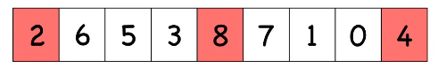
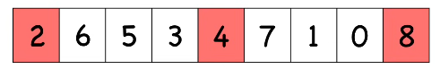

# Quick Sort

## Concept

- quick sort is recursive
- quick sort is all about the **pivot** which is a position in the array that, after sorting it, is
  1. in the correct position in the final sorted array
  2. has items to the left smaller
  3. has items to the right larger
- the steps for `partition` are, given an array from `low` to `hi`,
  1. pick a `pivot` and place that at the end of the array at `hi`
  2. use `i = low - 1` to represent the "back of the line"
  3. iterate from `low` to `hi`
     - if you find a value less than `pivot`
     - then increment `i` and swap the two, putting the smaller value in the "back of the line"
  4. swap `pivot` with `i + 1`, putting the pivot in the middle of the low and high values
  5. return the pivot's location at `i + 1`
- the steps for `quickSort` are, given an array from `low` to `hi`,
  - so long as `low < hi`, then
  - call partition on the array, getting the partition's location
  - quick sort `low` to `pivot_location - 1`
  - quick sort `pivot_location + 1` to `hi`
- how do we choose a pivot?
  - you can use any value as the pivot
  - but, we want a pivot that partitions the array in half to get best efficiency
  - we can use median-of-three to guess this
    1.  choose the first, middle, and last elements of the array
       
    2. sort these three elements
       
    3. choose the middle element as the pivot

## About

- quick sort is not a stable algorithm because it exchanges non-adjacent elements

## Time Complexity

### Worst

$$
O(n^2)
$$

### Average

$$
O(n\log n)
$$

