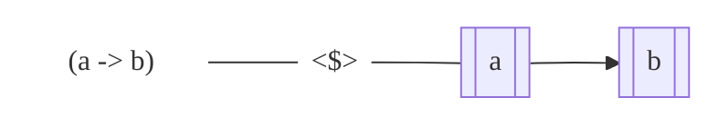
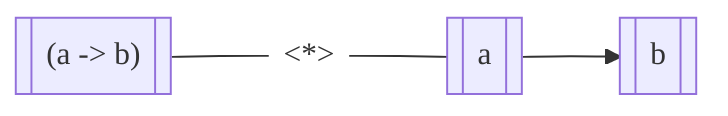

# Functors, Applicatives, and Monads

## Functors

- ==Functor== is a typeclass for things that can mapped over
- the list type is part of the `Functor` typeclass

```haskell
-- this is how the "Functor" typeclass is implemented
class Functor f where
	fmap :: (a -> b) -> f a -> f b
-- it defines one function "fmap" with no default implementation
```

- Note `f` is **not a concrete type** but a [type constructor](9-Defining-Types-and-Type-Classes.md#type-constructors) (like `Maybe`)
- `fmap` takes a function from one type `a` to another `b` and a *functor* applied with `a` and returns a *functor* applied with `b`



> - The type declaration of `fmap` is similar to that of [`map`](8-HOFs.md#Recursive-Patterns-via-HOFs) where
>   `map :: (a -> b) -> [a] -> [b]`
> - Lists are an instance of `Functor` such that
>
> ```haskell
> instance Functor [] where
> -- notice we pass "[]" as the type constructor not "[a]" as this would then be a concrete type
>     fmap = map  
> ```

- Types that can act like boxes can be ==functors== such as `Maybe a` or `[a]` (i.e. they can be mapped over)
- To be exact, they *must* have a [kind](8-Defining-Types-and-Type-Classes.md#kinds-:k) of `* -> *`

```haskell
instance Functor Maybe where  
    fmap f (Just x) = Just (f x)  
    fmap _ Nothing = Nothing  
{-ghci>-} fmap (++ " HEY GUYS IM INSIDE THE JUST") (Just "Something serious.")  
{->>-} Just "Something serious. HEY GUYS IM INSIDE THE JUST"  
```

> Note that `fmap` in infix form is `<$>`

###  `Tree` as a Functor

```haskell
data Tree a = Node a [Tree a] | Leaf a
-- defining "fmap" for a tree
instance Functor Tree where
      fmap :: (a -> b) -> Tree a -> Tree b
      fmap f (Leaf x) = Leaf $ f x
      fmap f (Node x ts) = Node (f x) $ (f <$>) <$> ts
      -- "ts" is a "[Tree a]" so there are two layers of boxes
      -- for this reasons, the fmap must be applied to the fmap to the function
```

### Functions as a Functor

- Even functions can be though of as functors
- A function with type `a -> b` is a computation that takes a type `a` and returns a `b`; i.e. it is a *computational context* for a value of type `b`
- The `->` operator itself is a type constructor with kind `* -> * -> *`, such that we can write a Functor instance for `((->) a)`

> Note that we are writing a Functor instance for `((->) a)` and *not* `(->)` because, recall, a type constructor can *only* be a Functor instance if it's of **kind** `* -> *`

```haskell
instance Functor ((->) a) where
      fmap :: (b -> c) -> (a -> b) -> (a -> c)
      -- fmap for a function is just function composition!
      fmap = (.)
{-ghci>-} ((2*) <$> (5+) <$> (100-)) 90
{->>-} 30
```

> Because `<$>` is right associative, it is taken as $2*(5 + (100 - 90)) = 30$

## Applicatives

- What if the function is in a separate context (i.e. a box)?



The ==Applicative== class extends Functors with additional methods

- `pure` takes a *pure* value and wraps it in a Functor instance (i.e. it puts it into a computational context)
- `<*>` applies a function found in one Functor to a value in another Functor.

### `Maybe` as an Applicative

```haskell
instance Applicative Maybe where
    pure :: a -> Maybe a
    pure = Just
    
    (<*>) :: Maybe (a -> b) -> Maybe a -> Maybe b
    Nothing <*> _ = Nothing
    _ <*> Nothing = Nothing
    (Just f) <*> (Just x) = Just $ f x
    
{-ghci>-} (*) <$> Just 5 <*> Just 10
{->>-} Just 50
```

> This is what is happening:
>
> ```mermaid
> %%{init: {"fontFamily": "Fira Code"}}%%
> flowchart LR
> 	f["(*)"]:::inv --- fmap((<$>)):::inv
> 	fmap --- a[[5]]
> 	a --> b[["(5*)"]]
> 	b --- app((<*>)):::inv
> 	app --- c[[10]]
> 	c --> d[[50]]
> classDef inv fill: #ffffff00, stroke: #ffffff00
> ```

### List as an Applicative

```haskell
instance Applicative [] where
	pure :: a -> [a]
	pure = repeat
	
	(<*>) :: [a -> b] -> [a] -> [b]
	[] <*> _ = []
	_ <*> [] = []
	(f:fs) <*> (x:xs) = f x : (f x : fs <*> xs)
{-ghci>-} pure 1 :: [Int]
{->>-} [1,1,1,1,1,1... -- an infinite list of 1's
{-ghci>-} [(2^), (5+), (3*)] <*> [5..7]
{->>-} [32,11,21]
```

> Where $[2^5, (5+6), (3*7)]=[32,11,21]$

- In this application of `<*>` on a list, we map each function in the first list to a value in the second until either list runs out
- Another way we can do this is with a *cartesian product*

```haskell
newtype NDList a = NDList [a] deriving Show
```

> - because we already defined lists as an instance of Applicative, we will make a new type from list using `newtype`
> - `newtype` is similar to the `data` keyword
> - `NDList [a]` is a value constructor that has the field `[a]`

```haskell
instance Functor NDList where
    fmap :: (a -> b) -> NDList a -> NDList b
    -- we can just use List's definition of fmap and put it back into a NDList
    fmap f (NDList l) = NDList $ f <$> l 
instance Applicative NDList where
    pure :: a -> NDList a
    -- this time pure just shoves that one value into an NDList
    pure x = NDList [x] 
    (<*>) :: NDList (a -> b) -> NDList a -> NDList b
    -- this is a NDList *cartesian product*
    NDList fs <*> NDList xs = NDList $ [f x | f <- fs, x <- xs]
    
{-ghci>-} NDList [(2^), (5+), (3*)] <*> NDList [5..7]
{->>-}  [32,64,128,10,11,12,15,18,21]
```

> | `<*>`  | `5`  | `6`  | `7`   |
> | ------ | :--- | :--- | :---- |
> | `(2^)` | `32` | `62` | `128` |
> | `(5+)` | `10` | `11` | `12`  |
> | `(3*)` | `15` | `18` | `21`  |

### Functions as an Applicative

```haskell
instance Applicative ((->) a) where
	pure :: b -> (a -> b)
	pure = const

	(<*>) :: (a -> (b -> c)) -> (a -> b) -> (a -> c)
	f <*> x = \y -> f y (x y)
```

> ##### `pure`
>
> - recall `const` takes 2 arguments and returns the first
> - so if `const` takes 1 argument $x$, then it returns a function that awaits a second argument $y$ before returning the first $x$
> - this is also equivalent to `pure x = \_ -> x`
>
> ##### `<*>`
>
> ```mermaid
> %%{init: {"fontFamily": "Fira Code"}}%%
> flowchart LR
> 	f[["(b -> c)"]] --- app((<*>)):::inv
> 	app --- a[[b]]
> 	a --> b[[c]]
> classDef inv fill: #ffffff00, stroke: #ffffff00
> ```
>
> -  `(a -> (b -> c))`: `(b -> c)` is in the box `((->) a)`
> -  `(b -> c)`: `c` is the box `((->) b)`
> - `(a -> c)`: `c` is in the box `((->) a)`
> - thus, we are awaiting an `y` of type `a` such that
>   `f <*> x = \y -> f y (x y)`

```haskell
-- zip pairs one elements of a list with another (one-to-one) in a tuple
{-ghci>-} (zip <*> drop 5) [1..10]
{->>-} [(1,6),(2,7),(3,8),(4,9),(5,10)]
-- "zip" is "f" and "drop 5" is "x"
-- (\y -> zip y (drop 5 y)) [1..10]
-- zip [1..10] [6..10]
```

### `Find` Example

```haskell
find :: (a -> Bool) -> [a] -> Maybe a
find _ [] = Nothing
find p (x:xs) | p x = Just x
              | otherwise = find p xs
              
{-ghci>-} find even [1..10]
{->>-} Just 2
{-ghci>-} find (>10) [1..10]
{->>-} Nothing
-- where the limitation happens:
{-ghci>-} find even <$> Just [1..10]
{->>-} Just (Just 2)
{-ghci>-} find (>10) <$> Just [1..10]
{->>-} Just Nothing
```

> - What is happening here is that `find` is an *impure* function (i.e. it returns its own *context* which is `Maybe`)
> - However, when we use `<$>` with the argument also in a `Maybe` context, our result is a `Maybe (Maybe a)`
> - However, `find even <$> Nothing` returns `Nothing` which makes `Just Nothing` look even worse

## Monads

The ==Monad== class further extends Applicatives so that they support the additional methods `>>=` ("bind"), `>>` ("sequence"), and `return`

```haskell
class (Applicative m) => Monad m where
    infixl 1 >>=
    (>>=) :: m a -> (a -> m b) -> m b -- called "bind"

    infixl 1 >>
    (>>) :: m a -> m b -> m b -- called "sequence"
    x >> y = x >>= \_ -> y

    return :: a -> m a
    return = pure
```

> ###### Bind `>>=`
>
> ```mermaid
> %%{init: {"fontFamily": "Fira Code"}}%%
> flowchart LR
> 	ma[[a]] --> f
> 	subgraph f[" "]
> 	direction LR
> 	a[a]:::inv ---> mb[[b]]
> 	end
> 	f --> mb2[[b]]
> classDef inv fill: #ffffff00, stroke: #ffffff00
> ```
>
> 1. takes type `a` in some context $x$
> 2. takes a functions that takes a type `a` and returns `b` in a *new context* $y$ (just as [`find`](#find-example))
>    - note that there two contexts $x, y$ are *different*!
> 3. takes the `a` out of $x$ and passes it to the function to get a b in a context $y$
> 4. finally it *combines* the two contexts $x, y$ together into one *single* context along with its type `b`
>
> ###### Sequence `>>`
>
> ```mermaid
> %%{init: {"fontFamily": "Fira Code"}}%%
> flowchart LR
> 	ma[[a]] --> mb[[b]]
> 	mb --> mb2[[b]]
> ```
>
> - *sequence* is just a bind where value of type `a` in the context $x$ is disregarded 
> - hence it uses `>>=` in its definition by passing the function `\_ -> y`
> - note that the *context* $x$ is still preserved
>
> ###### `return`
>
> is the same as [`pure`](#Applicatives)

### `Maybe` as a Monad

```haskell
instance Monad Maybe where
	(>>=) :: Maybe a -> (a -> Maybe b) -> Maybe b
	Nothing >>= _ = Nothing
	Just x >>= f = f x
{-ghci>-} Just [1..10] >>= find even
{->>-} Just 2
-- this fixes our previous limitation with the Applicative
```

### Some Impure Functions

return their own context such as `find`

#### `safeDiv` Example

```haskell
safeDiv :: Integral a => a -> a -> Maybe a
safeDiv _ 0 = Nothing
safeDiv x y = Just $ x `div` y
{-ghci>-} 10 `safeDiv` 0
{->>-} Nothing
```

#### Random `fDivs` example

`fDivs :: Integral a => a -> a -> a -> a -> a -> a -> Maybe a`
$$
\text{fdiv}(a,b,c,d,e,f) = \frac{(a / b) + (c / d)}{e}+f
$$
without using `bind`, we'd have to pattern match which would be a lot of tedious code to return `Nothing` if any of the operations fail

```haskell
-- using bind for dDivs
fDivs :: Integral a => a -> a -> a -> a -> a -> a -> Maybe a
fDivs a b c d e f = a `safeDiv` b >>= \r -> 
          c `safeDiv` d >>= \r' ->
          (r + r') `safeDiv` e >>= \r'' ->
          return $ r'' + f
{-ghci>-} ghci> fDivs 20 0 10 2 3 5
{->>-} Nothing
```

> Note that if one of these computations fails, [bind](#Maybe-as-a-Monad) short circuits and returns `Nothing` without preforming the rest of the code:
>
> `Nothing >>= _ = Nothing`
>
> Where `f` never gets used

### Syntactic Sugar: `do` Notation

`do` is only syntactic sugar for what was written above for [`fDivs`](#random-fdivs-example)

```haskell
fDivs' :: Integral a => a -> a -> a -> a -> a -> a -> Maybe a
fDivs' a b c d e f = do r   <- a `safeDiv` b
                        r'  <- c `safeDiv` d
                        r'' <- (r + r') `safeDiv` e
                        return $ r'' * f
```

#### Example Translation of `do`

```haskell
do r1 <- func1 x
       r2 <- func2 y
       func3 r1 r2
       r3 <- func4 z
       func5 r3
       return (r1, r2, r3)
-- is equivalent to
func1 x		>>= \r1 ->
func2 y 	>>= \r2 ->
func3 r1 r2 >>= \_ -> -- notice this is a sequence ">>"
func4 z 	>>= \r3 ->
func5 r3 	>>= \_ -> -- another sequence
return (r1, r2, r3)
```

`do` blocks also support `let` definitions, but `in` is omitted as such

```haskell
do r1 <- func1 w
    r2 <- func2 x
    let y = pureFunc r1 r2
		z = pureVal
    r3 <- func3 y z
    return (r1, r2, r3)
```

