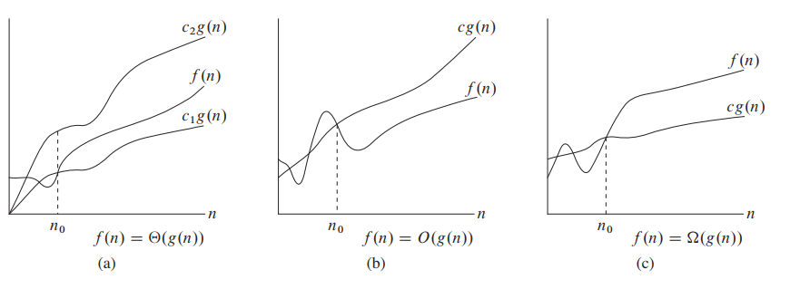

# Asymptotic Notation

- **asymptotic notation** is often used to describe the running times of algorithms 
- it is a way of abstracting the actual function that describes the running time of an algorithm

## $\Theta$-notation *"asymptotically tight bound"*

- $\Theta(g(n))$ denotes the set of functions $f(n)$​
- a function $f(n)$ belongs to the set if there exists positive constants $c_1,c_2$ such that it can be "sandwiched" between $c_1g(n)$ and $c_2g(n)$ for sufficiently large $n$​
  - "sufficiently large $n$" can be expressed as "for all $n \ge n_0$​"
- we often abuse notation and say "a function $f(n)$ = $\Theta(g(n))$" or "... is $\Theta(g(n))$"
  - we mean $\in \Theta(g(n))$​
  - but the abuse is useful because if we write something like $2n^2+\Theta(n)$ it is clear we mean $2n^2+f(n)$ where $f(n)\in\Theta(n)$

## $O$​-notation *"asymptotic upper bound"*

## $\Omega$-notation *"asymptotic lower bound"*

## "$\Theta = O+\Omega$" Theorem

- for any 2 functions $f(n), g(n)$ we have $f(n) = \Theta(g(n))$ if and only if $f(n)=O(g(n))$ and $f(n)=\Omega(g(n))$