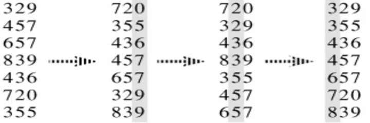

# Radix Sort

Radix sort is a linear time sorting algorithm.

## Design

- the procedure assumes that each element in the $n$-element array `A` has $d$ digits $D_1D_2...D_d$
  - where digit $D_1$ is the lowest order digit
  - and digit $D_d$ is the highest order digit
- we use counting sort (or any other stable sort) on each digit
  - the type of sort you use here will effect its complexity
- sort from $D_1$ to $D_d$

## Runtime Analysis

Given $n$ $d$-digit numbers in which each digit can take up to $k$ possible values, radix sort sorts in $\Theta(d * (k+n))$ if the stable sort used uses $\Theta(n + k)$.