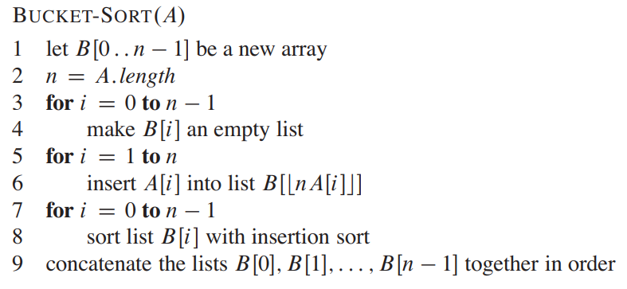
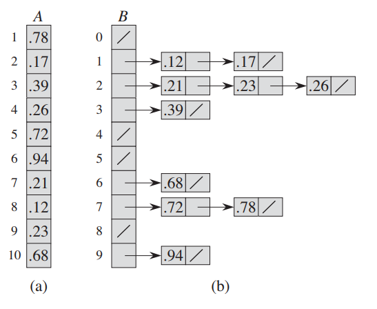

# Bucket Sort

## Pseudocode

## Design

- bucket sort assumes the input has elements evenly distributed over the interval 0 and 1

- divide the interval into $n$​ equal sized sub-interval buckets in an array $B$​
  - where each element in $B$ is the head of a linked list (i.e. a bucket)

- distribute the input elements into the buckets
  - for a bucket $i$, it covers the domain of $[i \times \frac1n, (i + 1)\frac1n]$​

  - if an element has a value $a$​​, its bucket index is

$$
i \times \frac1n \le a \le (i + 1)\frac1n \\
i \le a * n \le i +1\\
i = \lfloor a \times n \rfloor
$$

- sort each bucket with insertion sort
- go through each bucket to list the elements as a sorted array

## Runtime Analysis

### Worst Case

In the worst case, all the elements are placed in the same bucket and the runtime is $O(n^2)$

### Average Case

$$
T(n) = \Theta(n) + \sum_{i = 0}^{n-1} O(n_i^2)
$$

Where $n_i$ is the number of elements that fall into bucket $i$. We will use expectation for the average case.
$$
\begin{split}
E[T(n)] &= E[\Theta(n) + \sum_{i = 0}^{n-1} O(n_i^2)]\\
&= \Theta(n) + \sum_{i = 0}^{n-1} O(E(n_i^2))
\end{split}
$$
Use $X_{ij}$ as a RV that `A[j]` falls into bucket $i$​.
$$
X_{ij} = \begin{cases}
0 & \text{with probability } 1 - \frac1n \\
1 & \text{with probability } \frac1n
\end{cases}\\
$$
49:33 L11