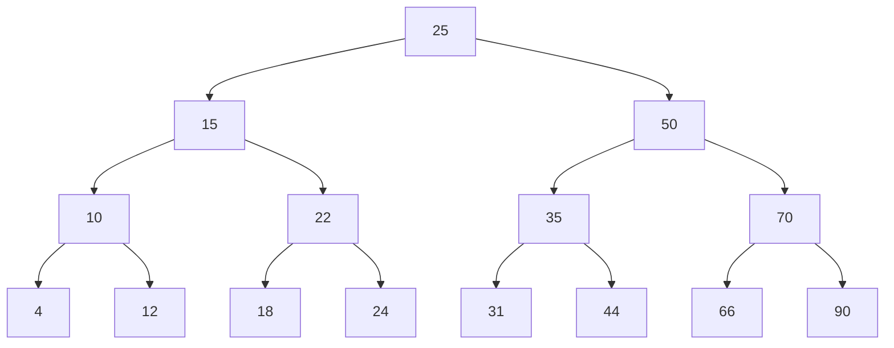
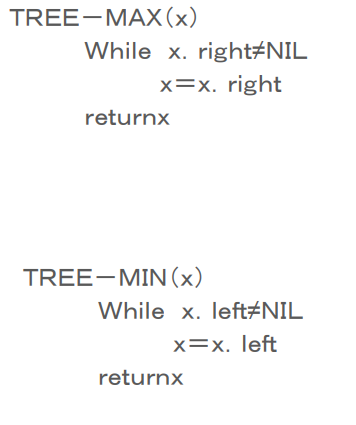
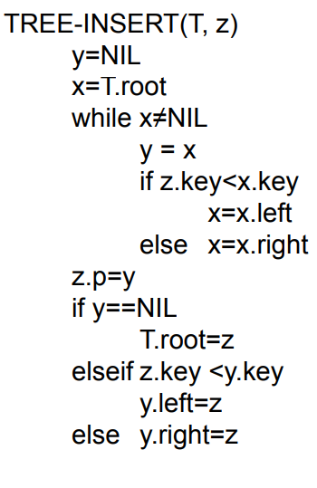
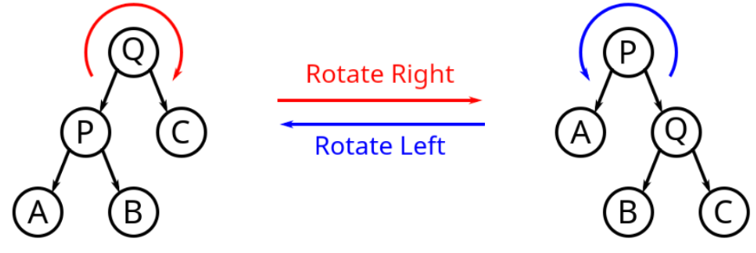

# Binary Search Tree (BST)

- each node contains a quintuple
  - an index
  - a key
  - pointers to its left, right child, and parent
- all keys in the left subtree of $x$ should be less than or equal to that of $x$
  - and all in right subtree should greater than or equal to that of $x$
- search, insert, delete, predecessor, successor, minimum, maximum operations are all $O(h)$ where $h$ is the height of the tree
- in a standard BST, $h$ is determined by the order of inserting $n$ items
  - the best case $h = n \text{ lg } n$
  - the worst case $h = n$

## Tree Traversals



### In Order

`4, 10, 12, 15, 18, 22, 24, ...`

1. left subtree
2. root
3. right subtree

### Pre-Order

`25, 15, 10, 4, 12, 22, 50, 35, 31, 44, 70, 66, 90`

1. root
2. left subtree
3. right subtree

### Post-Order

`4, 12, 10, 18, 24, 22, 15, 32, 44, 35, 66, 90, 70, 50, 25`

1. left subtree
2. right subtree
3. root

## Searching



## Successor


## Insert



## Delete

1. `z` has no children
   - just remove `z`
2. `z` has 1 child
   - replace `z` with its child
3. `z` has 2 children
   - replace `z` with its successor

## Rotation



```
# Right rotation pseudocode
function rightRotate(y):
    x = y.left
    T = x.right
    # Perform rotation
    x.right = y
    y.left = T
    return x
    
# Left rotation pseudocode
function leftRotate(x):
    y = x.right
    T = y.left
    # Perform rotation
    y.left = x
    x.right = T
    return y
```

