# Balanced BST: Red Black Tree

## Properties

1. every node is either red or black
2. the root is black
3. every null pointer descending from leaf is black
4. if a node is red then *both* its children are black
5. for each node, all paths from the node to descendant leaves contain the same number of black nodes
   - this is the **black height**

## Black Height $\text{bh}$

The height is at most $2 \text{ lg } (n+1)$

### Proof

The subtree rooted at $x$ has at least $2^{\text{bh}(x)}-1$​ internal nodes. We will use induction to show this.

- the base case that $x$ is a null root node (i.e. no key) has $\text{bh}(x) = 0$
  - this complies with $2^{\text{bh}(x)}-1 = 2^0 -1 = 0$
- we will also show 3 more base cases comply with our hypothesis

```mermaid
graph
	1(⚫) --> 2(null)
	1 --> 3(null)
	4(⚫) --> 5(null)
	4 --> 6(🔴) --> 8(null)
	6 --> 7(null)
	9(⚫) --> 10(🔴) --> 11(null)
	9 --> 12(🔴) --> 13(null)
	10 --> 14(null)
	12 --> 15(null)
	
```

- in these three cases we also have at least $2^{\text{bh}(x)}-1$ internal nodes
  1. $2^2 - 1 = 1$ internal nodes
  2. $2^2 - 1 = 1 < 2$ internal nodes
  3. $2^2 - 1 = 1 < 3$​ internal nodes

18:11 L15

