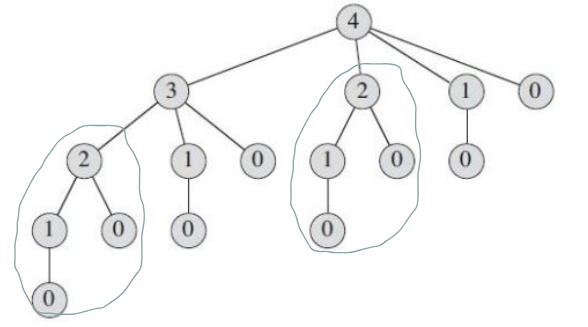

# Rod Cutting

## Design

- we have rod of length $n=4$
- rods sell for different prices depending on their length. For example

- what is the optimal way we can cut up our rod to get the most revenue? Here are some example ways to cut our rod

- the number of potential cuts for a rod of length $n$ is $2^{n-1}=2^{4-1}=8$​
- this is exponential so testing every solution is not feasible
- assume the optimal solution cuts the rod into $k$ pieces where $1\le k\le n$
  - the optimal decomposition is $n = i_1+i_2+...+i_k$
  - the corresponding optimal revenue is $r_n=p_1+p_2...+p_k$​

- find the optimal revenue $r$ for each subproblem
  - $r_1 = \max{(1)}=1$
  - $r_2 = \max(2, 5) = 5$ 
    - where you can cut the rod into $[1,1]$ for price $1+1=2$ or
    - $[2]$ for $5$
  - $r_3 = \max(3, 6, 6, 8) = 8$​
    - $[1,1,1]$ for $1+1+1=3$
    - $[1,2]$ for $1+5=6$
    - $[2,1]$ for $5+1=6$
    - $[3]$ for $8$
  - notice we can actually reuse previous overlapping solutions 
  - $r_4 = \max(9,9, 19, 8)=10$ where can reuse previous solutions by
    - $0 + p_4 = 9$
    - $r_1 + p_3 = 1 + 8 = 9$
    - $r_2 + p_2 = 5 + 5 = 10$
    - $r_3 + p_1 = 8 + 1 = 9$​
  - $r_5=\max(10,13,13,11)=13$
    - $0+p_5=10$
    - $r_1+p_4=1+9=10$
    - $r_2+p_3= 5 + 8=13$
    - $r_3+p_2=8+5=13$
    - $r_4+p_1= 10+1=11$

## Without Memoization

### Code

### Runtime Analysis

- our recursion tree is made by taking initial cuts (the nodes) then recursing in `cutRod` to find the next maximum
- notice the redundancies in the tree

$$
T(n) = 1 + \sum_{j=0}^{n-1}T(j) \\
T(0) = 1\\
T(1) = 1 + 1 = 2\\
T(2) = 1 + T(0) + T(1) = 4\\
T(3) = 1 + T(0) + T(1) + T(2) = 8\\
T(n) = 2^n
$$

- note that you can use an inductive prove to show this
- we can use **dynamic programming** which uses additional memory to save previous computations
- there are 2 equivalent ways to reduce the repeated computation:
  - **top down**
  - **bottom up**

## Top Down

We write the procedure recursively in a natural manner, but modified to save results of subproblems.

### Code

## Bottom Up

When solving a particular subproblem, we have already solved all of the smaller subproblems its solutions depends on and have those solutions saved.

### Code

