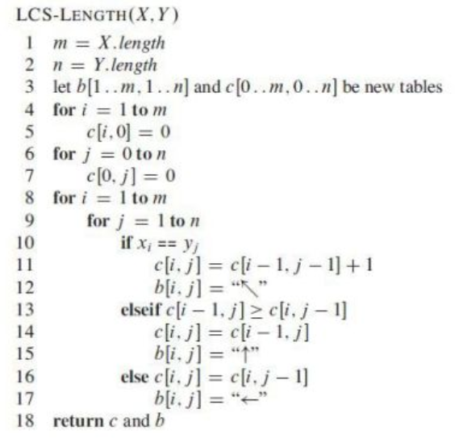

# Longest Common String

- we have 2 sequences $X: (x_1, x_2, ...,x_m)$ and $Y:(y_1,y_2,...,y_n)$
- we wish to find the longest common subsequence of $X,Y$
  - a subsequence of a sequence $X$ is any sequence that can be obtained by deleting zero or more elements from $X$​ without changing the order of the remaining elements

- consider each subsequence of $X$ corresponding to a subset of the indices $(1,2,...,m)$​ 
  - to make a subsequence of $X$, you can think of it as having the option to include $x$ or not
  - this (binary choice) yields $2^m$​ possible subsequences 

- let $Z: (z_1,z_2,...,z_k)$ be any LCS of $X,Y$
  1. if $x_m = y_n$ then $z_k = x_m = y_n$ and $Z_{k-1}$ is an LCS of $X_{m-1}$ and $Y_{n-1}$
  2. if $x_m \ne y_n$ then $z_k \ne x_m$ implies $Z$ is an LCS of $X_{m-1}$ and $Y$
  3. also, if $x_m \ne y_n$ then $z_k \ne y_n$ implies $Z$ is an LCS of $X$ and $Y_{n-1}$​

## Recursive Design

- the conclusion we get from the 3 points above is that to find the LCS of $X,Y$
  - if $x_n=y_m$ then we'll find the LCS of $X_{m-1}, Y_{n-1}$ and then append the value to it
  - otherwise we need to solve 2 subproblems
    - find the LCS of $X_{m-1},Y$ *and* the LCS of $X,Y_{n-1}$ and then take the longer of these two as the LCS of $X,Y$
    - this is from the *implications* of the points 2 and 3 from above 

## Code

- this code uses a *bottom up* approach to DP
- initialize 2 tables $b, c$ of size $m \times n$​ 
  - i.e. $c(i, j)$ will hold the LCS for $X_i$ and $Y_j$​
- we initialize the first *row* and *column* of $c$ with $0$ as the LCS of any empty string with any other string will be length $0$
- because of the bottom up structure, instead of starting from the last indices of both $X,Y$, we start from the first
  - the first conditional $x_i=y_i$ indicates a symbol $\nwarrow$ meaning we have a match so "cut both"
  - the second $\uparrow$ indicates cut $x$
  - the third $\leftarrow$ indicates cut $y$

