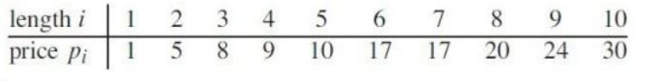

# Greedy Algorithms

- greedy approach considers the local optimal solutions and assumes they will lead to the global optimal solution
- this approach doesn't always work

## Trying greedy approach on Rod Cutting

- say we have a rod of length 4
- if we try to take the greedy choice of *unit price* (i.e. price per length) we have the following units prices
  1. for 1 (cut off 1)
  2. for 2.5 (cut off 2)
  3. for 2.6 (cut off 3)
  4. for 2.25 (cut off 4)
- the greedy choice would be the sell lengths 3 then 1 for a price of 9
- however, you can sell for 2 then 2 for a price of 10
- thus the greedy solution from unit price is *not* optimal 

## When does greedy work?

- a greedy algorithm is a special case of DP
- in DP,  bottom up approach has to consider the solutions of its children before solving itself
- however, in greedy algorithms, the solutions of children *don't* affect the current choice
  - this means *bottom up approach is invalid*