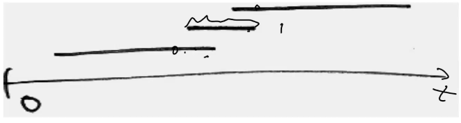
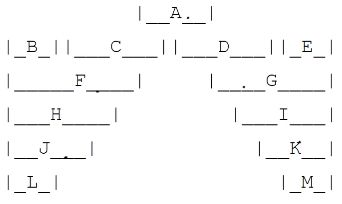
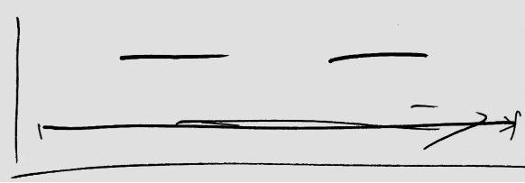

# Activity Selection

- we have a set $S$ of $n$ activities each with start times $s_i$ and finish times $f_i$
- we'd like to schedule the maximum set of non-overlapping activities

## Brute Force Approach

- we could try *all* compatible meeting combinations
- for each meeting, we'd need to chose to schedule it or not
- this gives a binary choice and a total combinations of $2^n$

## Possible Greedy Approaches

### Pick the shortest meeting first

The above depicts a counter example.

### Minimize "not in use" time between meetings

The above depicts a counter example.

### Pick meetings with the least number of conflicts

The above depicts a counter example. A has the least number of conflicts (2) while the rest have at least 3. If we pick A, at most we can schedule is 3 meetings however, we could schedule B, C, D, E for 4.

### Pick the earliest start time first

The above depicts a counter example.

### Pick the earliest finish time first

This greedy choice will actual give a global optimal solution to our problem. However how can we prove this?

## Proving our greedy choice

- say that an optimal solution to the problem $S$ is $A$
- assume that $A$ *does not* have the greedy choice of earliest finish time in $S$
- take the meeting $a$ with the earliest finish time in $A$
- because $a$ is not the earliest finish time in $S$, there exists a meeting $s$ in $S$ that is not in $A$ that has an earlier finish time
- thus, we can replace $a$ with $s$ with no overlap giving us a new optimal solution that *has* the greedy choice
- therefore, there is *always* an optimal solution for this problem that contains the greedy choice