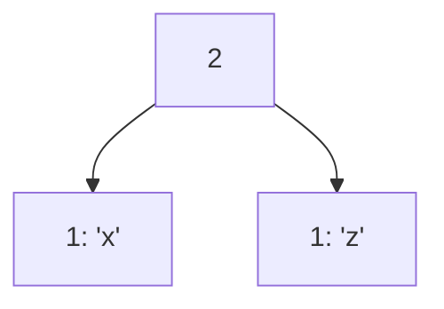
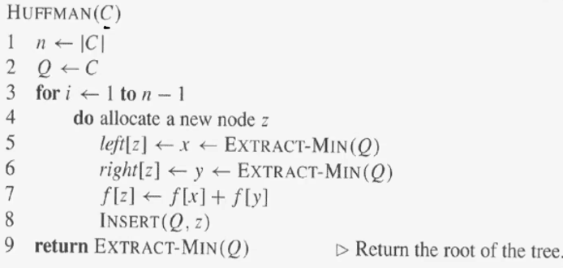

# [Huffman Coding](https://youtu.be/JsTptu56GM8?feature=shared)

Huffman encoding is a data compression algorithm that uses a greedy approach. 

## Design

1. count all the frequencies of each character and put them into an descending ordered list
2. take the bottom 2 least frequent characters and link them together by the sum of their frequencies and put that at the top of the list

3. repeat this until you have a finished tree
4. to encode a character, use `0` to denote traverse left on the tree and `1` to denote traverse right
   - once you reach a leaf (i.e. a character) you terminate
   - the sequence of `0` and `1` is the encoding 

## Code

