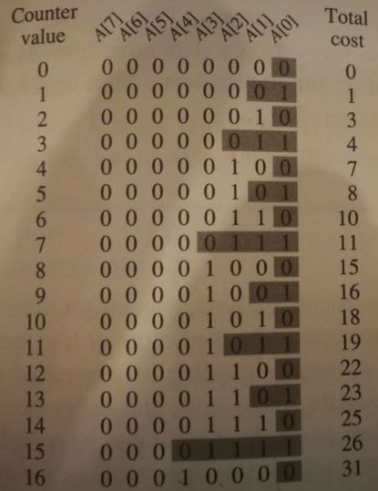
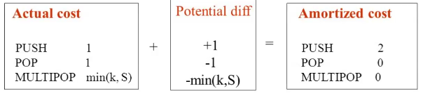

# Amortized Analysis

- amortized analysis is the evaluation of the average cost over a sequence of operations on a data structure
- the *average cost* maybe small although a single operation can be expensive
- it is *not* the cost for the *average case* and doesn't involve probability analysis

## 1. Aggregate Analysis

- the amortized cost is $T(n) / n$ where $T(n)$ is the worst case 
- it applies to any operation in a sequence of $n$ operations
  - operations can be different types

### Insertion to a dynamic array

- items can be inserted at a given index with $O(1)$ if the index is present in the array
- if not, then the array double in size and the cost is not longer constant

$$
c_i = 1 + \begin{cases}
i - 1 & \text{if } i - 1 \text{ is power of 2} \\
0 & \text{otherwise}
\end{cases}
$$

- if we insert $n$ elements then

$$
\frac{\sum_{i=1}^n c_i}{n} \le \frac{n + \sum_{j=1}^{\lfloor\text{ lg } (n-1)\rfloor} 2^j}{n}
 = \frac{O(n)}{n}
$$

- notice that

$$
\sum_{j=0}^{a} 2^j = 2^0 + ... + 2^a = 2^{a+1}-1\\
\sum_{j=1}^{\lfloor\text{ lg } (n-1)\rfloor} 2^j = 2^{\lfloor\text{ lg } (n-1)\rfloor+1}-1-1
$$

- note that we subtract with another $-1$ because we start at $j=1$

$$
\begin{split}
\sum_{j=1}^{\lfloor\text{ lg } (n-1)\rfloor} 2^j &= 2*2^{\lfloor\text{ lg } (n-1)\rfloor}-2\\
&= 2 * (n-1) - 2
\\&= O(n) 
\end{split} 
$$

### Stack Operations (`multipop`)

- `push(S, x)` pushes `x` onto `S` in $O(1)$
- `pop(S, x)` in $O(1)$
- `multipop(S, k)` pops `k` top elements from `S` if the size $\ge k$​ otherwise it pops all elements
  - at most $O(n)$
- what is the amortized cost of a sequence of $n$ `push`, `pop`, `multipop` operations?
  - the size of the stack is $n$
  - for any $n$, the cost of a sequence of $n$ of these operations is $O(n)$ (as we can't pop more than $n$)
  - amortized cost is $O(n)/n = O(1)$

### Binary Counter

- $A[0..k-1]$ is an array denoting a $k$-bit binary counter that starts at $0$
  - adding 1 to $A[i]$ flips it
  - if $A[i]=1$ then it yields a carry to $A[i+1]$

- notice that $A[0]$ flips $n$ times
  - $A[1]$ flips $n/2$ times
  - $A[2]$ flips $n/4$ times

$$
\sum_{i=0}^{\lfloor \text{ lg } n \rfloor} \lfloor \frac{n}{2^i} \rfloor <
n\sum_{i=0}^\infin 1/{2^i} = n \times \frac{1}{1 - \frac12}=2n
$$

- amortized cost is $O(n)/n=1$

## 2. Accounting Method

- for different operations, we "charge" a specific amount $\hat c_i$ different than their actual costs $c_i$

  - can be less or more

- when amortized cost is *more than* the actual then 

  - we store the excess credit into the object 
  - credit is stored for future use when the amortized cost is *less than* the actual

- how do we assign amortized costs?

  - the total amortized cost *must* be an upper bound on the actual cost
    $$
    \sum_{i=1}^n\hat c_i \ge \sum_{i=1}^n c_i
    $$

  - thus the total credit in the data structure is
    $$
    \sum_{i=1}^n\hat c_i - \sum_{i=1}^n c_i \ge 0
    $$
    

### Stack Operations

- actual costs
  - `push` is 1
  - `pop` is 1
  - `multipop` is $\min(k,s)$ where $s$ is the length of $S$
- amortized cost
  - `push` is 2
  - `pop` is 0
  - `multipop` is 0
- analysis
  - each object in the stack has 1 "coin" of credit on it because it costs 1 to push and 1 gets saved
  - the total credit for a stack is going to be nonnegative as we can never pop more than what the stack has 

## 3. Potential Method

- similar to the *accounting method*, however instead of storing credit, we store "potential"
- the potential is stored with the entire data structure instead of just a single object
- $c_i$​ is the actual cost
- $D_i$ is data structure after the $i$th operation to $D_{i-1}$
- $\phi(D_i)$ is the potential associated with $D_i$
- $\hat c_i$ is the amortized cost of the $i$th iteration and is defined as $\hat c_i = c_i + \phi(D_i) + \phi(D_{i-1})$
- the total amortized cost is

$$
\sum_{i=0}^n \hat c_i = \sum_{i=1}^n[c_i + \phi(D_i) - \phi(D_{i-1})]
= \sum_i^n c_i + \phi(D_n) - \phi(D_0)
$$

### Stack Operations

Let the potential of a stack $\phi$ be the *number of elements* in the stack.

### Binary Counter

Let the potential of the counter $\phi$ be the *number of the 1's* in the counter.