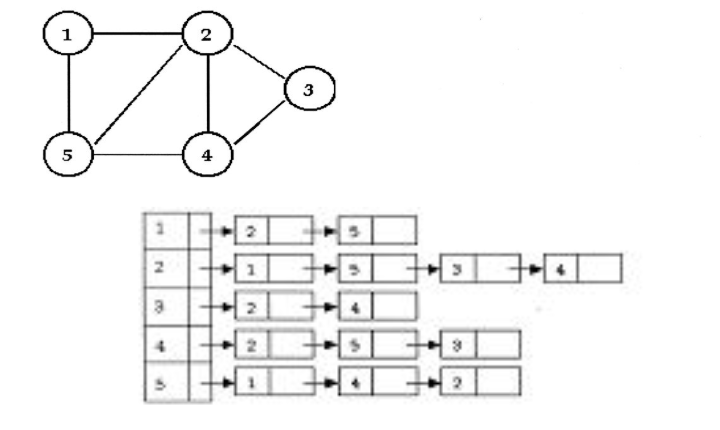

# Graphs

$$
G=(V,E)
$$

## Algorithms

- finding cycles
- connected
- traversals: BFS, DFS
- topological sort
- strongly connected components

## S'more Terminology

- in a directed graph, a path $<v_0, v_1,...,v_k>$ forms a **cycle** if $v_0=v_k$ and the path contains at least one edge
  - a **self-loop** is a cycle of 1
  - a directed graph with *no self-loops* is a **simple** directed graph
- in an undirected graph, a path $<v_0, v_1,...,v_k>$ forms a **cycle** if $k\ge3, v_0=v_k$ and $v_1,v_2,...v_k$ rare distinct
- **acyclic** graphs have no cycles
  - if an acyclic graph is connected, it is a **tree**
- **degree** if a vertex in undirected graph is number of edges incident to it
  - **out-degree** and **in-degree** of directed graph is edges leaving it and entering it
- the **length of a path** is the number of edges on it
- a graph is **connected** if every pair of vertices is reachable through a path
  - a directed graph is **strongly** connected if *both* vertices can reach each others
    - directed graph may have strongly connected *components*

## Representation

### Adjacency List

- every vertex has its own linked list containing its adjacent nodes

- the total memory required for an *undirected graph* is $O(|V| + 2*|E|)$
  - where we have to count every edge twice
- the total memory required for a *directed graph* is $O(|V| + |E|)$

### Adjacency Matrix

- a $|V| \times |V|$ matrix where $A[i,j]=1$ if an edge exists between $i,j$
  - if it is directed, $A[i,j]$ denotes an edge from $i$ to $j$
- $|V|^2$ memory
- this is better for dense graphs
- undirect graph will be symmetric along the diagonal