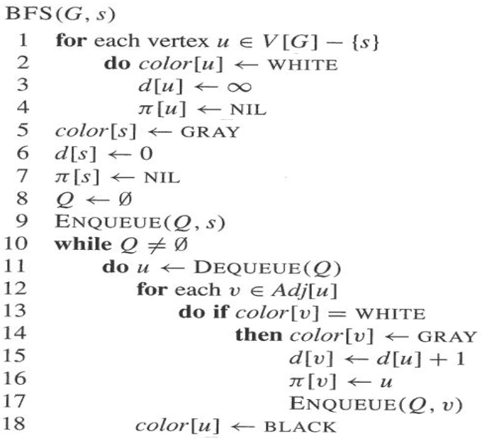
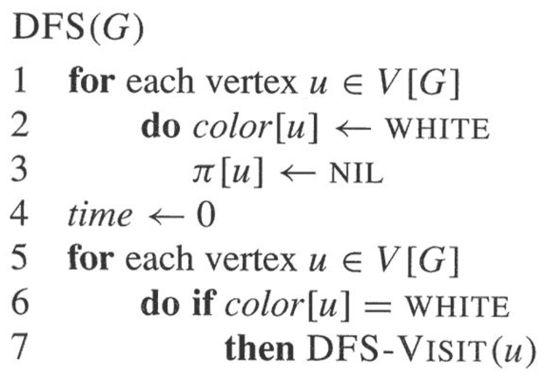
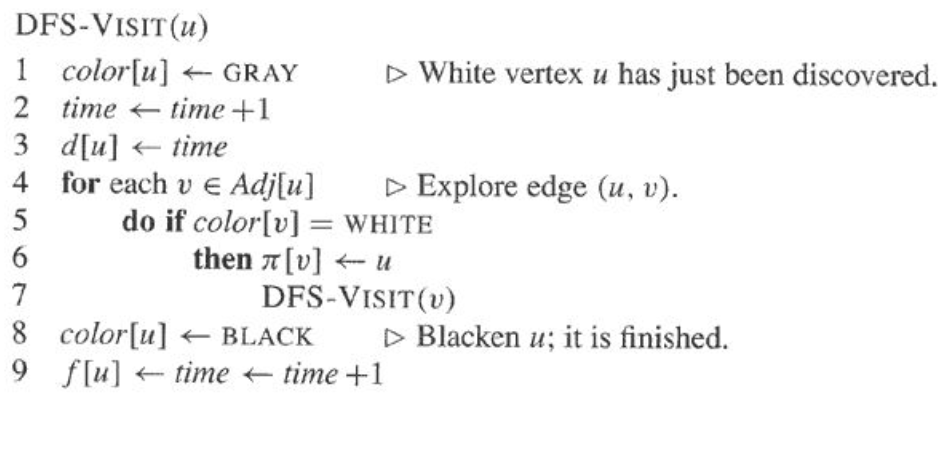
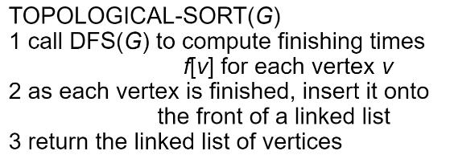

# Graph Traversal

## Breadth First Search (BFS)

- uses a queue to visit the source's neighbors first before going to their neighbors
- if it's an undirected graph, all vertices will be visited if the graph is connected
- if it's a directed graph, all vertices will be visited if it is strongly connected 

### Code

### Analysis

- $O(V+E)$
- $O(V)$ because every vertex is enqueued at most once
- $O(E)$ because every vertex is dequeued at most once
  - we examine $(u,v)$ only when $u$ is dequeued
  - therefore we examine every edge at most twice if undirected
  - at most once if directed
- BFS finds the shortest path to each reachable vertex in a graph from a given source
  - the procedure BFS builds a BFS tree

## Depth First Search (BFS)

- uses a stack to explore as far down a branch as possible before backtracking to explore other branches

### Code

### Analysis

- $\Theta(V+E)$
- similar to BFS, however this is a tight $\Theta$ since it is guaranteed to examine every vertex and edge by restarting from disconnected components
- another interesting property of DFS is that the search can be used to classify the edges of the input graph

#### DFS Edge Classification

1. **tree edges** are edges in the depth-first forest $G_\pi$
   - edge $(u,v)$ is a tree edge if $v$ was first discovered by exploring edge $(u,v)$
2. **back edges** are those edges $(u,v)$ connecting a vertex $u$ to an ancestor $v$ in a depth-first tree
   - self-loops (only in directed graphs) are considered to be back edges
3. **forward edges** are those nontree edges $(u,v)$ connecting a vertex $u$ to a descendant $v$ is a depth-first tree
4. **cross edges** are all other edges
   - they can go between vertices in the same depth-first tree, as long as 
   - one vertex is not an ancestor of the other, or
   - they can go between vertices in different depth-first trees

#### Why is this useful?

- a directed graph is acyclic if and only if a depth-first search yields no *back edges*
- in a depth-first search of an undirected graph $G$, every edge of $G$ is either a tree edge or a back edge

### Topological Sort

- a DFS can be used to perform a topological sort of a directed acyclic graph (DAG)
- a topological sort of a DAG $G=(V,E)$ is a linear ordering of all its vertices such that if $G$ contains an edge $(u,b)$ then $u$ appears before $b$ in the ordering
  - if the graph is cyclic then no linear ordering is possible
- a topological sort of a graph can be viewed as an ordering of its vertices along a horizontal line so that all directed edges go from left to right

#### Code

### Cycle Detection

$G$ has a cycle if and only if DFS detects a back edge