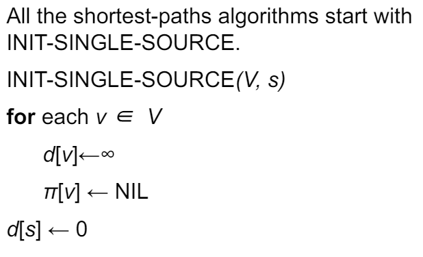
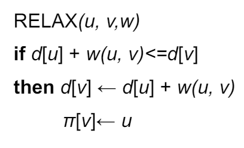
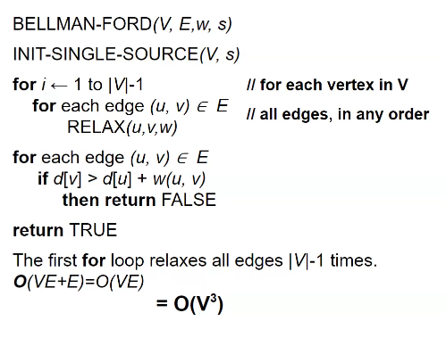
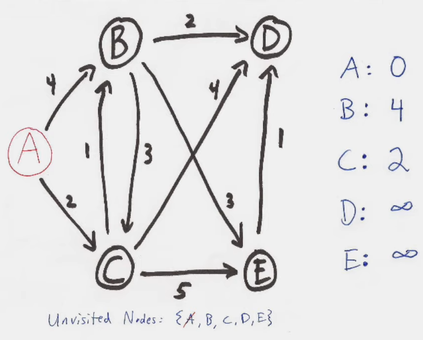
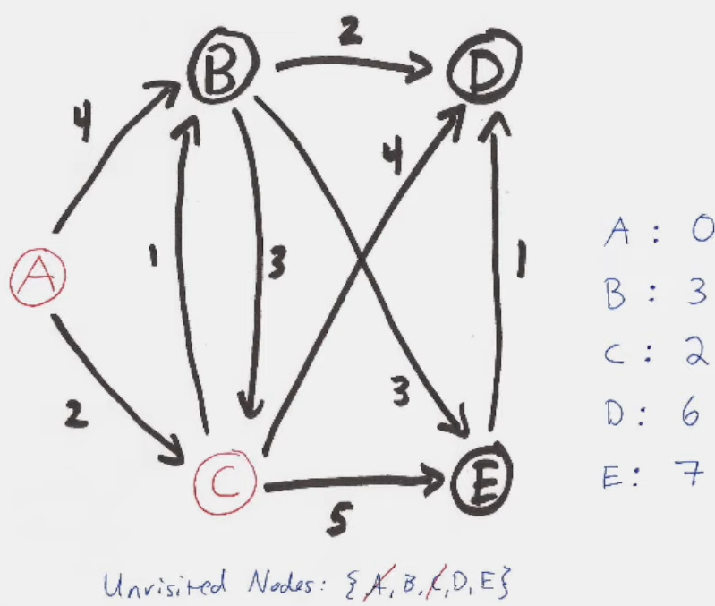
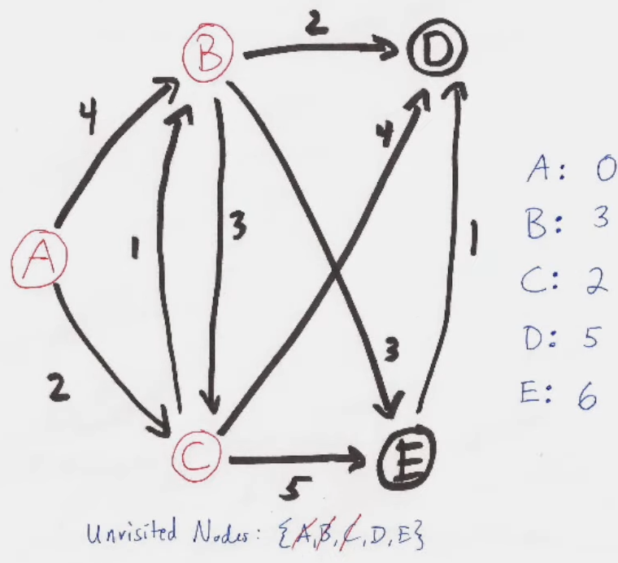
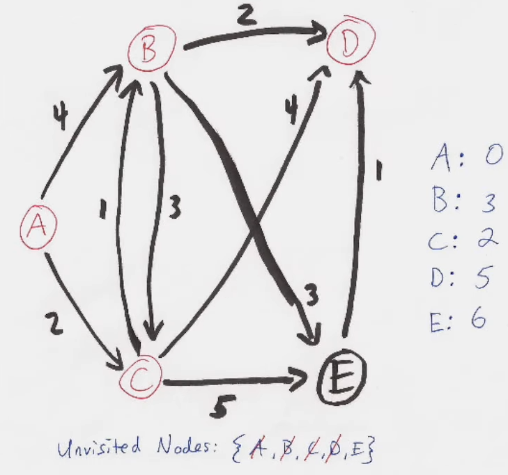
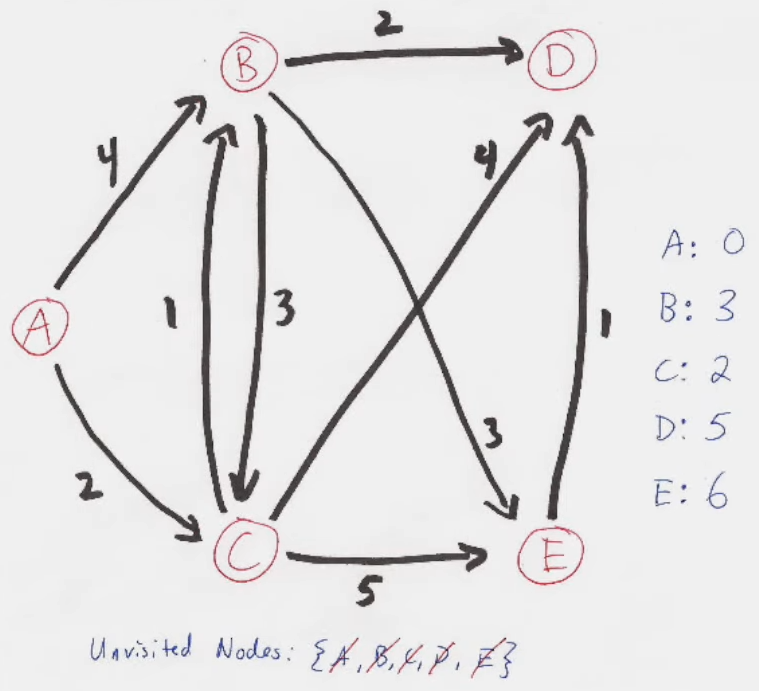

# Shortest Paths

- our input its
  - a directed graph $G=(V,E)$
  - a weight function $w:E\rightarrow \mathbb R $
- **weight of a path** $p=<v_0,v_1,...,v_k>$ is the sum of its edge weights
- **shortest path** from $u$ to $v$ is any path $p$ such that $w(p) = \delta(u,v)$

$$
\delta(u,v) = \begin{cases}
\min\{w(p): u \overset p \rightsquigarrow v|\} & \text{if a path $u \rightsquigarrow v$ exists} \\
\infin & \text{otherwise}
\end{cases}
$$

## Variants

- **single-source**: find shortest path from a given *source* vertex $s$ to every vertex $v\in V$
- **single-destination**: find shortest path to a given destination
- **single-pair**: find shortest path $u$ to $v$
  - there is no way known to solve that's better in the worst case than single-source
- **all-pairs**: find shortest path from $u$ to $v$ for all $u,v \in V$

## "Gotchyas"

### Negative-weight Edges

- they are okay so long as no negative-weight cycles are reachable form the source
  - if we have a negative-weight cycle, just keep going around it and we get $w(s,v) = - \infin$ for all $v$​ on the cycle
  - some algorithms work only if there are *no* negative-weight edges in the graph

### Can a path contain a cycle?

- a path can't contain a negative cycle because you can always loop it again to decrease the path length
- a path can't contain a positive cycle because you can remove it to decrease the path length 
- a path also can't a zero-weight cycle
- thus paths do not have cycles

## Optimal substructure

- **lemma**: any sub-path of a shortest path is also a shortest path
- **proof**: using "cut and paste"
  - suppose $p$ is a shortest path from $u$ to $v$ where $\delta(p) = w(p_{ux})+w(p_{xy})+w(p_{yv})$
  - suppose there is a shorter path $p'_{xy}$ such that $w(p'_{xy})<w(p_{xy})$
  - thus we can get a $\delta(p') = w(p_{ux})+w(p'_{xy})+w(p_{yv}) < p$ which contradicts $p$ being a shortest path

## Single Source Algorithm: Bellman Ford

- can have negative weighted edges (but no cycles)

### Variable Conventions

- $d[v]$ is a **shortest-path estimate** from the source $s$ to some $v$
  - initially $d[v]=\infin$ 
  - always maintain $d[v] \ge \delta(s, v)$
- $\pi[v]$ is the predecessor of $v$ on a shortest path from $s$
  - if there's no predecessor then $\pi[v] = \text{NIL}$ (this is also our initialization)
  - $\pi$ induces a **shortest-path tree**

### Initialization



### Relax

Can we improve the shortest-path estimate (best seen so far) for $v$ by going through $u$ and taking $(u, v)$?



### Code



```py
def bellman_ford(G, start):
    shortest_paths = {}
    for node in G:
        shortest_paths[node] = infinity
    shortest_paths[start] = 0
    size = len(G)
    for _ in range(size - 1):
        for node in G:
            for edge in G[node]:
                cost = edge[0]
                to_node = edge[1]
                if shortest_paths[node] + cost < shortest_paths[to_node]:
                    shortest_paths[to_node] = shortest_paths[node] + cost
    # iterate once more and check for negative cycle
    for node in G:
        for edge in G[node]:
            cost = edge[0]
            to_node = edge[1]
            if shortest_paths[node] + cost < shortest_paths[to_node]:
                return 'INVALID - negative cycle detected'
    return shortest_paths
```

## Single Source Algorithm: Dijkstra's Algorithm

- no negative-weight edges
- is basically a weighted version of BFS
- instead of a FIFO queue, it used a priority queue using $d[v]$​ 
- has 2 sets of vertices
  - $S$ for vertices whose final shortest-path weights are determined
  - $Q$ is a priority queue



- to pick the next vertex, pick the one that hasn't been chosen with the smallest $d[v]$​ 
- if we implement the priority queue with a binary heap
  - $O(E\text{ lg } V)$
- proving greedy choice

Greedy Choice – pick the vertex with the smallest shortest path estimate (not including the vertices we are done with)
Assume we have a solution: we know the shortest path from s to every other vertex. “S” is the set of edges in the solution. If S does not contain the greedy choice at the last step, we can remove the non-greedy last edge added to S and add the greedy choice to S and get just as good a solution.