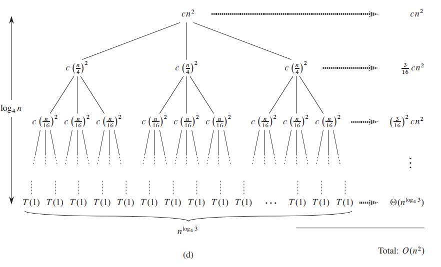
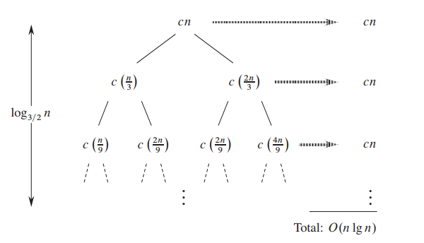

# Solving Recurrences

## Substitution Method

- comprises of 2 steps:
  1. guess the form of the solution
  2. use mathematical induction to find the constants and show that the solution works
- we substitute the guessed solution for the function when applying the inductive hypothesis to smaller values

### Example

$$
\begin{split}
T(n)& = 2T(\lfloor \frac n2 \rfloor) + n\\
T(1)& = 1
\end{split} 
$$

- *guess* that the solution is $T(n) = O(n \text{ lg } n)$^1^
- induction requires us to show that $T(n) \le cn \text{ lg } n$ for an appropriate choice of the constant $c > 0$
- assume that this bound holds for all positive $m < n$, in particular for $m = \lfloor n/2\rfloor$
- this yields $T(\lfloor n/2 \rfloor) \le c \lfloor n/2\rfloor \text{ lg } (\lfloor n/2 \rfloor)$^2^
- substitute the above ^2^ back into the original

$$
\begin{split}
T(n) & \le 2(c \lfloor n/2\rfloor \text{ lg } (\lfloor n/2 \rfloor)) +n\\
& \le cn \text{ lg } (n/2) + n \\
& = cn \text{ lg } n - cn \text{ lg } 2 + n\\
& = cn \text{ lg } n - cn + n\\
& \le cn \text{ lg } n & \text{if } c \ge 1
\end{split} 
$$

- induction also requires us to show the solution holds for the boundary conditions
  - recall [asymptotic notation](0-Asymptotic-Notation.md) requires us to prove for "sufficiently large $n$" or $n \ge n_0$​ where we get to choose what $n_0$ is
  - the base case $T(1) = 1 \cancel \le c(1)\text{ lg } (1) = 0$ goes against out hypothesis 
  - notice that for any $n>3$, our relation does not depend on $T(1)$
  - this leaves us with $n=2$ and $n=3$ that we must prove works with our hypothesis

  $$
  \begin{split}
  T(2) &= 2T(1) + 2 = 4\\
  & \le c (2)\text{ lg } (2) = 2c\\
  T(3) & = 2T(1) + 3 = 5\\
  & \le c(3)\text{ lg } (3) \approx 4.75c
  \end{split}
  $$

  - lastly, we complete the proof $T(n) \le cn \text{ lg } n $ by choosing $c \ge 2$

### *Subtracting lower-order from the guess*

$$
T(n) = T(\lfloor n/2\rfloor) + T(\lceil n/2\rceil) + 1
$$

- *guess* that the solution is $T(n) = O(n)$
- we must show $T(n) \le cn$ ^1^ for some choice of $c$
- assuming the boundary holds for all $m < n$, in particular $m = \lfloor n /2\rfloor$ and $m = \lceil n/2 \rceil$
- this yields $T(\lfloor n /2\rfloor) \le c\lfloor n /2\rfloor$ and $T(\lceil n /2\rceil) \le c\lceil n /2\rceil$ ^2^
- substituting the above ^2^ back into the original

$$
\begin{split}
T(n) &\le c\lfloor n /2\rfloor + c\lceil n /2\rceil + 1 \\
&= cn + 1
\end{split}
$$

- however, this doesn't imply $T(n) \le cn$ for any $c$
- we can solve this by *strengthening* our hypothesis to $T(n)\le cn-d$ ^3^
- again, assuming the boundary holds for all $m < n$, in particular $m = \lfloor n /2\rfloor$ and $m = \lceil n/2 \rceil$
- this yields $T(\lfloor n /2\rfloor) \le c\lfloor n /2\rfloor - d$ and $T(\lceil n /2\rceil) \le c\lceil n /2\rceil -d$ ^4^
- substituting the above ^4^ back into the original

$$
\begin{split}
T(n) &\le (c\lfloor n /2\rfloor - d) + (c\lceil n /2\rceil - d) + 1 \\
& = cn - 2d + 1\\
& \le cn -d & \text{if } d \ge 1
\end{split}
$$

---

## Recursion Tree

### Example 1

Solve the upper bound of $T(n) = 3T(\frac n4) + cn^2$.

- how far from the root do we reach $1$?
  - the subproblem for a node at depth $i$ is $\frac n{4^i}$
  - the subproblem size is $1$ when $n(\frac 14)^i=1$ or when $i = \log_4 n$
  - thus, the tree has $\log_4 n + 1$ levels (at depths $0,1,2,...,\log_4n$)
- what is the cost at each level of the tree excluding the final level?
  - each level has 3 times more nodes than the one before so the number of nodes at depth $i$ is $3^i$
  - the subproblem size reduces by a factor of $4$ for each level we go down, each node at depth $i$ for $i=0,1,2,...,\log_4n-1$ (i.e. all the levels but the last) has a cost of $c(\frac n{4^i})^2$ such that the total cost at depth $i$ is $3^ic(\frac n{4^i})^2 = (\frac{3}{16})^icn^2$
- what is the cost at the final level of the tree?
  - the final level at depth $\log_4n$ has $3^{\log_4n}=n^{\log_43}$ nodes
  - each node has a cost $T(1)$ which we can assume is a constant
  - thus, the final level of the tree has a cost of $\Theta(n^{\log_43})$ 
- what is the sum of all the costs?

$$
\begin{split}
T(n) &= cn^2 + \frac{3}{16}cn^2 + (\frac 3{16})^2 cn^2
+ ... + (\frac3{16})^{\log_4n-1}cn^2 + \Theta(n^{\log_43})\\
&= k * cn^2 + \Theta(n^{\log_43})\\
&=O(n^2)
\end{split}
$$

### Example 2

Solve the upper bound for $T(n) = T(\frac n3) + T(\frac{2n}3) + cn$.

- how far from the root do we reach $1$?

  - notice that the tree can't be balanced as some branch paths will reach further to get to $1$

  - the longer branch path will be that of $T(\frac{2n}3)$

  - using this longer branch path, the subproblem size is $1$ when $(\frac23)^in=1$ or when $i = \log_{\frac 32} n$
    $$
    \begin{split}
    i &= \log_{\frac 32}n \\
    &= \frac{\text{lg }n}{\text{lg }\frac{3}{2}}\\
    &= c \text{ lg } n\\
    &=O(\text{lg } n)
    \end{split}
    $$

- what is the cost at each level of the tree?

  - notice at every level, it is $cn$

- what is the sum of all costs?

  - if we pretend the tree is balanced (which is fine for our upper bound since we'll be overestimating)
  - there are $O(\text{lg } n)$ levels
  - each level is $cn$
  - thus, $T(n) \le O(\text{lg }n) * cn = O(n \text{ lg } n)$

---

## Master Theorem

Applicable for recurrence relations in the form of:
$$
T(n) = aT(\frac{n}{b})+f(n)
$$

> Note that master theorem only solves *some* case.

### Cases

#### Case 1

- if $f(n)=O(n^{\log_ba-\epsilon})$ for some constant $\epsilon>0$, 
- then $T(n)=\Theta(n^{\log_ba})$.

#### Case 2

- if $f(n) = \Theta(n^{\log_ba})$,
- then $T(n) = \Theta(n^{\log_ba} \text{ lg } n)$

#### Case 3

- if $f(n) = \Omega(n^{\log_ba+\epsilon})$ for some constant $\epsilon > 0$ and 
- if $af(\frac{n}{b}) \le cf(n)$ for some constant $c>1$ and sufficiently large $n$, 
- then $T(n) = \Theta(f(n))$

### Example 1

- solve the asymptotic bound of $T(n)= T(\frac{2n}3)+1$
- $a=1, b = \frac 32, f(n)=1$​
- $\log_ba=\log_{\frac32}1=0$
- we can easily show the tight bound by $f(n) = 1 = \Theta(1) = \Theta(n^0) = \Theta(n^{\log_ba})$
- this is [case 2](#case 2) such that $T(n) = \Theta(n^{\log_ba} \text{ lg } n)=\Theta(\text{lg } n)$

### Example 2

- solve the asymptotic bound of $T(n) = 3T(\frac{n}{4})+n \text{ lg } n$
- $a=3, b=4, f(n)= n \text{ lg } n$
- $\log_ba=\log_43 = 0.8$
- we can show the lower bound by $f(n) = n \text{ lg } n = \Omega(n^{0.8+0.2}) = \Omega(n^{\log_ba+\epsilon})$
  - where $\epsilon=0.2$
- this is [case 3](#case 3) such that $T(n) = \Theta(f(n)) = \Theta(n \text{ lg } n)$

### Example 3

- solve the asymptotic bound of $T(n) = 2T(\frac{n}{2})+ n^2$
- $a = 2, b = 2, f(n) = n^2$
- $\log_ba = \log_22 = 1$
- we can show the lower bound by $f(n) = n^2 = \Omega(n^{1 + 1}) = \Omega(n^{\log_ba+\epsilon})$
  - where $\epsilon=1$
- this is [case 3](#case 3) such that $T(n) = \Theta(f(n)) = \Theta(n^2)$​

---

## Extended Form of Master Theorem

$$
T(n) = aT(\frac{n}{b})+f(n)
$$

### Extended Form Cases

#### Case 1

- if $af(\frac nb) = cf(n)$ is true for some constant $c<1$,
- then $T(n) = \Theta(f(n))$

#### Case 2

- if $af(\frac nb) = cf(n)$ is true for some constant $c>1$,
- then $T(n) = \Theta(n^{\log_ba})$

#### Case 3

- if $af(\frac nb) = f(n)$ is true,
- then $T(n) = \Theta(f(n) \log_bn)$

### Methodology

1. list values of $a,b,f(n)$
2. plug $a,b$ in to evaluate $af(\frac nb)$
3. set $af(\frac nb)=cf(n)$ and solve for $c$
4. match the value of $c$ to the above [cases](#Extended Form Cases)

### Example

- solve the asymptotic bound of $T(n) = 3T(\frac n2)+n$
- $a=3,b=2,f(n)=n$

$$
af(\frac nb) = cf(n)\\
\frac 32n = cn\\
c = \frac 32\\
c > 1
$$

- this is <u>case 2</u> such that $T(n)=\Theta(n^{\log_ba}) = \Theta(n^{\text{lg } 3})$ 

