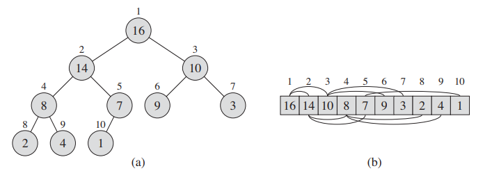

# Heap Sort

## Heaps 🧺

### Binary Heap



- a binary heap is an almost complete binary tree that is stored in an array
  - we will use a variable `size` to determine which parts of the array constitue the heap
- given index `i`, the following can be used to calculate a node's parent and left / right children

```ts
const parent = (i: number) => Math.floor(i / 2) + 1;
const left = (i: number) => 2 * i + 1;
const right = (i: number) => 2 * i + 2;
```

### Max Heap Property

For any node $i$ (excluding the root), $A[\text{parent}(i)] \ge A[i]$.

## Code

### `maxHeapify`

```ts
function maxHeapify(A: number[], i: number, size: number) {
    const l = left(i);
    const r = right(i);
    let largest: number;
    // find the largest tree
    if (l < size && A[l] > A[i]) largest = l;
    else largest = i;
    if (r < size && A[r] > A[largest]) largest = r;
    if (largest != i) {
        // swap
        swap(A, i, largest);
        // recurse
        maxHeapify(A, largest, size);
    }
}
```

- `maxHeapify` assumes that the trees at `left(i)` and `right(i)` are already max heaps, but the property is violiated at `i`
- it finds the largest of the two children and swaps with the parent `i`. Then it recurses down the child branch it swapped with
- it terminates when `i` is already the largest

### `buildMaxHeap`

```ts
function buildMaxHeap(A: number[]) {
    for (let i = parent(A.length - 1); i >= 0; i--) {
        maxHeapify(A, i, A.length);
    }
    return A.length;
}
```

- takes an array `A` and builds a max heap out of it
- it returns the `size` of the heap 
  - which is just `A.length` since a max heap was built using the entire array

### `heapSort`

```ts
function heapSort(A: number[]) {
    let size = buildMaxHeap(A);
    for (let i = A.length - 1; i > 0; i--) {
        swap(A, 0, i);
        size--;
        maxHeapify(A, 0, size);
    }
}
```

- starting from the lastmost element, we swap it with the root of the tree
  - where the root was previously the largest element the tree as a result of the max heap property
- next, we decrement the size of the heap as the element last swapped with is the next largest element
- finally we call `maxHeapify` to correct for the swapped element in the root
  - notice that the root's left and right children are *still* max heaps as we excluded the largest element from our heap using `size--`

## Correctness

## Runtime Analysis

### [Max Heapify](#maxHeapify)

- [children subtrees have a size of at most $\frac {2n}3$​](https://stackoverflow.com/questions/9099110/worst-case-in-max-heapify-how-do-you-get-2n-3) such that we can describe the recurrence relation as

$$
T(n) \le T(\frac{2n}3) + \Theta(1)
$$

- we can solve this using the [master thereom](3-Solving-Recurrences.md#Master Theorem)

$$
a = 1, b = \frac{3}2, f(n) = \Theta(1)\\
\log_aa = \log_\frac321 = 0 \\
f(n) = \Theta(1) = \Theta(n^0) =\Theta(n^{\log_ba})
$$

- this is <u>case 2</u> such that $T(n) = \Theta(n^0 \text{ lg }n) = \Theta(\text{lg } n)$
- alternatively, you can characterize the runtime on the height of  a binary tree which would be $\text{lg } n$

### [Build Max Heap](#buildMaxHeap)

- each call to `maxHeapify` is $O(\text{lg } n)$
- $n$ of these calls are made such that the upper bound is $O(n \text{ lg } n)$
- *we can show a tight bound but I don't feel like it* 🙂

### [Heap Sort](#heapSort)

- if we put the previous stuff together we get

$$
\begin{split}
T(n) &= O(n \text{ lg } n) + O(n \text{ lg } n) + O(1)\\
&= O(n \text{ lg } n)
\end{split} 
$$

- the nice thing about heap sort is that we can sort in place meaning only a constant number of array elements are stored outside the input array
  - notice in [merge sort](2-Merge-Sort.md) we do not have this feature
