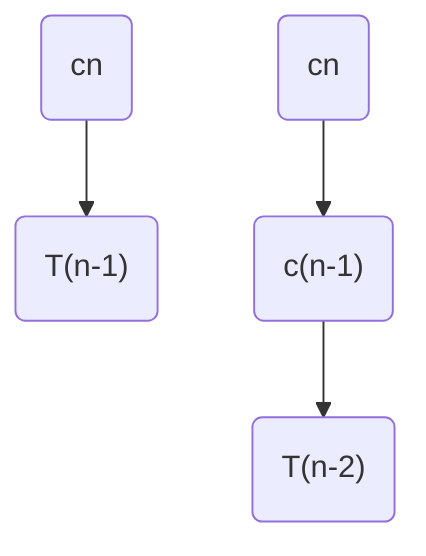
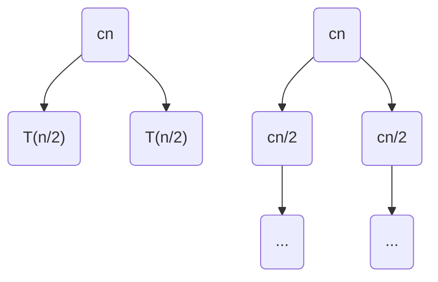

# Quicksort

## Code

```ts
function quicksort(A: number[], p: number, r: number) {
    if (p < r - 1) {
        const q = partition(A, p, r);
        quicksort(A, p, q);
        quicksort(A, q + 1, r);
    }
}

function partition(A: number[], p: number, r: number): number {
    const x = A[r - 1];
    let i = p - 1;
    for (let j = p; j < r - 1; j++) {
        if (A[j] < x) {
            i++;
            swap(A, i , j);
        }
    }
    swap(A, i + 1, r - 1);
    // return the pivot's index
    return i + 1;
}
```

## Design

- pick one element as the pivot from the array
  - in our case, it is `A[r]` the last element of the array
- partition the array into 2 subarrays
  - where all elements in the left subarray are less than or equal to the pivot
  - and all elements in the right subarray are greater than or equal to the pivot
- in both subarrays, recursively partition them
- notice `pivot` sorts in place so no extra space is needed

## Runtime Analysis

$$
T(n) = T(a) + T(b) + \Theta(n)
$$

- where $\Theta(n)$ is the complexity of `partition`
- $a$ is the elements in the left subarray and $b$ is the elements in the right subarray after partition finishes

### Worst Case

$$
\begin{split}
T(n) &= T(n - 1) + T(0) + \Theta(n)\\
&= T(n-1) + cn
\end{split}
$$

The worst case partition is that we have $n-1$ elements in the left subarray but $0$ in the right (meaning we happened to pick the largest element as our pivot).



The recursion tree has a depth of $n$ giving us the sum of $cn + c(n-1) + ... + c$ or $c n\frac{1(n+1)}{2} = \Theta(n^2)$​.

### Best Case

$$
\begin{split}
T(n) &= 2T(\frac n2) + \Theta(n)\\
&= 2T(\frac n2) + cn
\end{split} 
$$

The best case is that our partition has an equal number of elements on both sides of the array.



The recursion tree has a depth of $\text{lg } n$ with each layer having a cost of $cn$ giving us a total of $cn \text{ lg } n$ or $\Theta(n \text{ lg } n)$

### Average Case

- the average case will also be $\Theta(n \text{ lg } n)$
- notice that regardless of the split such as $\frac13\frac23$ split or $\frac1{10}\frac9{10}$ split, the asymptotic bound will also be $O(n \text{ lg } n)$