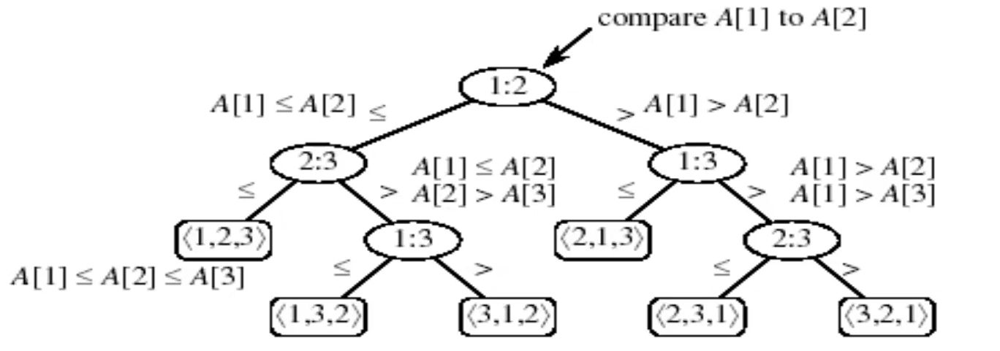

# Lower Bound on Sorting

Claim: when using **comparison sorts** (i.e. insertion sort, merge sort, heapsort, quicksort, etc...) we must make *at least* $n \text{ lg } n$ comparisons in the general case.

## The Decision Tree Model

- an abstraction of any comparison sort
- represents comparisons made by a specific algorithm on inputs of a given size

- each internal node is labeled by indices of array elements from their original position
- each leaf is labeled by the permutation of orders that the algorithm determines

### Lower bound of the tree

The lower bound of the height of the tree is $n \text{ lg } n$.
