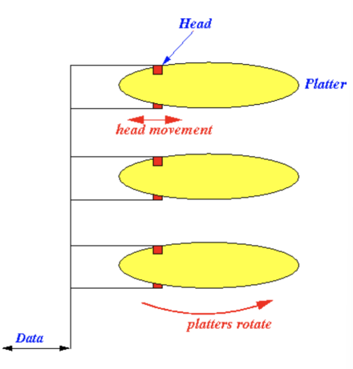
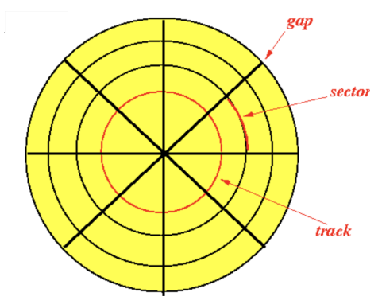
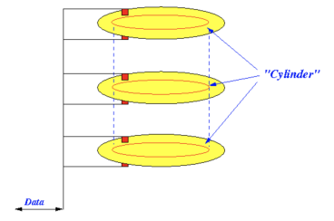

# Hardware

[toc]

How a DBMS deals with large amount of data efficiently:

- how a system stores / manages very large volumes of data?
- what representations and data structures best support efficient manipulations?

## Disk-Oriented Architecture

- the Disk-Oriented Architecture is a fundamental approach in a DBMS 
- the DBMS assumes that the primary storage location of the database is on non-volatile storage (HDD, SSD)
  -  the database is stored in a file as a collection of fixed length blocks called **pages** on disk
- the DBMS's components manage the movement of data between non-volatile and volatile storage
  - the system uses an in-memory (volatile) buffer pool to cache blocks fetched from disk

## Classification of Physical Storage Media

### Volatile Storage

- **volatile** means that if you pull the power from the machine, then the data is lost
- supports fast *random  access* with *byte-addressable* locations
  - the program can jump to any byte address and get the data there
- this storage is often referred to as just **memory** or *RAM*

### Non-Volatile Storage

- **non-volatile** means that the storge device doesn't need to be provided continuous power to retain data
- **block** or **page** addressable
  - to read a value at a particular offset, the program first has to load the page into memory that holds the value the program wants to read
  - retrieval time **depends upon the location of the disk** 
  - **relative placement of pages on disk** impacts DBMS performance
- usually better at *sequential access* or reading contiguous chunks of data
- this storage is often referred to as **disk**

#### Disk

- the goal of DBMS is to support databases that exceed the amount of memory available
  - **READ** transfer data from disk → memory 
  - **WRITE** transfer data from memory → disk
  - these are expensive!

- a disk contains multiple **platters** or *circular hard surface where data is stored by inducing magnetic changes*
- platters rotate 7200 - 15000 RPM (rotations per minute)
- the disk contains read/write heads that allow to read/write from all surfaces simultaneously
  - all heads move at the same time (in or out)

- the surface of the platter is divided into circular **tracks**
- each track is divided into **sectors** which are separated by blanks spaces called **gaps**
  - gaps are non-magnetic and used to identify the start of sectors
  - a sector is the smallest unit of data that can be read or written (usually 512 bytes)
  - usually 500 - 1000 sectors on inner track and 1000 - 2000 on outer track
- a **disk block** or **page** (a logical unit) is composed of a number of consecutive sectors (determined by OS)
  - data are read written in units of a disk block
  - disk block is same size as memory block or page
  - block size is usually 4K - 64K bytes

#### Cylinder

- the tracks that are under the heads at the same time form a **cylinder**
  - cylinder $i$ consists of the $i$^th^ track of all the surfaces
  - the disk head does not need to move when accessing data on the same cylinder

#### Disk Storage Characteristics

- $\text{number of cylinders} = \text{tracks per surface}$ (where a surface is a platter)
  - i.e. if we have 10 tracks then we have cylinder 0 through cylinder 9
- $\text{tracks per cylinder} = \text{number of heads} = 2 \times \text{number of platters}$

