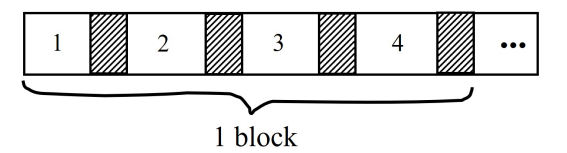

# Access Times

[toc]

## Accessing the Disk

- the time taken between the command to read the block is issued and the time the contents of the block appear in memory is called ==latency of the disk== or ==access time==
- steps to access data on a disk
  1. move the disk heads to the desired cylinder ($\text{seek time}$)
  2. wait for the desired sector to arrive under the disk head ($\text{rotational delay}$)
  3. transfer the data from the sector to main memory $\text{transfer time}$

$$
\text{access time} = \text{seek time} + \text{rotational delay} + \text{transfer time} + \text{other delay}
$$

- $\text{other delay}$ includes:
  - CPU time to issue I/O
  - contention for controller
    - different programs can be using the disk
  - contention for bus, memory 
    - different programs can be transferring data
  - usually the delays are negligible; $\text{other delay} = 0$
- $\text{seek time}$ is time to position the read/write head at the proper cylinder 
  - this includes the time required for the head to physically move and for the drive's electronics to settle
  - $\text{seek time}$ can be 0 if the heads happen to already be at the proper cylinder 
  - the ==average seek time== is often used to characterize the speed of the disk
- $\text{rotational delay}$ is the time for the disk to rotate so the right sector is at the head's position
  - the ==average rotational delay== is the time for a $\frac{1}2$ revolution
  - for example, given a total revolution of 7200 RPM

$$
\text{one rotation} = \frac{1 \text{ min}}{7200} \times \frac{60 \text{ sec}}{1 \text{ min}} \times \frac{1000 \text{ ms}}{1 \text{ sec}} \approx 8.33 \text{ ms} \\
\text{average rotational latency} = 8.33 / 2 \approx 4.16 \text{ ms}
$$

-  $\text{transfer time}$ is the time it takes to read / write the actual data from / to disk (after the read/write head and track are positioned)
  - i.e. the time it takes the sectors of the block & the gaps between them to rotate past the head (read & write)
  - influenced by *data transfer rate* & size of the data
- ==data transfer rate== is the rate at which data can be retrieved from or stored in the disk
  - number of bits transferred per second

$$
\text{transfer time} = \frac{\text{block size}}{\text{transfer rate}}
$$

> - the $\text{seek time}$ & $\text{rotational delay}$ dominate the $\text{access time}$
> - the key is to lower the *I/O cost* (i.e. reduce  $\text{seek time}$ & $\text{rotational delay}$)

## Arranging Blocks on Disk

- so far we covered random access for *one* block; what about the *next* block?
- blocks in a file should be arranged sequentially on disk to minimize seek and rotational delays
- for a *sequential scan*, *pre-fetching* several blocks at a time is a big win
- time to get blocks should be proportional to the size of blocks; and seek time and rotational latency become trivial

$$
\text{time to get block} = \frac{\text{block size}}{\text{transfer rate}} + \text{negligible}
$$

- $\text{negligible}$ includes:
  - skip gap
  - switch track
  - one in a while, next cylinder

### Sequential Access Pattern

- ==sequential access pattern==
  - successive requests are for successive disk blocks
  - disk seek required only for first block
- random access pattern is poor because successive requests are for blocks that can be anywhere (i.e. too many seeks)

### Cost of Writing is similar to Reading

Unless you want to verify then add another rotation

### Modifying a Block

- to modify a block you must:
- read block to memory, modify in memory, write block back to disk, and *maybe verify?*

## Example: Megatron 747 Disk 

- rotate at 3600 RPM
- 1 surface
- 16 MB MiB usable capacity (this excludes the gaps)
  - $2^{20}*16 =2^{24} \text{ bytes}$
- 128 cylinders 
  - $128=2^7$
- seek time:
  - average is $25 \text{ ms}$
  - adjacent cylinders is $5 \text{ ms}$
- 1 KB block is 1 sector
  - $2^{10} * 1 = 2^{10} \text{ bytes}$ 
- 10% overhead between blocks (gaps)
  - 90% useful data (sectors)

$$
\text{bytes per cylinder} = \frac{\text{total capacity}}{\text{number of cylinders}} = \frac{2^{24}}{2^7}=2^{17} \text{ bytes}\\
\text{blocks per cylinder} = \frac{\text{bytes per cylinder}}{\text{size of block}} = \frac{2^{17}}{2^{10}} = 2^7 \text{ blocks per cylinder}\\
\text{time for 1 revolution} = \frac{1 \text{ min}}{3600 \text{ rev}} \times \frac{60 \text{ sec}}{1 \text{ min}} \times \frac{1000 \text{ ms}}{1 \text{ sec}} = 16.66 \text{ ms}\\
\text{time over useful data} = 16.66 * 0.9 = 14.99 \text{ ms}\\
\text{time over gaps} = 16.66 * 0.1 = 1.66 \text{ ms}\\
\text{transfer time for 1 block} = \frac{\text{time over useful data}}{\text{blocks per cylinder}} = \frac{14.99}{2^7} = 0.117 \text{ ms} \\
\text{transfer time for 1 block with gap} = \frac{16.66}{2^7} = 0.13 \text{ ms} \\
\\
\text{access time} (T_1) = \text{seek time} + \text{rotational delay} + \text{transfer time}\\\\

25 + \frac {16.66} 2 + 0.117 = 33.45  \text{ ms}
$$

- where access time $T_1$ is time to to read one random block (where a block is made of 1 sector)
- note that we use 0.117 (the time for 1 block *without* the gap) because this is *transfer time* so we only care about the useful data we're reading
- supposed OS deals with 4 KB blocks and our sectors are 1 KB

- the access time $T_4$ is

$$
25 + \frac{16.66}{2} + 0.117 \times 1 + \\
0.13 \times 3 = 33.83 \text{ ms}
$$

- where the first term is to read the first *random* sector and the next term is the 3 following sequential sectors