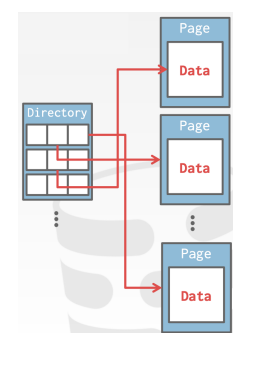

# Database Storage Part 1

[toc]

## System Design Goals

- allow the DBMS to manage databases that exceed the amount of memory available
- since reading / writing to disk is expensive, it must be managed carefully to avoid long stalls
- random access on disk is usually much slower than sequential access, so the DBMS will want to maximize sequential access

## Disk-Oriented DBMS Overview

- the database is all on a disk and the data in database files are organized into ==pages== with the first page being the ==page directory==
- to work on data, the DBMS needs to bring the data into memory
- this is achieved through the utilization of a ==buffer pool== which manages the bi-directional transfer of data between the disk and memory 
- the ==execution engine== executes queries
  - requests a particular page from the buffer pool, which then handles the task of  fetching the page into memory
  - subsequentially, the buffer pool provides the execution engine with a ==memory-based pointer== to the requested page
- the ==buffer pool manager== keeps these pages in memory while the execution engine operates on them, ensuring efficient data access   

## Why not use the OS?

- DBMS tends to prefer managing task independently due to its deeper understanding of accessing data / executing queries
- this approach often yields to superior results as compared to relying on OS

## File Storage

- in its most basic form, a DBMS stores a database as files on disk
- some may use a file hierarchy, other may use a single file (i.e. SQLite)
  - the OS doesn't know anything about these files
  - only the DBMS knows how to decipher their content
  - these files will be stored on the top of the file system supported by OS 
- the DBMS will rely on the file system to provide basic read / write operations

### Storage Manager

- the DBMS's ==storage manager== is responsible for maintaining a database's files on disk
  - some storage managers even handle their own schedule for read and write operations
- it organizes the files as a collection of ==pages== 
  - tracks data read / written to pages
  - tracks the available space

### Database Pages 

- the DBMS organizes the database across one or more files in fixed-sized blocks of data called ==pages== 
- a page is a fixed-size block of data
  - it can contain different kinds of data (tuples, meta-data, indexes, log records)
  - most systems do not mix page types within pages
  - most systems require a page to be ==self-contained== meaning all the information needed to read a page is on the page itself 
- each page is given a unique internal identifier called a ==page ID== generated by the DBMS 
  - to map these IDs to their physical locations, which include file paths and offsets, the DBMS employs an indirect layer
- there are 3 different notations of *pages* in a DBMS:
  1. ==Hardware Page== (usually 4 KB)
     - this is a physical unit of storage
     - different storage devices have varying page sizes
  2. ==OS Page== (usually 4 KB)
     - this is a unit that the OS uses for various management and memory allocation stuff
  3. ==Database Page== (512 B - 16 KB)
     - this is the unit of data storage in the DBMS system itself
     - different DBMS may adopt different sizes for their pages
- a hardware page is the largest block of data that a storage device can guarantee ==failsafe writes==
  - the storage device guarantees an atomic write of the size of the hardware page (either the amount is written or non at all)
  - when a database page size exceeds the hardware page size, additional measures from the DBMS are necessary

### Page Storage Architecture

- within a DBMS, the challenge lies in locating a specific page on the disk based on its *page ID*
- here are common ways DBMS manage pages files on disk:
  - ==Heap File Organization==
    - this involves storing data pages in an *unordered manner*
    - data is simply appended as it arrived without specific ordering
  - ==Sequential / Sorted File Organization==
    - data pages are arranged in a sequential or ordered manner based on certain criteria such as a primary key
    - this can speed up certain types of queries and enable range-based access
  - ==Hashing File Organization==
    - data pages are distributed across the disk using a hash function
    - this aims to distribute data an optimize retrieval through calculated hash values
  - ==Tree File Organization==
    - data pages are structured in tree-like structures (such as B-trees or B^+^-trees) to facilitate efficient search, iteration, and deletion operations

### Database Heap

- a ==heap file== is an unordered collection of pages where tuples are stored in random order
  - must support iterating over all pages ensuring comprehensive access to stored data (i.e. if you need data on the `Students` table, the heap file will know which pages to scan)
- when dealing with multiple files, metadata is essential to track existing pages and available space
- heap files can be represented in 2 primary ways
  - **linked list**
    - header page holds pointers to a list of free pages and a list of data pages
  - **page directory**
    - DBMS maintains dedicated pages to track data page locations and available space
- the DBMS can locate a page on disk given a page ID through either a linked list / page directory

#### Heap File: Linked List

- maintain a header page at the beginning of the file that stores 2 pointers
  - the head of the *free page list*
  - the head of the *data page list*
- each page keeps track of how many free slots they currently have
- however, when the DBMS needs to locate a specific page, it has to do a sequential scan across the data page list until the desired page is found
  - or if it needs a specific amount of space, it needs to do a scan on the free list until a page is found with enough space

#### Heap File: Page Directory

- the DBMS maintains ==directory pages== that tracks the location of data pages within the database files
- the directory also keeps a record of available free slots
- the DBMS has to make sure the directory pages are in sync with the data pages
  - this guarantees the information in the page directory accurately reflects the state of the data pages

