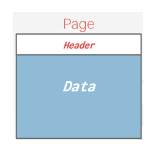
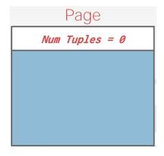
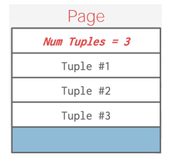
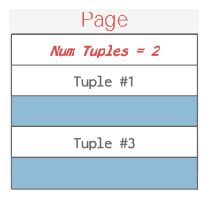
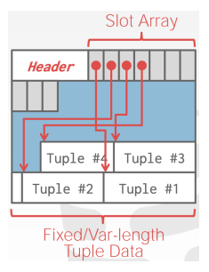
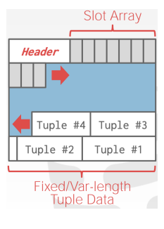
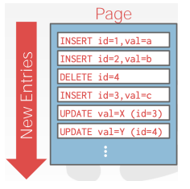
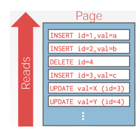

# Page Layout

[toc]

- every page includes a ==header== section that records metadata about the page's content
  - page size
  - checksum for data integrity
  - DBMS version
  - transaction visibility details
  - compression-related information
- some systems require pages to be *self-contained*
  - all the required information to understand and interpret the page’s contents is present within the page itself

- assume we are only storing tuples
- there are 2 approaches to laying out data in pages:
  1. tuple-oriented
  2. log-structured

## Tuple Storage

- ==Strawman Idea== keep track of the number of tuples in a page an then just append a new tuple to the end
  - page header stores tuple count on the page
  - new tuples are added by placing them at the end of the page after existing tuples so long as there is room
- this works great for fixed length tuples
  - however problems arise when tuples are deleted or when tuples have variable-length attributes

## Slotted Pages

- the most common layout scheme is called ==slotted pages== 
- a ==slot array== keeps track of the start position of each tuple
  - i.e. maps the offset where the tuples start
- the header keeps track of:
  - the number of used slots
  - the offset of the starting position of the last slot used
  - the slot array
- to add a tuple, the slot array grows from the beginning to end and the data of the tuples grow from the end to the beginning
- the page is considered full when the slot array and tuple data meet

## Log-Structured File Organization

- instead of storing tuples in pages, the DBMS only stores ==log records==
  - the information on *how the tuple was created or modified*
- the system appends log records to the file of how the database was modified (insert, update, & delete)
- to read a record, the DBMS scans the log backwards and *recreates* the tuple to find what it needs
- this has fast writes, but potentially slow reads
- periodically compact the log
  - i.e. if it had a tuple and then made an update to it, it could compact it down to just inserting the tuple
  - the issue with this is *write amplification* (re-writes the same data over and over) 

