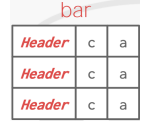

# Tuple Layout

[toc]

- a tuple is a sequence of bytes
- its the DBMS's job to interpret those bytes

## Tuple Header

- each tuple is prefixed with a **tuple header** that contains metadata
  - data about reading the tuple
  - visibility information (concurrency control)
  - bit map for NULL values
    - an array that indicates which attributes have NULL values 
- note that the DBMS does not need to store metadata about the schema of the database here

## Tuple Data 

- attributes are usually stored in the order you specify when you create the table
- this is done to simplify data management, query processing, and maintenance of the data structure
- most DBMS enforce a limit on the size of the tuple ensuring it doesn't exceed the size of a page 

### Denormalized Tuple Data

- if  2 tables are related (i.e. have a common attribute that links them) the DBMS can "pre-join" or **denormalize** them; so the tables end up on the same page 
- instead of storing related data in separate pages, the DBMS can decide to physically store related tuples from both tables on the same page
  - potentially reduces amount of I/O for common workload patterns (DBMS just loads 1 page instead of 2)
  - can make updates more expensive

 → 

### Record ID

- the DBMS needs a way to keep track of individual tuples (each is assigned a unique **record indentifier**)
  - most common: `record_ID = page_ID + offset` where `offset` gives the location of the tuple within the page 
  - typically, `page_ID = file_ID + block_offset` where `block_offset` gives the location of the block within the block
- an application **cannot** rely on the IDs for anything meaningful 

