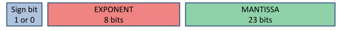
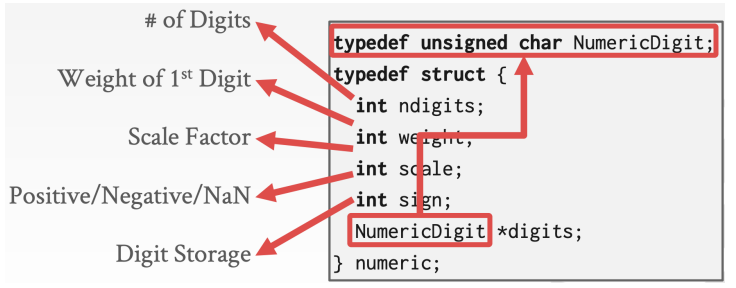

# Data Representation

[toc]

## Tuple Storage

- a **tuple** is a sequence of bytes (i.e. byte arrays)
- its up to the DBMS to know how to interpret those bytes
- the **DBMS's catalogs** contain the schema information about tables that the system uses to figure out the tuple's layout

### Data Representation

#### IEEE-754 Standard Floating Point Representation

- specifies a format for representing real numbers, the sign bit, exponent, and mantissa (fractional part) 
- example of 32-bit:



- where the number is represented as `(sign) 1.(mantissa) * 2^(exponent)`

#### How DBMS Stores the Bytes for a Value

- [`INTEGER | BIGINT | SMALLINT | TINYINT`](#Integers)
  - native C / C++ representation
- [`FLOAT | REAL`](#Variable Precision Numbers) vs [`NUMERIC | DECIMAL`](#Fixed Point Precision Numbers)
  - [IEEE-754 Standard](#IEEE-754 Standard Floating Point Representation) / Fixed-point Decimals
- [`VARCHAR | VARBINARY | TEXT | BLOB`](#Variable Length Data )
  - header with length, followed by data bytes
- [`TIME | DATE | TIMESTAMP`](#Dates and Times)
  - 32 / 64-bit integer of (micro)seconds since Unix epoch

#### Integers 

- most DBMS store integer in native C / C++ types specified by the IEEE-754 standard
  - these values are fixed length

#### Variable Precision Numbers

- these are inexact variable precision numeric types that uses native C / C++ types
- stores directly specified by the IEEE-754 standard
  - these values are also fixed length
  - they can have *rounding errors* as some numbers can't be represented precisely in binary floating-point format
  - <span style="color:orange">as a result, calculations may yield slightly inaccurate results</span>
    - to avoid this issue, we use [Fixed-Point Precision Numbers](#Fixed Point Precision Numbers)

```c
# include <stdio .h>
int main (int argc , char * argv []) {
    float x = 0.1;
    float y = 0.2;
    printf("x+y = %.20 f\n", x + y );
    printf("0.3 = %.20 f\n", 0.3);
}
// Output
// x + y = 0.30000001192092895508
// 0.3 = 0.29999999999999998890
```

#### Fixed Point Precision Numbers

- numeric data types with arbitrary precision and scale
- <span style="color:orange">used when round errors are unacceptable</span>
- typically stored in an exact, variable-length binary representation with additional meta-data that specifies the length of the data and the position of the decimal point
  - similar to `VARCHAR`



#### Variable Length Data 

- these represent data types of arbitrary length
  - an array of bytes
- has a header that keeps track of the length of the string to make it easy to jump to the next value
- it may also contain a checksum for the data

##### Large Values

- two common approaches to handle such cases are: 
  - overflow page
    - stored in the main DBMS file as a new page
  - external storage
    - store in an external file

#### Dates and Times

- common approach is to represent dates and times as the number of (micro/milli) seconds since the Unix epoch

---

# System Catalog

- in order for the DBMS to be able to decipher the contents of tuples, it maintains an internal catalog to tell it metadata about the databases 
- the metadata will contain what tables and columns the database have along with their types and orderings of the values
- almost every DBMS stores their database's catalog in itself in the format that they use for their tables
  - they use special code to **bootstrap** these catalog tables (wrap low-level access methods to access the catalog)
- you can query the DBMS's internal `INFORMATION_SCHEMA` catalog to get information about the database 
  - ANSI standard set of read-only views that provide information about all tables, views, columns, and procedures in a database 
