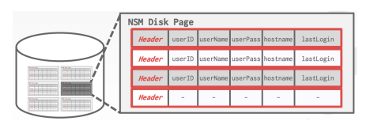
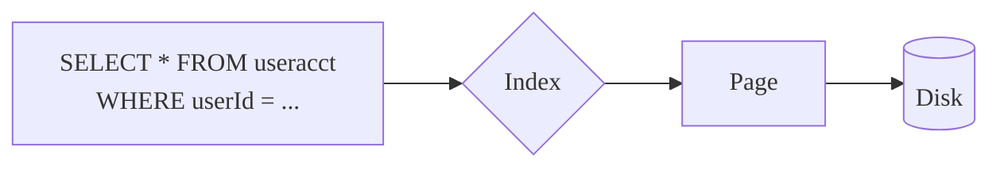
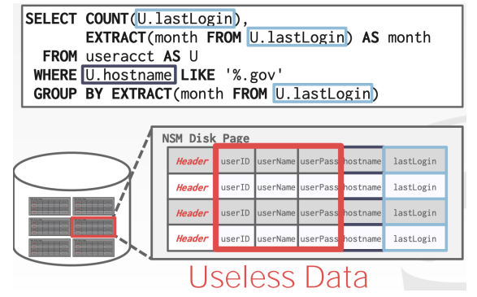
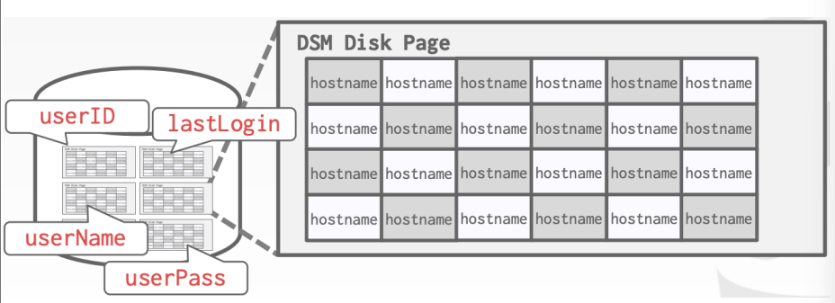
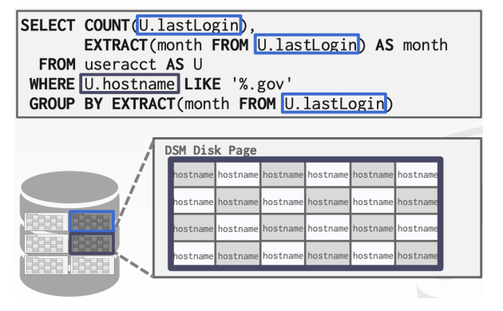
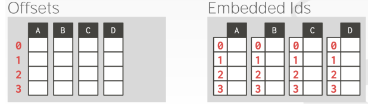
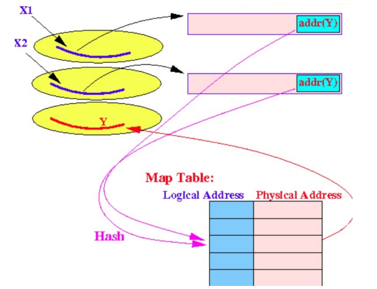
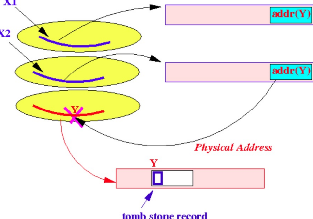

# Storage Models

[toc]

- ways to store tuples in pages
- ==workloads== are the general nature of requests a system will have to handle

## Workloads

### On-line Transaction Processing OLTP

- workload for simple queries that read / update a small amount of data that is related to a single entity in the database 
- fast, short running operations
- simple queries that operate on a single entity at a time
- typically handle more writes that reads
- repetitive operations
- example:
  - users had things to their cart
  - they can make purchases
  - but actions *only* affect their accounts

### On-line Analytical Processing OLAP

- complex queries that read large portions of the database spanning multiple entities
- you execute these workloads on the data you have collected data from OLTP applications
- long running, more complex queries
- example:
  - computing the five most bought items over one month period for these geographical locations

### Hybrid Transaction + Analytical Processing HTAP

- a new type of workload which has become popular 
- tries to do OLTP and OLAP together on the same database 

## Data Storage Model

- there are different ways to store tuples in pages
- the DBMS can store tuples in different ways that are better for either OLTP or OLAP

### $n$-ary Storage Model NSM

- the DBMS stores all attributes for a single tuple contiguously in a single page

- ideal for OLTP workloads where requests are insert-heavy and transactions tend to operate only an individual entity
  - it takes only one fetch to be able to get all the attributes for a single tuple  

- however, when queries are long and complex, multiple fetches will need to be performed 
  - and most of the data in blocks fetched is useless

#### Summary

| Advanages | Disadvantages             |
| ---------------------------------------------- | ------------------------------------------------------------ |
| fast inserts, updates, and deletes             | not good for scanning large portions of the table and / or a subset of attributes |
| good for queries that need the entire tuple    | this is because is **pollutes** the buffer pool by fetching data that is not needed for the query |

### Decomposition Storage Model DSM

- a.k.a. ==column store==
- DBMS stores the values of a single attribute for all tuples contiguously in a page

- ideal for OLAP workloads where read-only queries perform large scans over a subset of table attributes 

#### Stitching: Putting the Tuples Back Together

- there are two approaches ([Fixed-Length Offsets](#Fixed-Length Offsets) is more common)

##### Fixed-Length Offsets

- assuming all attributes are *fixed-length*
  - the DBMS can compute the offset of the attribute for each tuple
  - when the system wants the attribute of a specific tuple, it knows how to jump to that spot in the file from the offset
- to accommodate *variable-length* fields, the system can
  - ==Offset== or pad fields so that they are all the same length
  - ==[Embedded IDs](#Embedded Tuple IDs)==

##### Embedded Tuple IDs

- instead of fixed-length offsets, each column contains embedded tuple IDs or pointers that indicate the position or identity of the tuple they belong to
- these embedded IDs link the values across columns, allowing the DBMS to reconstruct the tuple by following the tuple IDs across columns
- *note* this method has a large storage overhead as it needs to store a tuple ID for every attribute entry

#### Summary

| Advanages               | Disadvantages             |
| ------------------------------------------------------------ | ------------------------------------------------------------ |
| reduces the amount of wasted I/O because the DBMS only reads the data that it needs | slow for point queries, insets, updates, and deletes because of tuple splitting / stitching |

## Modification of Tuples

### Insertion

- ==easy case== tuples with fixed length and not in sequence (unordered)
  - insert new tuple at end of file
  - or, in a *deleted* slot if one is available 
- ==little harder== tuples with variable size
  - reusing space may not always be possible, leading to fragmentation 
    - there maybe empty spaces scattered throughout the storage
    - this can impact efficiency
- ==difficult case== tuples are in sequence (ordered)
  - find position and slide following tuples to make room
  - if tuples are sequenced by linking, insert [overflow blocks](3.4-Data-Representation+System-Storage.md#Large-Values) (if there isn't enough space in the current block)

### Deletion

- options
  - delete and immediately reclaim space by shifting other tuples or removing overflows
    - more space efficient
  - mark deleted and list as free for re-use
    - may need a chain of deleted tuples (to scan for re-use)
    - need a way to mark
    - better preformance
- trade-offs
  - how expensive is immediate reclaim?
  - how much space is wasted if we don't immediately reclaim?

#### Concerns about Deletions

- say that records $X_1, X_2$ both have a reference to record $Y$ using its *physical address*
- if $Y$ is deleted, then all other records that reference $Y$ (i.e. $X_1,X_2$) will need to be updated
- there are 2 solutions:
  - [Logical Addressing](#Logical Addressing)
  - [Tombstone Records](#Tombstone Records)

##### Logical Addressing

- instead of physical, use logical addresses where $X_1,X_2$ reference a logical address in a map table
  - when $Y$ is deleted, the associated physical address can just be set to `NULL`
  - **however** the logical address used by tuple $Y$ must remain in the map table
    - and the logical address of $Y$ can't be re-used

 → 

##### Tombstone Records

-  if we do continue to use physical addresses, use a ==tombstone record==
  - which is a special-purpose tuple that is very small in size and serves are a marker to indicated a tuple was deleted
- when the tuple is deleted, it is replaced by a tombstone record *without* shifting other records required
-  the tombstone in also *permanent*, it must always exist incase other records reference the deleted tuple
   -  if we just replace the $Y$'s tombstone with new insertion $Z$, then the other tuples that used to reference $Y$ will now reference a completely other tuple $Z$

 

### Update

- if a new tuple is shorter than the previous, the update is easy
- if it is longer, we need to shift tuples or create overflow blocks
- *note* we will never create a tombstone tuple in an update operation
