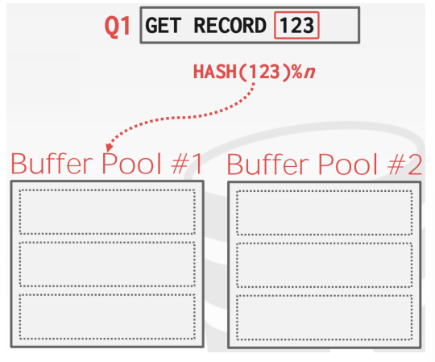
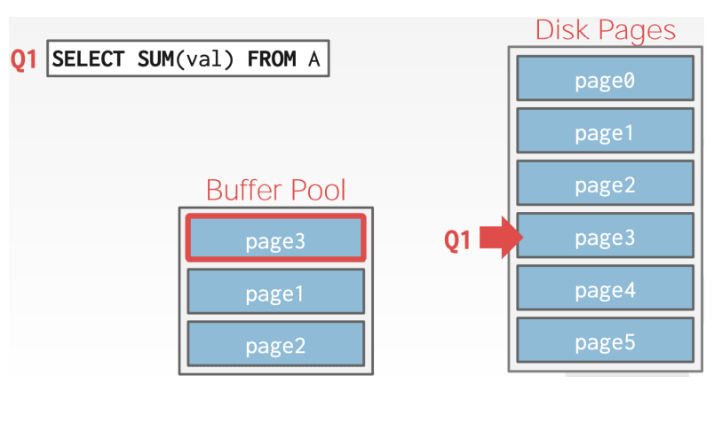

# Buffer Pools

[toc]

- a well-designed DBMS should make it seem as though all data is already in memory
  - this illusion of data residing in memory ensures that data operations are performed at the highest possible speed
- another way to think of this problem is **spatial** vs **temporal** control
  - ==Spatial Control== where to write pages on disk
    - involves deciding *where* to physically store pages
    - the primary objective is to optimize layout on disk to keep pages that are often accessed together located closely 
      - i.e. reduce seek times and improve retrieval performance
    - enhance physical layout
  - ==Temporal Control== when to read and write pages
    - focuses on managing *when* to bring pages to memory (read) and flush to disk (write)
    - the goal is to minimize the number of stalls or delays from I/O 
    - need efficient *caching*, *prefetching*, and *write policies*
    - enhance data movement

# Buffer Pool Manager

- ==buffer pool== integral part of the DBMS and serves as an in-memory cache for pages 
  - store pages from database that have been fetched (read) from disk
  - the primary purpose of a buffer pool is to improve the efficiency of data access by reducing the need for frequent & redundant disk I/O 

## Buffer Pool Organization

- the buffer pool is organized as an array of fixed-sized pages
  - each array entry is called a ==frame==
- when the DBMS requests a page, an exact copy is placed into a frame
  - then the DBMS can search the buffer pool first when a page is requested
  - if the page is not found, then the system fetches a copy of a page from disk
- pages on a buffer pool can be *any* order

## Buffer Pool Metadata

- the buffer pool must maintain certain metadata mainly in a page table

### Page Table

- in-memory *hash* table that keeps track of pages that are currently in the buffer pool
- it maps page IDs to frame locations 
- it also maintains additional metadata *per-page* including
  - ==dirty-flag==
    - a bit that identifies if a page in the buffer pool has been modified or not
    - gets set when a thread modifies a page (i.e. needs a flush)
  - ==pin / reference counter==
    - track the number of threads that are currently accessing that page (either reading it or modifying it)
    - a thread has to increment the counter *before* accessing the page
    - if a page's count $>0$, then the storage manager is **not** allowed to evict the page from the buffer pool
  - ==latch==
    - when a thread tries to read a page *not* in the buffer pool (i.e. cache miss)
      1. a *latch* is put on the entry that corresponds to that missing page to indicate that the entry is occupied while the page is being fetched
         - this prevents multiple threads loading the same page 
      2.  once the page is fetched, update the entry to point to the fetched page in pool and release the latch

#### Locks vs Latches

- do not confuse locks & latches
- ==locks==
  - a higher-level, logical primitive that protects the database's contents (i.e. tuples, tables, indexes) from *other transactions* by the user
  - transactions will hold a lock for its entire duration
  - need to be able to rollback changes
- ==latches==
  - a low-level primitive that the DBMS uses to protect critical sections of its internal data structure (i.e. page table, region of memory) from *other threads*
  - latches are held for the duration of a specific operation or critical section 
  - no need to rollback changes

## Memory Allocation Policies

- determine how memory is allocated to optimize performance
- memory in the database is allocated for the buffer pool according to two policies
  1. global (memory allocation) policies
  2. local (memory allocation) policies
  3. combination of policies

### Global Policies

- focus on making decisions that benefit the entire workload being executed by DBMS 
- consider all active transactions, queries, and processes for optimal memory allocation

### Local Policies

- make decisions that prioritize the performance of individual queries or transactions, even if those decisions may not be ideal for the entire workload
  - allocate memory to specific transaction without considering concurrent transactions
- aims to enhance response time & execution of individual tasks

### Combination of Policies

- many modern DBMS use a combination of both global & local views

---

## Buffer Pool Optimizations

- [Multiple Buffer Pools](#Multiple Buffer Pools)
- [Pre-Fetching](#Pre-Fetching)
- [Scan Sharing](#Scan Sharing)
- [Buffer Pool Bypass](Buffer Pool Bypass)

### Multiple Buffer Pools

- the DBMS can use multiple buffer pools
  - each page that is stored is assigned to one of the buffer pools randomly using a [hashing function](#Approach 2: Hashing) or [object ID](#Approach 1: Object IDs)
- each buffer pool can adopt local policies tailor for the data stored in it
- helps reduce latch contetion & improve locality

#### Approach 1: Object IDs

- embed an object identifier in record IDs and then maintain a mapping from objects to specific buffer pools
  - for each tuple, we have `<objectId, pageId, slotNum>`
  - `objectID -> buffer_pool_number`

#### Approach 2: Hashing

- hash the page ID to select which buffer pool to access
  - `HASH(pageID) % number_of_buffer_pools`

### Pre-Fetching

- the DBMS can also prefetch pages based on a query plan
  - sequential scans
    - choose the LRU (least recently used) page and replace it with the page that is most likely next in the query's sequence
  - index scanes
    - ???

### Scan Sharing

- queries are able to **reuse data** retrieved from storage or operator computations
  - a.k.a. *synchronized scanes*
  - this is different from result caching
- allow multiple queries to attach to single cursor that scans a table
  -  queries do not have to be exactly the same
  - can also share itermediate results
- if a query starts a scan & there is already one doing this, then the DBMS will attach to the second query's cursor
  - the DBMS keeps track of where the second query joined with the first so that it can finish the scan when it reaches the end of the data structure

#### Example of Scan Sharing

1. Q1: `SELECT SUM(val) from A`
   - query 1 begins scanning at page 0 and moves down to 3, ultimatly replacing page 0 in the buffer:
     
2. Q2: `SELECT AVG(val) from A`
   - query 2 begins at 0 but is moved to the Q1 cursor as they are the same scans:
     
3. once both scans complete up to page 5, Q2 is moved back to page 0 to scan the pages it missed:
   

- another thing to consider is `SELECT AVG(val) from A LIMIT 100` 
  - if scan sharing is beign done, the results may vary depending on where the scan began

### Buffer Pool Bypass

- the sequential scan operator will not stored fetched pages in the buffer pool to avoid overhead
  - memoery is local to running query 
  - works well if operator needs to read a large sequence of pages that are contiguous on disk
  - can also be used for temporary data (sorting, joins)
- a.k.a. *light scans*