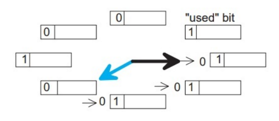

# Buffer Replacement Policies

[toc]

- ==replacement policy== is an algorithm that the DBMS implements that makes a decision on which pages to evict from buffer pool when it needs space
- implementation goals:
  - correctness
  - accuracy
  - speed
  - metadata overhead

## First In, First Out FIFO

- one of the simplest page replacement algorithm
- replace page that has been in the buffer for the longest time
- implementation: pointer to oldest page in a *circular* buffer
  - `pointer->next = pointer++ % M` where `M` denotes the buffer size
- simple but does not prioritize frequently accessed page 
  - such as the page with the page header

##  Least Recently Used LRU

- maintain a timestamp of when each page was last accessed
- when the DBMS needs to evict a page, select the one with the oldest timestamp
- implementation: 
  - list ordered by LRU
  - access a page, move it to list tail
  - keep the pages in sorted order to reduce the search time on eviction
  - DBMS picks the page to evict with the oldest timestamp

### Clock

- approximation of LRU but optimized and runs much faster without needing separate timestamps per page
  - each page has a reference bit
  - when a page is accessed, set it to 1
- organize the pages in a circular buffer with a *clock hand*
  - upon sweeping / looping on pages in the buffer pool, check if page's reference flag is set to 1
  - if yes, set to 0 and continue the loop
  - if no, then evict
  - clock hand remembers positions between evictions
- a.k.a. *second chance* as we set a page's bit to 0 if its 1 and then evict if it is still 0 when we come back to it

### Problems with LRU and Clock

- LRU & clock replacement policies are susceptible to ==sequential flooding== where the buffer pool's contents are trashed due to a sequential scan
  - a query performs a sequential scan that reads every page
  - this pollutes the buffer pool with pages that will only be used once and then never again
- since sequential scans read every page, the timestamps of every page read may not reflect which pages we actually want
  - *the most recently used page is actually the most unneeded page* 

---

## Better Policies

- [LRU-K](#LRU-K)
- [Localization](#Localization)
- [Priority Hints](#Priority Hints)

### LRU-K

- track history of the last `K` references to each page at timestamps and compute the interval between subsequent accesses
- the DBMS then uses this history to estimate the next time that page is going to be accessed

### Localization

- the DBMS chooses which pages to evict on a per transaction / query basis
  - this minimizes the pollution of the buffer pool from each query

### Priority Hints

- the DBMS knows the context of each page during query execution 
- it can provide hints to the buffer pool on whether a page is important or not

---

## Dirty Pages 

- there are two ways to make a decision on which page to evict
  - ==fast== if a page in the buffer pool is not dirty, then the DBMS can simply *drop* it
  - ==slow== if a page is dirty, then the DBMS must write back to disk to ensure that its changes are persisted
- trade-off between fast evictions vs dirty writing pages that will not be read again in the future

### Background Writing

- the DBMS can periodically walk through the page table and write dirty pages to disk
- when a dirty page is safely written, the DBMS can either evict the page or just unset the dirty flag
- need to be careful that we don't write dirty pages before their log records have been written