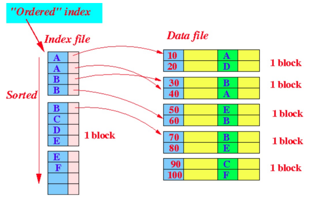
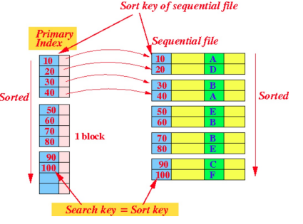
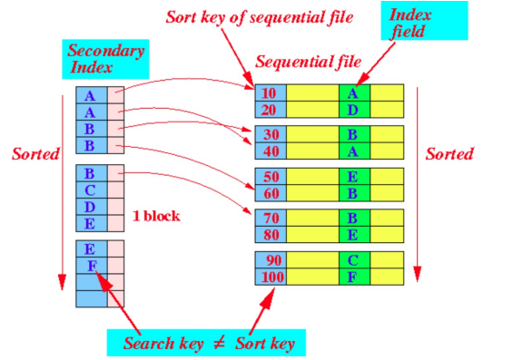
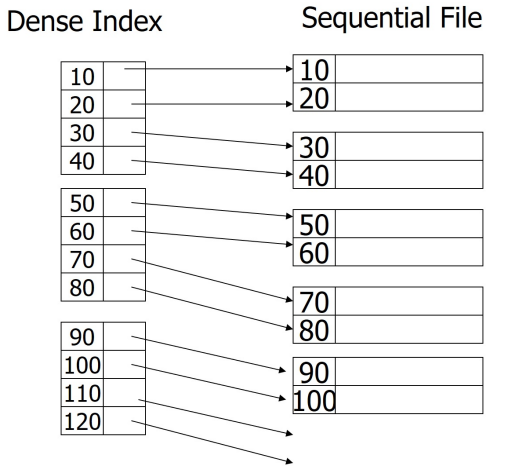
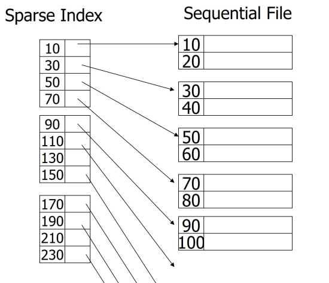
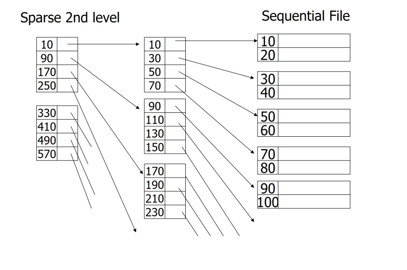

# Conventional Indexes

[toc]

## Applications of Data Structures in DBMS

- a DBMS uses various data structures for many different parts of system internals including
  - ==internal metadata== data structures keep track of information about the database and system state
  - ==core data storage== can be used as the base storage for tuples in the database 
    - i.e. hash table / tree to organize underlying pages / tuples inside pages
  - ==temporary data structures== during query processing, DBMS may create temporary data structures to optimize query execution 
  - ==table indexes== auxiliary data structures are used to enhance the efficiency of searching for specific tuples within the database tables
    - indexes provide quicker access to data based on specific criteria

### Design Decisions

- there are 2 main design decisions to consider when implementing data structures for the DBMS 
- ==data organization==
  - in the design of data structures for a DBMS, one critical decision is determining how to organize data in memory efficiently
- ==concurrency==
  - ensure concurrent access to the data structure in a safe way

---

## Convolutional Indexes

### How to Store a Table

- suppose we scatter its records arbitrarily among the blocks of the disk
  - to answer `SELECT * FROM R`, we need to scan every block
  - instead we should *reserve some blocks* for a given relation
- how about `SELECT * FROM R WHERE condition`?
  - we now need to scan all the records in the *reserved block* which is **still slow**

### Table Indexes

- a ==table index== is a replica of a subset of a table's columns that are organized and / or sorted for efficient access using a subset of columns
- the DBMS ensures that the contents of the `TABLE`(s) and `INDEX`(s) are in sync
- the DBMS's job to figure our the best index(es) to use in query execution
- *trade-off* on number of indexes per database
  - more indexes make queries faster
  - *but* indexes have a storage overhead & requires maintenance

### Index

- an ==index== is a data structure to allow users to find data items efficiently using *search keys*
- a ==search key== is an attribute(s) used to look up records in a file
- an ==index file== is a file containing *key-pointer* pairs of the form `(Key, pointer)`
  -  these are called ==index entries==
  - `Key` is a *search key* and `pointer` is an address pointer to a block / record
- index files are usually much smaller than original file
  - **and can be searched much quicker**

- the pointer is usually a **block pointer** to locate the block that contains the record quickly
  - the record is then found by a search operation inside the block
- 2 basic kinds of indices:
  - ==ordered indices== search keys are stored in sorted order
  - ==hash indices== search keys are distributed uniformly using a hash function 

####  Ordered Index

- ==ordered index== is when index entries are stored *sorted on the search key value*

- the values in the index are ordered so that binary search can be done
- the following are *types of ordered indices*
  - [Clustering Index](#Clustering Index)
  - [Secondary Index](#Secondary Index)

##### Clustering Index

- a ==clustering index== defines the physical storage order of data in a table, allowing for sorting in only one specific way
  - it is often referred to as a ==primary index==
- in a sequentially ordered file, the clustering index is the one where search key specifies the sequential order of the file
  - i.e. the records are sorted base on the primary key or another designated key which serves as the *sort key*
- the ==sort key== consists of field(s) whose values determine the order in which records are arranged in a sequential file

##### Secondary Index

- a ==secondary index== is an index in which the search key specifies an order that differs from the sequential order of the file
  - it also called a ==non-clustering index==
  - this means the secondary index allows data retrieval in a specific order other than the physical storage order of the file (alternate paths to data)

##### Indexed Sequential File

- assume all files are ordered sequentially on some search key
- an ==index-sequential file== is a type of sequential file that is ordered based on a search key
  - it typically includes a clustering index on the search key, which determines the physical storage order of the data
- designed for applications that require both sequential processing of entire file & random access to records

#####  Dense vs Sparse Indices

###### ==Dense Index==

- index record appears for every search-key value in the file

- Pros:
  - the number of blocks is usually smaller when compared to number of data blocks
    - if the index is too large, use [sparse index](#Sparse Index) instead
  - searching for an existing record can be done with *just* the indexes
  - the record is directly found in a block using the pointer (no search in the block is needed)
  - if the entire index data fits in memory, we only need one disk I/O 
- Cons:
  - require more storage space
  - more complex to maintain 

###### ==Sparse Index==

- contains index records for *only some* search-key values
  - we only store one `(key, pointer)` pair per data block
  - the key is for the first record in the block

- to locate a record with `key K`
  1. search the index for the largest key less than or equal to `K`
  2. retrieve the block pointed to the index field
  3. search within the block for every record with key `K`
- Pros:
  - the size of index data is less that [dense index](#Dense Index)
- Cons: 
  - can't find out if record exists using only the index

###### Multilevel Index

- a ==multi-level index== is one approach to increase efficiency if an index spans many blocks
- utilize multiple levels of indexing allowing for efficient access to large dataset
  - **outer index** - a *sparse* index of the basic index
  - **inner index** - the basic index file
- if the outer index is also too large to fit in main memory, another level of index can be created...
  - indexes at all levels must be kept updated (insertion / deletion) 

> - should we build a dense 2nd level index?
>   - it doesn't make sense to make a *dense* 2nd index level as it should be sparse to have savings
> - can we use a sparse index on an *unsorted* file
>   - no as you can no longer find the records that are not in the index
>   - *however* you can use a *sparse index* on top of a *dense index* of an unsorted file

###### Notes on Pointers

- block pointers in sparse indices can be *smaller* than record pointers in dense indices
- since each block is a fixed size, we can offset our pointer instead of using the full address as you'd need to do with record pointers

