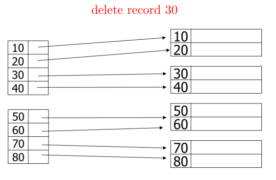
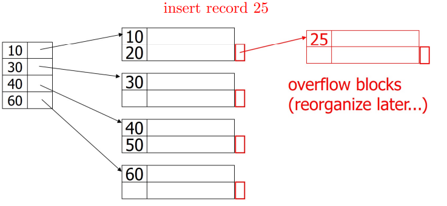

# Duplicates, Modifications, and Secondary Indexes

[toc]

## Duplicate Keys

- ==primary index== an index associated with a sorted file where the search key is *unique*
- in some cases, databases allow for duplicate values in search keys
  - this requires indices that can handle duplicates efficiently
- to implement such an index we can use
  - **dense index** with 1 index field
    - per record (pointer to each duplicate)
    - per unique search key (pointer to only first record)
  - **sparse index** 

### Duplicate Search Keys with Dense Index


- <span style="color:MediumSpringGreen">Pros:</span>
  - easy to find & count records
- <span style="color:red">Cons:</span>
  - more fields than necessary

### Duplicate Search Keys with Dense Index keys

- one index field per unique search key


- <span style="color:MediumSpringGreen">Pros:</span>
  - smaller index
  - quick search
- <span style="color:red">Cons:</span>
  - more complicated to find successive records
  - to find all data records with search key `K` follow the one pointer in the index and then move forward in the data file

### Duplicate search keys with sparse index


- <span style="color:MediumSpringGreen">Pros:</span>
  - small index
  - fast search
- <span style="color:red">Cons:</span>
  - complicated to find records (i.e. looking for key 30)

---

## Modifications

- an index file is a sequential file & must be treated in a similar way to a file of sorted records
  - use overflow blocks
  - insert new blocks
  - slide elements to adjacent blocks

### Deletion using Sparse Index

 → 

- as a sparse index points to the block, no action is required
  - note that any record that is *not* the index's search key should not result in any action

 → 

- the first record of the block was updated so the the index must be updated by just **replacing** it with the next available record

 →  →  

- in this case, there is no available records left in the block so the block can be removed
  - the subsequent indexes are also shifted up


### Deletion using Dense Index

 →  → 

- this will be similar to record deletion

---

### Insertion using Sparse Index

 → 

 → 

- in this example, we checked for space in the next block and slice the data down
  - an alternative would be to use an overflow block to insert 15
  - the alternative is demonstrated below

 → 

- this is also what would occur if there is no room in the next block

---

## Sparse vs. Dense Tradeoff

|               | Dense                                         | Sparse                                             |
| ------------- | --------------------------------------------- | -------------------------------------------------- |
| space         | 1 index field per record (many)               | 1 index filed per block (few)                      |
| access        | direct access to record                       | must search block                                  |
| exist queries | only needs index                              | must search block                                  |
| modifications | always updated if the order of records change | updated *only* if first record of block is changed |

---

## Secondary Indexes

- ==secondary index== additional indexes created on attributes other than primary key
  - they provide alternative paths to data
- work on unsorted records
- works like any other index (find record faster)
- first level is always dense; any other levels are sparse
- duplicates are allowed

#### Secondary Indexes: Dense vs Sparse

- the records would typically be sorted by the primary key
- the secondary index would be sorted by its own search-key such that it will have a different order from the sequential order of the records file

 

- because the order of the index file is different from the data file, we can't have sparse indexes as they won't make sense to search
  - thus, the first level of secondary indexes are always dense
    - i.e. pointers are record pointers
  - any [other levels on top of the first](5.1-Conventional-Indexes.md#Multilevel Index) should be sparse

#### Secondary Index and Duplicate Keys


- duplicate keys can introduce a lot of overhead
- altenatives:
  - [Variable sized index fields](#Variable sized index fields)
  - [Chain records](#Chain records)
  - [Buckets](#Buckets)

##### Variable sized index fields

- another option is to have **variable sized index fields**


- <span style="color:MediumSpringGreen">Pros:</span>
  - saves space in index
- <span style="color:crimson">Cons:</span>
  - requires more complex data structures to efficiently locate and manipulate index entries  

##### Chain records

- another option is to **chain records with same key**
  - the index entry points to first record of matching key
  - records with same key are linked together in linked list structure


- <span style="color:MediumSpringGreen">Pros:</span>
  - simple index 
  - easy to search
- <span style="color:crimson">Cons:</span> 
  - add fields to records header
  - must follow chain to successive records

##### Buckets

- instead of directly pointing to records with same search-key value, the index entry points to a ==bucket==
  - buckets are intermediate data structures placed between the *secondary index file* and *data file*
- each index record now points to a specific bucket that contains pointers to all actual records with same search-key value


###### Why "bucket" idea is useful?

- consider relation `Emp(name, dept, floor)`
- suppose we have a *primary index* on `name` and *secondary indexes & indirect buckets* with `dept` and `floor`

```sql
SELECT name FROM Emp
WHERE dept = 'Toy' AND floor = 2;
```


- to get the result, look for the intersection of the `Toy dept` bucket and the `floor 2` bucket
  - this minimizes the disk I/O

---

## Conventional Index Issues

- **unbalanced performance** with the number of operations to find a record varying based on data
- **degrading performance** as the file grows (due to overflow blocks)
- need for periodic reorganization of entire file
- *B^+^-Tree indexes are a more efficient alternative*
  - they also have disadvantages however

