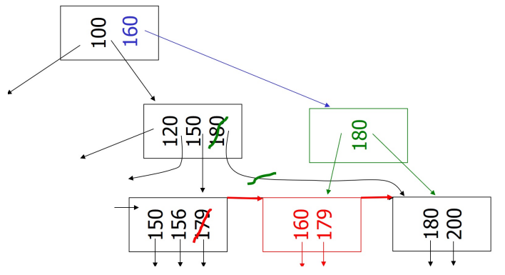
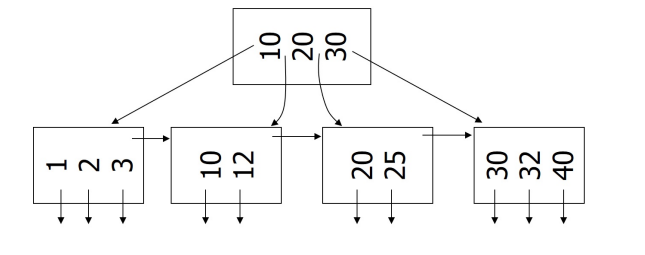
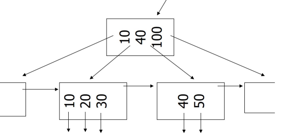

# Tree Indexes: B^+^-Tree

[toc]

## B-Tree Family

- almost every modern DBMS that supports order-preserving indexes use a B^+^-Tree
- there is a general **B-Tree** data structure but the term also refers to a family of data structures
  - B-Tree
  - B^+^-Tree
  - B^*^-Tree
  - B^link^-Tree
- the main difference between the original B-Tree and the B^+^-Tree is that 
  - B-Trees store keys and value in *all* nodes
  - B^+^-Trees only store values in leaf nodes
- modern B^+^-Trees adopts features from other trees in B-Tree family (such as sibling pointers)

## B^+^-Tree Structure

- **B^+^-Tree** self balancing tree data structure that keeps data sorted & allows searches, sequential access, insertion, & deletions in $O(\log n)$
  - generalization of binary search tree
    - i.e. node can have more than 2 children
  - optimized for systems that read & write large blocks of data
  - it is perfectly balanced
    - i.e. every leaf node is at same depth

### B^+^-Tree Nodes

- every node in a B^+^-Tree is comprised of an array of `(key, value)` pairs
  - the arrays are (usually) in sorted order
  - the *keys* are derived from the attributes the index is based on
  - the *values* will differ based on whether the node is an inner or outer node 
    - the value of inner nodes contain pointers to other nodes
- each node is stored in one block on disk

#### Leaf Node Values

- values will differ based on whether the node is classified as **inner nodes** or l**eaf nodes**
- 2 approaches for **leaf node** values
  1. **Record IDs**
     - a pointer to the location of the tuple that the index entry corresponds to
  2. **Tuple Data**
     - the actual content of the tuple is stored in the leaf node
     - this words only for primary key indexes
       - secondary indexes are based on non-unique attributes & primary data is needed to uniquely identify a record
       - secondary indexes will need to use record IDs

###  Main Challenges in B^+^-Trees

- to ensure good search cost, the tree should be kept of *minimum & uniform height*
- keep the tree
  - full (packed) and
  - balanced (almost uniform)
- because of insertions and deletions, we keep the tree "semi-full" 
  - each tree node is *half-full*

### B^+^-Tree Nodes with $n=3$

- each node is stored in one block on disk
  - and contains at most $n$ keys and $n+1$ pointers

$$
\text{size of nodes}:
\begin{cases}
    n + 1 \text{ pointers} \\
    n \text{ keys} 
\end{cases}
$$

| Sample internal node                                         | Sample leaf node                                             |
| ------------------------------------------------------------ | ------------------------------------------------------------ |
|  |  |

- the **sibling pointer** pointers to the next leaf node

#### Example

- if a block size is 4096 bytes, keys are integers (4 bytes each), and pointers are 8 bytes each, then $n=340$

$$
4 \times n + 8 \times (n+1) \le 4096\\
n = 340
$$

### Don’t want nodes to be too empty

- use a "fill factor" to control growth & shrinkage
- a 50% fill factor would be the minimum for a B^+^-Tree
- use at least (to ensure a balanced tree)

|                 | max pointers | max keys | min pointer                      | min keys                       |
| --------------- | ------------ | -------- | -------------------------------- | ------------------------------ |
| non-leaf        | $n+1$        | $n$      | $\lceil\frac{n+1}{2}\rceil$      | $\lceil\frac{n+1}{2}\rceil-1$  |
| leaf            | $n+1$        | $n$      | $\lfloor \frac{n+1}{2}\rfloor+1$ | $\lfloor \frac{n+1}{2}\rfloor$ |
| if its the root | $n+1$        | $n$      | $2$                              | $1$                            |

---

## Algorithms

### Search B^+^-Tree

- search for `key K`
  - start from root until leaf is reached
  - for current node find $i$ such that
    - $\text{Key}[i] < k \le \text{Key}[i+1]$
    - follow the $(i+1)$^th^ pointer 
  - if current node is leaf, return pointer to record or 
    - fail if no such record

### Insert into B^+^-Tree

- insert record with `Key k`
  - find correct leaf node `l` for `k`
  - add new entry to `l` in sorted order
    - if `l` has enough space, done
    - else
      - split `l` to 2 nodes `l, l1`
      - redistribute entries evenly (refer to the [minimum node counts](#Don’t want nodes to be too empty)) and copy up **middle key** (new leaf's `l1` smallest key)
      - insert index entry pointer to `l1` to parent of `l`
  - for the inner nodes: if during the redistribution & copying of middle key, the parent of `l` becomes full, a similar split operation occurs in parent node
    - entries are redistributed evenly between the parent node & the new node created by the split
    - the middle key from the split is **pushed up** further to the parent's parent node
    - this process continues recursively up until the root is reached
- cases
    1. [Case 1: Simple](#Case 1: Simple)
    2. [Case 2: Leaf overflow](#Case 2: Leaf overflow)
    3. [Case 3: Non-leaf overflow](#Case 3: Non-leaf overflow)
    4. [Case 4: New root](#Case 4: New root)

#### Case 1: Simple

`insert key 32, n = 3`

 → 

#### Case 2: Leaf overflow

`insert key 7, n = 3`

 → 

- the node is full so we shift half its entries down (refer to the [minimum node counts](#Don’t want nodes to be too empty)) to insert the new key 

→ 

- then we connect a new pointer to the parent

#### Case 3: Non-leaf overflow

`insert key 160, n = 3`

 → 

- the leaf node is full so we must redistribute again based

→ 

- using the leftmost node, create a new parent node

→ 

- continue to link up to parent

#### Case 4: New root

`insert 45, n = 3`

→ 

- the leaf node is full, so it is redistributed

→ 

- we add a new parent

→ 

- the root is on the same level as the parent node, so we need a new root

### Delete from B^+^-Tree

- remove record with `Key k`
  - find correct leaf `l`
    - if `l` is at least half full (refer to the [minimum node counts](#Don’t want nodes to be too empty)), done
    - else
      - merge `l` with sibling
      - after the merge, the **middle key** (which separates `l` & its sibling) is removed from the parent node
      - if the parent node also has an underflow, perform a similar redistribute recursively
- *note* B^+^-Tree removes a key from leaf node but not necessary from inner nodes
  - often in practice, coalescing is not implement as we assume nodes will fill up again (i.e. not worth it)
- cases
  1. [Case 1: Simple](#Case 1: Simple)
  2. [Case 2: Coalesce with sibling](#Case 2: Coalesce with sibling)
  3. [Case 3: Redistribute keys](#Case 3: Redistribute keys)
  4. [Case 4: (2) or (3) at a non-leaf](#Case 4: (2) or (3) at a non-leaf)

#### Case 1: Simple

`delete key 11, n = 3`

 → 

#### Case 2: Coalesce with sibling

`delete 50, n = 4`

→ 

- remove 50 which results in underflow

→ 

- because there is space in the sibling node, redistribute the values from the underflow into it

→ 

- remove the old pointer and parent value

#### Case 3: Redistribute keys

`delete key 50, n = 4`

→ 

- remove 50 which results in underflow

→ 

- because the sibling nodes are full, we will redistribute the sibling node's values into the underflow node

→ 

- update the parent pointer

#### Case 4: (2) or (3) at a non-leaf

`delete key 37, n = 4`

→ 

- remove 37 which results in an underflow so we redistribute into the sibling since it has space then remove the parent pointer  

→ 

- the parent also results in underflow so it is coalesced with its sibling

→ 

- the root is dropped inside the missing slot

### Splitting or Merging Nodes

- when splitting or merging nodes follow these conventions
  - **leaf split** 
    - $n$ is even: the *left* node should get the extra key
      - example $n=2$: splitting leaf `[1,4,5]` will result in `[1,4], [5]`
    - $n$ is odd: node can be evenly split with new value 
      - example $n=3$: splitting leaf `[1,4,5,6]` will result in `[1,4],[5,6]`
    - in both cases: the value inserted into the parent is the *smallest* value of the *right* node
  - **non-leaf split**
    - $n$ is even: node can be split evenly after the parent takes the extra key
      - example $n=2$: splitting non-leaf `[1,3,4]` will result in `[1],[4]` where parent gets the `3`
    - $n$ is odd: node can't be split evenly so the "middle" value taken by the parent will be from the *right* node
      - example $n=3$: splitting the non-leaf `[1,3,4,5]` will result in `[1,3],[5]` where the parent gets the `4`
  - **node underflow**
    - first try to redistribute values from a sibling
    - if these can't be done (the sibling would underflow), only then merge the node with one of its sibling
    - both approaches prefer using the left sibling if possible

