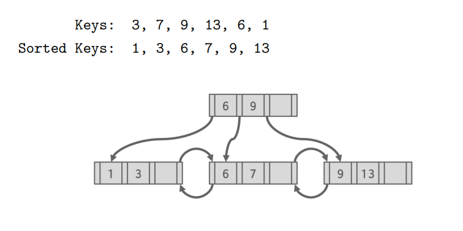

# B^+^-Tree Continued

[toc]

## Comparisons

### B^+^-Tree vs Indexed Sequential File

| B^+^-Tree                                                | Indexed Sequential File          |
| -------------------------------------------------------- | -------------------------------- |
| consumes more space so lookup is slower                  | less space so lookup is faster   |
| each insert / delete potentially results in restructures | inserts managed by overflow area |
| build-in restructuring                                   | requires temporary restructuring |
| predictable performance                                  | unpredictable perfromance        |

### B-Tree vs B^+^-Tree 

- unlike B^+^-Trees, B-Trees don't allow duplicate keys
- B-Trees can store data pointers in internal nodes
  - B-Trees can be more space-efficient because they don't need to store data pointers only in leaf nodes
  - B-Trees also can have potentially faster lookups as traversal all the way to leaf nodes isn't always needed
- B-Trees can be more expensive to updated in multi-threaded environment
  - updates may involve modifying non-leaf nodes that can be shared among multiple threads meaning more complex operations 

#### Summary of B-Tree vs B^+^-Tree

- B-Tree has faster lookup
- B-Tree has different sizes for non-leaf & leaves
- B-tree has more complicated deletion  
- in the end, B^+^-Tree is preferred
  - also *note* if blocks are fixed size, then lookup for B^+^-Tree is *actually better*

#### B-Tree Structure

- non-leaf nodes and leaf nodes will have different number of keys
- **non-leaf nodes** have
  - $n_1$ keys
  - $2n_1+1$ pointers, consisting of
    - $n_1$ record pointers
    - $n_1+1$ children pointers
- **leaf nodes** have
  - $n_2$ keys
  - $n_2+1$ pointers, consisting of
    - $n_2$ record pointers 
    - $1$ sequence (sibling) pointer 

### Example: Maximum number of records indexed

- assumer our DBMS has
  - pointers with 4 bytes
  - keys with 4 bytes
  - blocks with 100 bytes

#### Maximum number of records indexed in *2-level B-Tree*

- find the number of keys $n_1$ in the non-leaf nodes

$$
4n_1+4(2n_1+1)\le100\\n_1=8
$$

- find the number of keys $n_2$ in the leaf nodes

$$
4n_2 + 4(n_2+1) \le 100\\n_2=8
$$

- the root (i.e. non-leaf) has
  - $n_1=8$ keys
  - $n_1=8$ record pointers
  - $n_1+1=9$ children pointers
- the second (final level) has the 9 leaf nodes each with
  - $n_2=12$ keys
  - $n_2 = 12$ record pointers
- thus, the max records in this tree is $8 + 9 * 12 = 116$  

#### Maximum number of records indexed in *2-level B^+^-Tree*

- find the maximum number of keys $n$ 

$$
4n + 4(n+1) \le 100\\n=12
$$

- the root has
  - $n=12$ keys
  - $n+1=13$ child pointers
- the second (final level) has the 12 leaf nodes each with
  - $n=12$ keys
  - $n=12$ record pointers 
- thus, the max records in this tree is $13 * 12 = 156$ records 

---

## Data Organization

- a table can be stored in 2 ways
  1. ==heap-organized storage== organizing rows in no particular order
  2. ==index-organized storage== organizing rows in primary key order
- types of indexes
  - ==clustered index== organizing rows in a primary key order
  - ==un-clustered index== organizing rows in a secondary key order
- some DBMS will always use a clustered index
  - if a table doesn't contain a explicitly defined primary key, the DBMS will automatically make a hidden row ID as the primary key
  - used internally for the DBMS to uniquely identify rows

### Partial Keys

- say our index is on `<a,b,c>` but we only query on `a` (i.e. partial key)
  - not all DBMS support usage on the B^+^-Tree index when querying on partial keys
  - for a hash index, we must have **all attributes** in the search key

### B^+^-Tree Design Choices

- [Node size](#Node size)
- [Merge threshold](#Merge threshold)
- [Variable length keys](#Variable length keys)
- [Non-unique indexes](#Non-unique indexes) 
- [Intra-node search](#Intra-node search)

#### Node size

- the optimal node size for a B^+^-Tree depends on the speed of the disk
- larger nodes amortize the cost of reading from disk over more key-value pairs, reducing disk I/O 
  - the slower the disk, then the larger the optimal node size for B^+^-Tree
- optimal sizes can also vary depending on workload
  -  [OLAP](3.5-Storage-Models.md#Workloads) (leaf node scans) vs [OLTP](3.5-Storage-Models.md#Workloads) (root-to-leaf traversal)
  -  i.e. scan-heavy vs single key lookup

#### Merge threshold

- determines when underflowed nodes should be merged during delete operations
- while the standard rule is to merge when a node becomes less than half full, there maybe scenarios where violating this is beneficial 
  - some DBMS may opt to allow underflows to accumulate & periodically rebuild the entire B^+^-Tree for rebalance

#### Variable length keys

here are some approaches

1. ==pointers==
   - store keys as pointers to a tuples attribute
   - rarely used
2. ==variable length nodes==
   - we could still store the keys like normal and allow for variable length nodes
   - the size of each node in the B^+^-Tree can vary but requires careful memory management
   - rarely used
3. ==padding==
   - instead of varying key size, set each key size to the size of the maximum key and pad out shorter keys
   - this usually ends up in a lot of wasted space so its rarely used
4. ==key map / indirection==
   - an array of pointers is embedded within the node which maps to the variable length key-value pairs in that node
     - each pointer in the array represents an offset to a key inside the node itself
   - this is similar to [slotted pages](3.2-Page-Layout.md#Slotted Pages)

#### Non-unique indexes

here are 2 approaches

1. ==duplicate keys==
   - most common
   - use the same leaf node layout but store duplicate keys multiple times
   - each occurrence of a non-unique key is treated as a separate entry
   - for the DBMS to internally distinguish between non-unique keys, it can
     1. ==append record IDS== add a unique ID onto each key
     2. ==overflow nodes== overflow the duplicate in the same node (harder to maintain) I don't really get this one
2. ==value lists==
   - store each key only once and maintain a linked list of unique values
   - this saves space but results in extra traversal impacting performance 

#### Intra-node search

methods to search for a specific key in a node include

1. ==linear==
   - scan key-value entries in the node from beginning to end
   - does not require entries to be pre-sorted
2. ==binary==
   - jump to middle & pivot right or left depending on each middle key's comparison to search key
   - requires the entries to be pre-sorted
3. ==interpolation==
   - approximate starting position of search key based on known low and high values in the node
   - then perform a linear scan from there
   - requires the entries to be pre-sorted

---

## B^+^-Tree Optimizations

### Prefix Compression

- many keys in the same leaf are likely to have the same prefix
- instead of storing entire key, extract the common prefix & store only the unique suffix for each key

### Suffix Truncation

- the inner nodes are only used to "direct traffic"
- store a minimum prefix that is need to correctly route

#### Bulk Inserts

- fastest way to build a B^+^-Tree is to first sort keys and then build the index from bottom up
- this will be faster than inserting one-by-one as there would be no splits and merges in bulk insert

### Pointer Swizzling

- involves temporarily replacing (or swizzling) disk block pointers with in-memory pointers during a B^+^-Tree node’s access
  - nodes use page IDs to reference other nodes in the index
  - the DBMS must go to page table during traversal
  - instead, store raw pointers to avoid address lookup