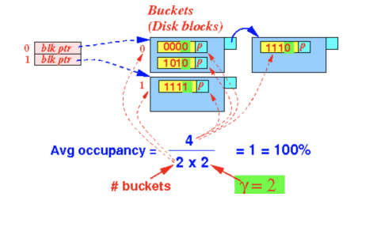

# Hash Tables

[toc]

- a **hash table** is another structure useful for indexes
  - implements an unordered associative array that maps keys to values
  - uses a **hash function** to compute an offset into the array for a given key to find the desired value

## Design Decisions

- 2 essential design decisions involved in implementing a hash table 
  1. **the hash function**
  2. **the hash scheme** 

### Design Decision 1: Hash Function 

- the **hash function** transforms a large & diverse set of keys into smaller more manageable range of indices (i.e. buckets or slots) in the hash table
- need to consider trade-off between fast execution vs **collision rate** (when 2 keys map to the same index)
  - hash function that always returns constant value would be very fast but result in many collisions 
  - hash function with *no* collisions would be ideal but often computationally expensive 
  - the best design is in the middle 

### Design Decision 2: Hashing Scheme

- the **hashing scheme** determines how collisions are handled 
- need to consider the trade-off between 
  - the need to allocate a large hash table (i.e. more buckets) to reduce chance of collisions 
  - vs executing additional instructions to handle collisions

---

## Hash Function

- is deterministic (i.e. will always return the same output for the same key)
- for DBMS, we need a hash that is 
  - fast to compute 
  - low collision rate
  - distribute keys evenly (i.e. each bucket has approximately the same number of elements)
- common example of a hash function `h` is
  - `key % B`
  - `sum_of_characters % B`
  - where `B` is size of *bucket array*
- a **bucket** is a unit of storage containing 1 or more entries
  - a slot in the bucket array
  - a bucket is typically a disk block
  - each element in a bucket array has a pointer to a linked list


### Storing Hash Tables on Disk

- for a DBMS, the hash table will need to be stored in secondary storage
- the bucket array of pointers to blocks is typically called the **bucket directory** & should be loaded in main memory 
  - each element (i.e. bucket) points to a disk block that contains key-value pairs
  - if the block overflows, then start a chain of overflow blocks
    - i.e. each blocks themselves are stored on disk & each block contains a pointer to the next block in the list

#### Using a Hash Index 

- to use a hash index to access a record given a search key `x`
  1. calculate the hash value as `h(x)` then index into the bucket directory
  2. the bucket directory will give us the pointer to the first block of the corresponding bucket
  3. read the disk block of the bucket `h(x)` into memory 
  4. search the block for `<x, record_pointer>`(linear search algorithm will do as main memory should be fast)
  5. use the `record_pointer` to access `x` record on disk

#### Inserting into Hash Table

- to insert a record with key `x`
  1. calculate the hash value of the key `h(x)` then index into bucket directory
  2. insert record `<x, record_pointer>` into one of the blocks in the chain of blocks for bucket `h(x)`

#### Deleting from a Hash Table 

- to delete a record with key `x`
  1. calculate the hash value of the key `h(x)` then index into bucket directory
  2. search for records with key `x` and delete any that are found
     - optionally try to consolidate overflow blocks of a bucket 

#### Performance of a Hash Table 

- the performance of a hash index depends of the number of overflow blocks used
- the fastest hash index is when no overflow blocks are used
  - 1 block access to read the index block into memory 
  - 1 block access to read the data block (containing the searched data) into memory
  - total is 2 disk block accesses

## Hash Index vs B^+^-Tree

- hash index is generally faster (less disk accesses) than B^+^-Tree for operations such as equality joins & lookups
- however, hash indexes can't support ordered searches like

```sql 
SELECT firstname, lastname
FROM employees
WHERE salary > 10000
```

- hash indexes do not store the data in any particular order

## How do we cope with growth?

- overflows and periodic reorganizations with new hash functions 
- dynamic hashing (bucket directory / hash table size `B `is allowed to vary)
  - extendible hashing
  - linear hashing

## Problem with Hash Tables 

- when many keys are inserted into the hash table, we will have many overflow blocks
  - which will require more I/O operations and slow performance
- we can reduce the number of overflow blocks by increasing the size of `B` 
  - the size of `B` is hard to change
  - this is because it will usually require *re-hashing* all keys in the hash table 
- solution is to use **dynamic hashing**

---

## Dynamic Hashing

- with **static hashing**, hashing function `h` maps keys to a fixed set of `B` bucket addresses
- **dynamic hashing** uses techniques that allow the size of the hash table to change with relative low cost
  - only a fraction of the existing search keys need to be re-mapped

### Extendible Hash Tables

- buckets get split instead of letting block chains grow forever
- only a *prefix* of the hash function is used to index into bucket address table (a.k.a. bucket directory)
- let the length of the prefix be $i$ bits
- the bucket address table size is $2^i$ where $i=1$ initially
  - value of $i$ grows / shrinks with size of database 
- multiple entries in the bucket address table may point to bucket
  - where buckets share a block if small enough 
- thus actual number of buckets is $<2^i$ as some buckets maybe shared or empty
  - number of buckets also changes dynamically due to coalescing & splitting of buckets
  - data movement during splits & coalescing is localized to affected buckets

#### Implantation of Extendible Hashing

- the bucket index consists of the first $i$ bits in the hash function value 
  - using the last $i$ bits instead could be implemented
-  each bucket consists of *exactly 1* disk block
  - **there are no overflow blocks**
- each bucket contains an integer $j$ indicating the number of bits of the hashing function value used to hash the search keys into the bucket

#### Algorithms

##### Inserting into Extendible Hash Table

- to insert a record with key `k`
  - compute `h(k)`
  - go to bucket indexed by the first $i$ bits of `h(x)`
  - follow the pointer to get to a block $x$
  - if there is a room in $x$ then insert record, <span style="color:MediumSpringGreen">done</span>
  - else, there are 2 cases
    1. $j<i$
       - split block $x$ in 2 blocks
       - distribute records in $x$ based of their $(j+1)$^st^ bit
       - update header of each new block to $j+1$
       - adjust pointers in the hash buckets based on $(j+1)$^st^ bit
       - if there is still now room in appropriate block for new record then repeat the process
    2. $j=i$
       - implement $i$ by 1
       - double length of the hash buckets
       - in the new hash buckets, entry indexed by both $w_0$ & $w_1$ each point to same block that old entry $w$ pointed to 
       - apply case 1 to split block $x$


###### Example of $j<i$

`insert h(k) = 1010`


###### Example $j=i$


#### Pros & Cons

-  <span style="color:MediumSpringGreen">Pros:</span>
  - hash performance does not degrade with growth of file
    - one block per bucket to lookup
  - minimal space overhead
- <span style="color:crimson">Cons:</span>
  - extra level of indirection to find desired record
  - doubles size every time we extend the table
  -  multiple entries with same hash value cause problems
- [linear hashing](#Linear Hash Tables) is an alternate that voids these problems (at the cost of more bucket overflows)

### Linear Hash Tables

- use $i$ lower order bits of hash


- the growth rate of the bucket array will be linear

- the decision to increase the size of the bucket array is flexible

  - common criteria is
    ```pseudocode
    if (the average occupancy per block > threshold) then
    	split 1 bucket into 2
    ```

- linear hashing uses overflow blocks

  - i.e. higher overhead than [extendible hashing](#Extendible Hash Tables)


#### Implementation of Linear Hashing

- $n$ is number of buckets that is currently in use
  - where the bucket are numbered from $0$ to $n-1$ (in binary)
- $i$ is number of bits used in hash value to index into a bucket
  - where $i$ is derived from $i = \lceil \log_2 n \rceil$
- thus
  - there are $n$ buckets in use (say 10)
  - $i$ bits are used from the hash 
  - there are $2^i$ possible hash values 
  - $n \le 2^i$

##### What if the last $i$ bits were $> n-1$?

- say we have $n=9$ buckets
- the last $i = \lceil \log_2 9 \rceil = 4$ bits of the hash will be used
- say the last $i$ bits were `1111` which maps to bucket index 15
- however, the max bucket index is $n-1=8$
- how can we map the *non-existing* bucket to an existing one?
- we can switch the first bit of a *non-existing bucket* to 0
  - bucket indexes $>n-1$ will have the first bit as 1 (`1XXX`)
  - switch to `0XXX`
  - the result will be a real bucket index

##### Criteria to increase $n$ in Linear Hashing

- commonly used criteria to increase buckets in use $n$ is

  ```pseudocode
  if (average occupancy of buckets > r) then
  	n++
  ```
- to determine the average occupancy of buckets

  - $n$ number of buckets in use
  - $r$ total number of search keys stored in the hash buckets
  - $\gamma$ block size (number of search keys that can be stored in 1 block)
    - max number of search keys in 1 block is $\gamma$
    - max number of search keys in $n$ blocks is $n \times \gamma$
    - we have a total of $r$ search keys in $n$ blocks
    - average occupancy of buckets $= \frac{r}{n \times \gamma}$

###### Example



