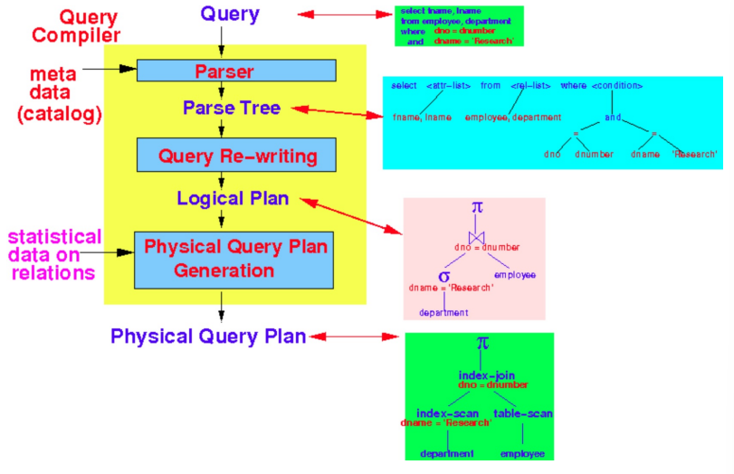
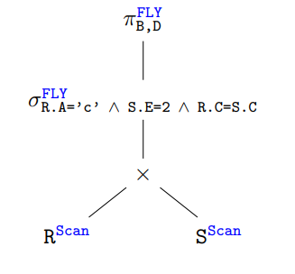
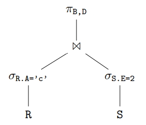
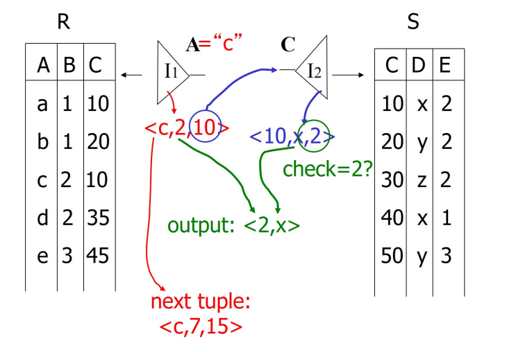

# Query Processing: Overview

[toc]

## Query Processing

- SQL is a declarative language
  - user tells the DBMS what answer they want, but *not* how to get it
  - DBMS needs to translate a SQL statement into an executable query plan
  - this allows for optimization decisions
- a ==query processor== must find a plan how to execute the query 
  - query compilation
  - query execution
- query compiler must find the appropriate plan to implement a query
  - ==parsing== translating the query into a parsing tree
  - ==query rewrite== the parse tree is transformed into an expression tree of relational algebra
    - i.e ==relational query plan==
  - ==physical plan generation== translate the **logical plan** into a **physical plan**
- ==logical query plan== (LQP) optimal sequence of relational algebra **operations** to perform the query
- ==physical query plan== optimal sequence of relation **algorithms** to perform the query

### Query Plan

- the DBMS converts SQL statement into a query plan
- operations in the query are plan are arranged in a tree
- data flows from the leaves of the tree to the root
- the output of the root node in the tree is the result of the query
- typically operations are binary (have 1-2 children)
- the same query plan can be executed in multiple ways
- most DBMS want to use an index scan as much as possible
- making logical & physical query are often called ==query optimizing==

### Query Processing: Steps to Process SQL Query

- the ==query compiler== consists of 3 major steps
  

### How do we execute query?

- one simple idea
  1. scan relations
  2. do cartesian product
  3. scan tuples 
  4. do projection

### Relational Algebra

- can be used to describe plans

#### Plan 1: "Fly" and "Scan"

- *plan 1*: initial query plan is constructed directly from the query

  - the query is
    

  - which is
    ```sql
    SELECT B, D
    FROM R, S
    WHERE R.A = 'c' and S.E = 2 and R.c = S.c
    ```

  - the constructed plan would be

    1. scan `R`
    2. for each tuple `r` of `R` scan `S`
    3. for each tuple `r, s` where `s` in `S`, select and project on the fly

- selecting from both `R, S` will result in their cartesian product which will performed through a ==scan==

  - the $\sigma$ filter and $\pi$ projection can both be done *on the* ==fly== meaning as we are doing the scan
  - these are the default strategy  

#### Plan 2: Try to avoid the Cartesian Product

- we should try to perform the *projections* and *filters* before the cartesian product to reduce the size of the operation
  - or try to avoid cartesian products all together

- *plan 2*: scan `R` and `S`, perform on the fly selections, do a natural join, then project



### Plan 3: Use `R.A` and `S.C` Indexes

- iterate until termination
  1. use `R.A` index to select `R` tuples with `R.A = 'c'`
  2. for each `R.C` value found, use `S.C` index to find matching tuples
  3. eliminate `S` tuples `S.E != 2`
  4. join matching `R, S` tuples, project `B, D` attributes and place in result



---

## Overview of Query Optimization

1. parse SQL to parse tree
2. convert tree to logical query plan
3. apply specific laws to get an improved LQP
4. estimate result sizes
5. consider physical plans
6. estimate costs
7. pick best physical plan
8. execute the plan