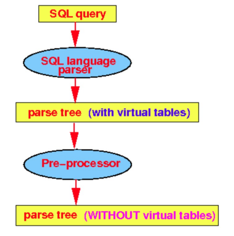
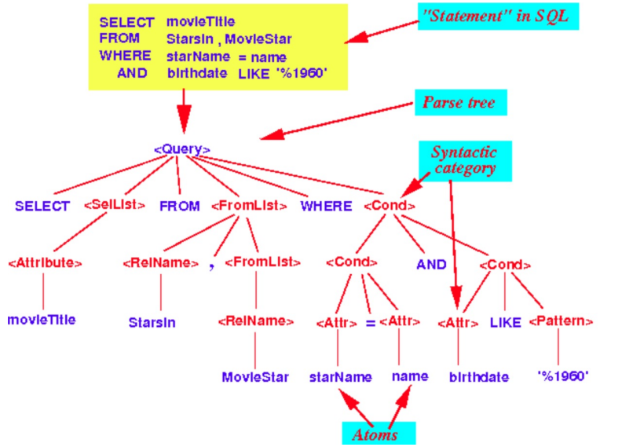
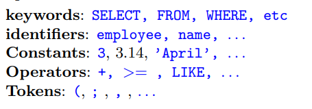
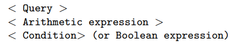
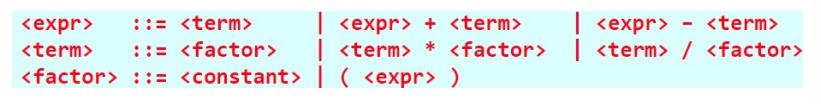
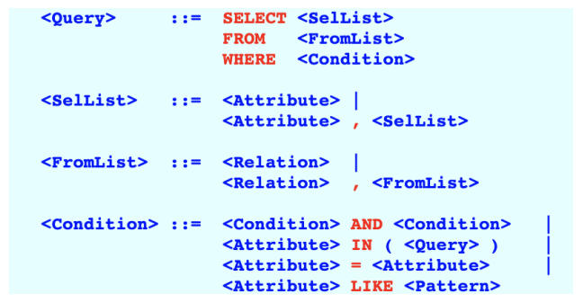
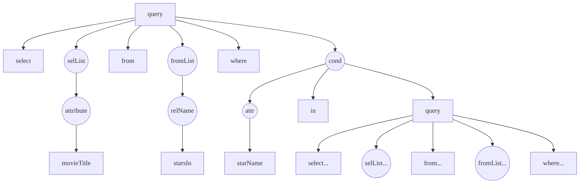

# Query Processing: Parsing and pre-processing

[toc]

## Parser

- parses the SQL command and constructs a **query parse tree** that represents the syntax elements

## Query Re-writing

1. converts a query parse tree into an **un-optimized LQP**
   - a **logical query plan** LQP consists of **relational algebra operators**
2. converts the **un-optimized LQP** into an **optimized LQP**
   - the optimized LQP is usually referred to as just the **LQP**

## Physical Query Plan PLP Generation

- select the best algorithm to execute the LQP
  - usually there are multiple algorithms available to implement one relational algebra operation 
  - we select the best algorithm based on
    - availability of indexes 
    - how much main memory is available (buffers) for the algorithm 

## SQL Query Parser

- SQL query parser consists of 2 parts
  1. **SQL language parser**
     - parses SQL command into parse tree
  2. **SQL pre-preprocessor**
     - checks for some semantic consistencies
     - replaces virtual tables (views) by some corresponding SQL query used to obtain the virtual tables (views)



### Parse Tree

- tree represents the hierarchical structure of the SQL command and its components
- each node in the tree corresponds to a specific part of the SQL command like tables, conditions, and selected columns 
- provides a structured way to understand the syntax of the query
- **parse tree** a tree whose nodes corresponds to
  - **atoms** of the programming language (i.e. identifies / keywords)
  - **syntactic categories** of the programming language (like expressions, statements, declarations, etc...)



#### Atoms

- **can't** be divided further
- **atoms** a.k.a. **terminals**



#### Syntactic category

- lexical construct that is built up with other lexical elements following some syntactic rules
- can be divided further



#### Properties of a parse tree

- node in a parse tree is either an **atom** or a **syntactic category**
- if atom then that node does not have any children
- if syntactic category then the subtree of the node is the instantiation of one of the syntactic rules or **grammar**

#### Grammar

- a **grammar** is a formal system that describes the syntax of a language
- defines rules for valid programs
  - these rules are **re-writing rules**
  - specify how symbols can be replaces or re-written in the language 



##### A simplified SQL grammar



###### Example Parse Tree

```SQL
SELECT movieTitle
FROM StarsIn
WHERE starName IN ( SELECT name
					FROM MovieStar
					WHERE birthdate LIKE '%1960 ')
```




