# Query Processing: Convert Parse Tree into initial LQP

[toc]

## Review: Relational Algebra

### Set vs Bag

- ==set== a collection of unrepeating elements
- ==bag== a collection of elements that can repeat
- relational algebra has 2 semantics
  - set semantics: relations are sets to tuples 
  - bag semantics: duplicates are not eliminated
- SQL uses *bag semantics*
- some operations (projection or union) are much more efficient on bags than sets
  - **selection** applies to each tuple so its effects on bags are similar to sets
  - **projection** also applies to each tuple but as a bag operator (we don't eliminate tuples)
  - **products** and **joins** are done on each pair of tuples, do duplicates have no effect on how we operate

#### Bag Semantics Notation

- $t^m$ denotes tuple $t$ appears with multiplicity $m$

---

## Operations

### Selection $\sigma$

- choose a subset of the tuples from a relation that satisfices a selection predicate
  - predicate acts as a filter to retain only tuples that fulfill its qualifying requirement
  - can combine multiple predicates using conjunctions / disjunctions
- syntax: $\sigma_c(R)$
  - $R$ is input
  - $c$ is condition (i.e. predicate)
- example: $\sigma_{a>5}(R)$

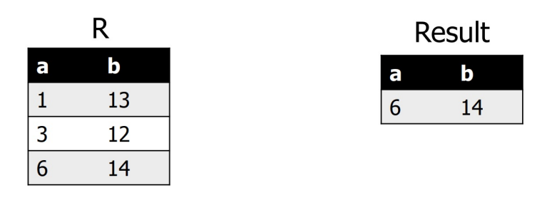

### Projection $\pi$

- generate a relation with tuples that contains only the specified attributes
- syntax: $\pi_A(R)$
  - $R$ is input
  - $A$ is list of project expression (i.e. attribute list)
- example: $\pi_b(R)$

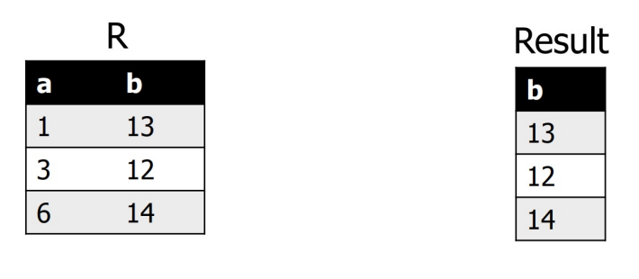

### Compose: Select and Project

- $\pi_{A_1,A_2,...}(\sigma_\text{cond}(\text{expr}))$

### Renaming

- to unify schemas for set operations (disambiguation in "self-joins")
- syntax $\rho_A(R)$
  - $R$ is input
  - $A$ is list of attribute renaming $b \leftarrow a$
- example: $\rho_{c \leftarrow c}(R)$

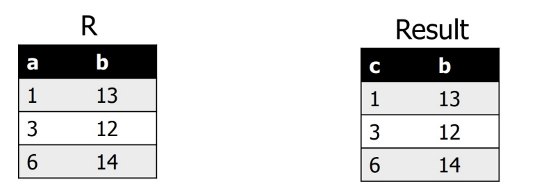

### Cross Product

- combine 2 relations (a.k.a. cartesian product)
- generate a relation that contains all possible combinations of tuples from input relations
- syntax: $R \times S$
- example: $R \times S$

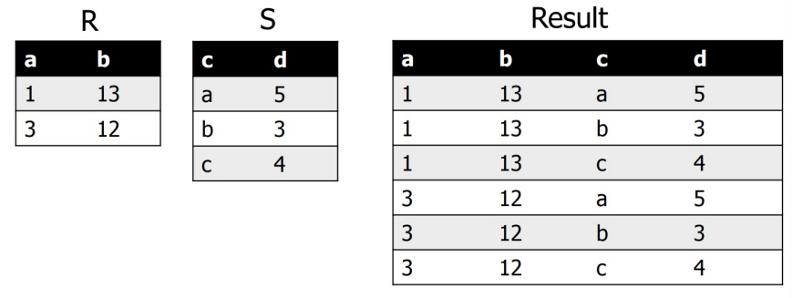

### Join Types

- **cross join**
  - same as cartesian product
- **inner join**
  - each tuple in the first relation must have a corresponding match in the second
- **outer join**
  - each tuple in one relation does not need to have a corresponding match in the other
  - this includes `LEFT JOIN` `RIGHT JOIN` and `FULL JOIN`

### Condition / Theta Join operation

- combine related tuples from 2 relations
- match tuples on some arbitrary join predicate $\theta$
- syntax: $R \Join_\theta S$
  - $R, S$ are inputs
  - $\theta$ is a condition
- the condition join is shorthand for $R \Join_\theta S = \sigma_\theta (R \times S)$
- example: $R \Join_{a=d}S$

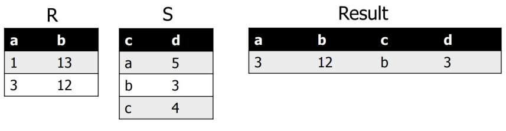

### Natural Join

- generate a relation that contains all tuples that are combinations of 2 tuples (one from each) with a common value for one or more attributes
  - the name & type of attribute must be the same
- syntax: $R \Join S$
- example: $R \Join S$

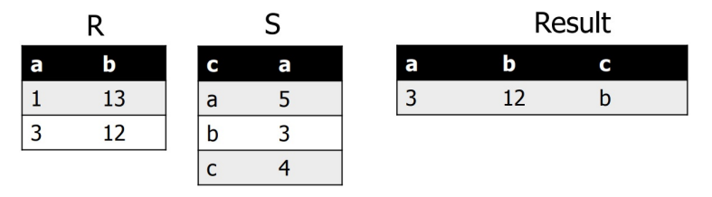

### Left-outer Join

- keep data from LHS

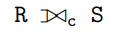

### Right-outer Join

- keep data from RHS

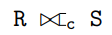

### Full-outer Join

- keep data from both relations

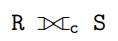

### Aggregation

- operations that aggregate the values in a single attribute of a relation
- operations are the same in relational algebra & SQL
- all operations treat a relation as a *bag* of tuples 
  - `SUM`
  - `AVG`
  - `MIN`
  - `MAX`
  - `COUNT` computes the number of non-null tuples in a column
- grouping and aggregation generally need to be implemented and optimized together
- syntax: $_{G \gamma A}(R)$
  - $A$ is a list of aggregate functions
  - $G$ is a list of group by attributes 
- example: $_{b\gamma \text{sum}(a)}(R)$

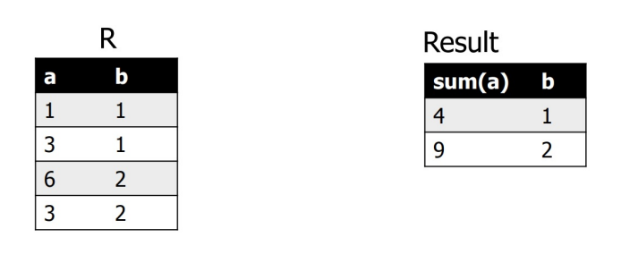

### Duplicate Removal / Elimination

- syntax: $\delta (R)$
- duplicate elimination is expensive

### Union, Intersection, and Difference

- union, intersection, and difference need new definitions for bags

#### Union

- syntax: $R \cup S$
- generate a relation that contains all tuples that appear in either only one or both input relations
- example: $R \cup S$

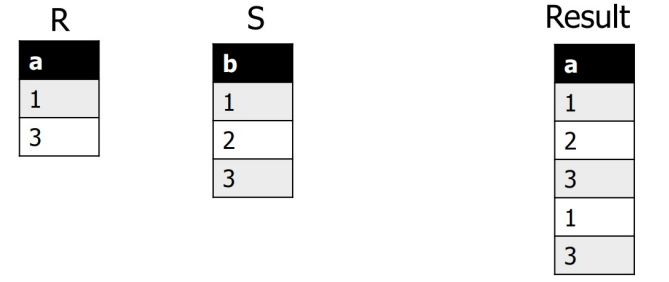

#### Intersection

- syntax: $R \cap S$
- generate a relation that contains all tuples that appear in both of the relations
- example: $R \cap S$

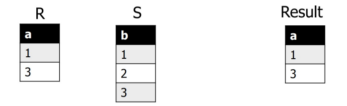

#### Set Difference

- syntax: $R-S$
- generate a relation that contains only the tuples that appear in the LHS and not the RHS
- example: $R - S$

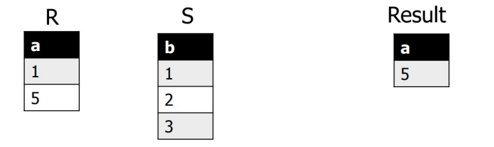

---

## Logical Query Plan LQP Generation

### Conversion into Relational algebra 

- when the query is expressed as a valid parse tree, we can generate a LQP expressed by relational algebra 
- given an SQL statement, return an equivalent relational algebra expression
  - `from` → joins and cross products $\Join \times $
  - `where` → into selection $\sigma$
  - `select` → projection and renaming $\pi \rho$
    - if `DISTINCT` → $\delta$
  - `group by` → aggregation $\gamma$
  - `having` → selection $\sigma$

### Logical and Physical Query Plans

- both are trees representing query evaluation
- their leaves represent data
- internal nodes are operators over the data
- **logical plan** is higher-level and algebraic
- **physical plan** is lower-level and operational

### Conversion into Relational Algebra

#### Two-Argument Select Example

```SQL
SELECT title FROM StarsIn WHERE starName IN (< Query >);
```

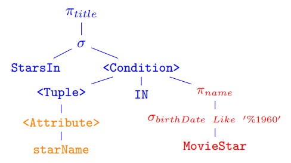

- this can be replaced by 

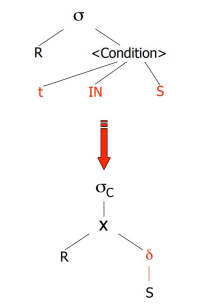