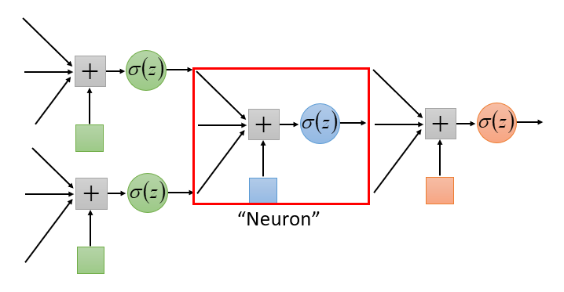
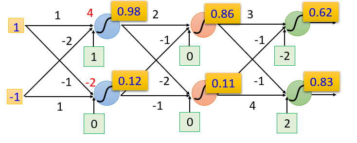
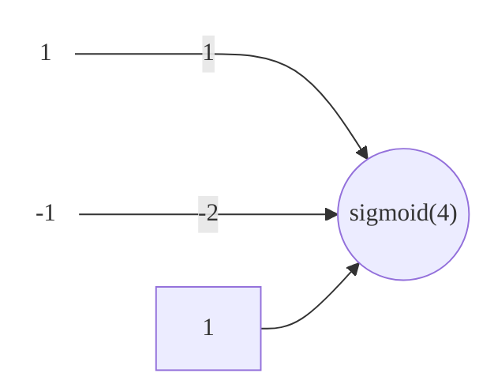
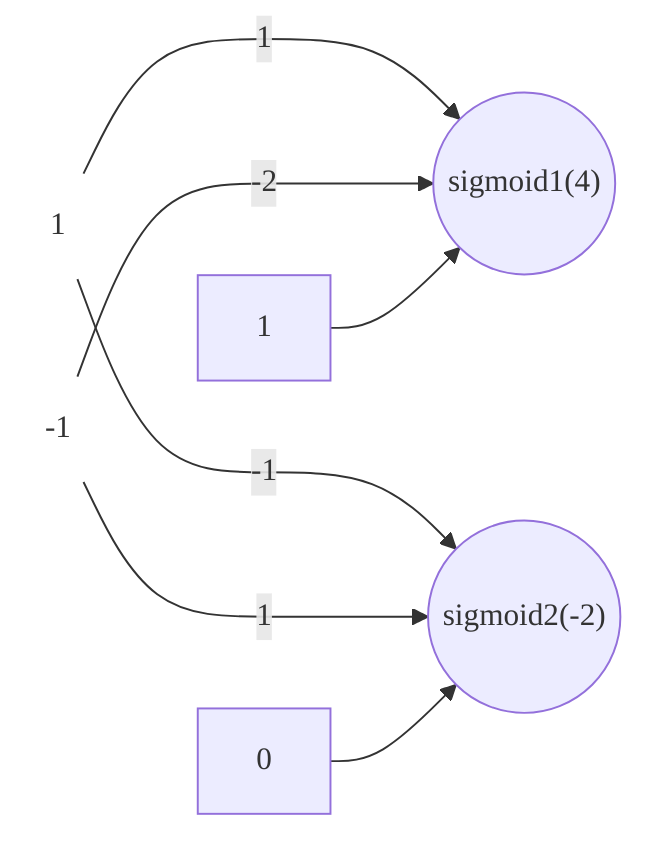
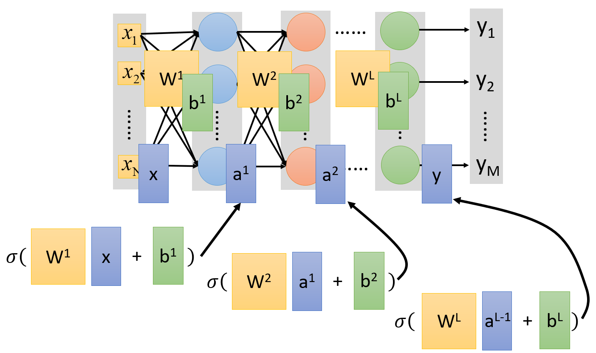

# Introduction

- Textbook: [Deep Learning](https://www.deeplearningbook.org)

[toc]

## Ups and Downs of Deep Learning

- 1958: perceptron (linear model)
- 1969: perceptron has limitations
- 1980s: multi-layer perceptron 
  - differences from DNNs today
- 1968: backpropagation
  - usually more than 3 hidden layers is not helpful
- 1989: 1 hidden layer is "good enough" so why go *deep*?
- 2006: RBM initialization ([Restricted Boltzmann machine](https://en.wikipedia.org/wiki/Restricted_Boltzmann_machine))
- 2009: GPU gives advance to hardware
- 2011: start to be popular in speech recognition
- 2012: win ILSVRC image competition ([Large Scale Visual Recognition Challenge](https://www.image-net.org/challenges/LSVRC))
- 2015: image recognition surpasses human-level performance
- 3/2016: Alpha GO beats Lee Sedol
- 10/2016: speech recognition system as good as humans

## 3 Steps for Deep Learning

1. define a set of functions (in our can a NN)
2. goodness of function
3. pick the best function

## Neural Network

- different connections leads to different network structures
- ==network parameter $\theta$== is all the weights and biases in the neurons

### Fully Connected Feedforward Network

- the input value in the `sigmoid` neuron is 4
- $(1 \times 1) + (-1 \times -2) + (1) = 4$
- or the sum of the dot product of the input features and their weights plus the bias
- as shown, we can define a ==function set== given a network structure based on the possible values for $\theta$

### Neural Network as a Matrix Operation

We can represent each layer as a matrix operation as shown

$$
\sigma(\begin{bmatrix}
1 & -2\\
-1 & 1
\end{bmatrix}
\begin{bmatrix}
1\\-1
\end{bmatrix}
+
\begin{bmatrix}
1\\0
\end{bmatrix}) =
\sigma(\begin{bmatrix}
4\\-2
\end{bmatrix})
$$

Further representing each layer:

Finally, we can represent the entire NN as a function on a vector $\vec x$
$$
\vec y = f(\vec x)
\\= \sigma (W^L ... \sigma(W^2 \sigma(W^1 \vec x + b^1)+b^2)...+b^L)
$$
We can use parallel computing techniques to speed up matrix operations

### Calculating Loss

Given our output $y$ and target $\hat y$ (with 10 classes), our loss $l$ on one example is
$$
l(y, \hat y) = -\sum_{i=1}^{10} \hat y_i \ln(y_i)
$$
Our total loss $L$ for $N$ examples is
$$
L = \sum^N_{n=1}l^n
$$

> - find the parameter $\theta$ that minimizes $L$
> - to do this, we can utilize [gradient descent](G:\My Drive\School\3-Junior-Spring\CS 581 Advanced Artificial Intelligence\9-Neural-Networks.md#Backpropagation-Algorithm)

## Frequently Asked Questions

- how many Layers / how many neurons in each?
  - trial & error + intuition :confused:
- can the structure be automatically determined?
  - e.g. Evolutionary Artificial Neural Networks
- can we design the network structure?
  - e.g. Convolutional Neural Network 

