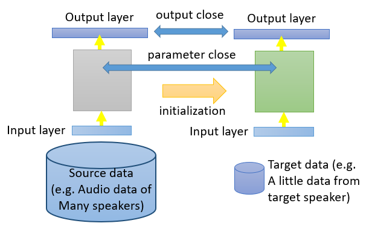
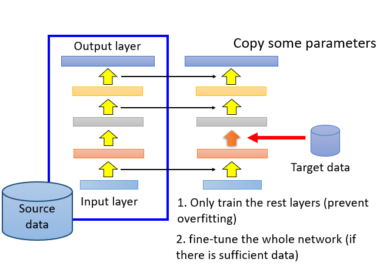
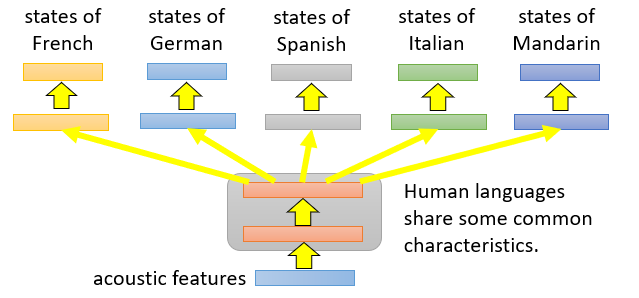
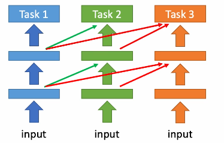
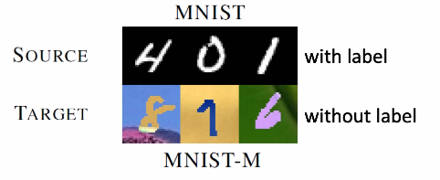
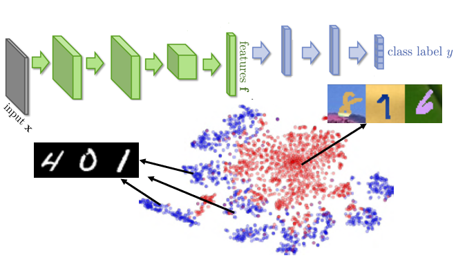
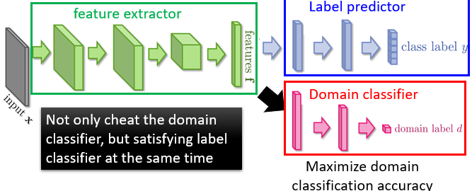
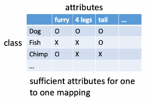
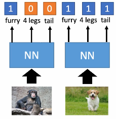

# Transfer Learning TL

## What is TL?

- say we want to train a dog / cat classifier for *real images* (target data)
- we already have data not *directly related to* the task such as (source data)
  - a previously trained elephant / tiger classifier
    - similar domain, different tasks
  - a previously trained dog / cat classifier for *cartoon images*
    - different domain, same task

## Why use TL?

- hard to find data to train a model for Taiwanese speech recognition
  - but there are many YouTube videos in English & Chinese
- expensive to get medical image data for medical image recognition
  - but there are many images in nature
- limited number of text data for a domain specific text analysis task
  - but there are many webpages on the internet

## Cases for TL

1. Source Data & Target Data is Labeled
   - [model fine-tuning](#Model fine-tuning )
   - [multi-task learning](#multi-task learning)
2. Source Data is labeled, Target Data is *unlabeled*
   - [domain-adversarial training](#domain-adversarial training)
   - [zero-shot learning](#zero-shot learning)
3. Source data is unlabeled, Target data is labeled
   - self-taught learning
4. Source data is unlabeled, Target data is unlabeled
   - self-taught clustering

---

## Model fine-tuning 

> Source Data & Target Data is Labeled

-  task description: **one-shot learning** means that our data looks like
  - source data: ($x^s,y^s$) **very large amount**
  - target data: ($x^t,y^t$) **very little** 
- example: (supervised) speaker adaptation
  - source data: audio data and transcriptions from many speakers
  - target data: audio data and its transcription for specific user
- idea: training a model by source data then fine-tune the model by target data
  - challenge: only limited target data so be careful not to overfit

### Conservative Training

- train a network using the source data
- then train a new network by using the parameters from the previous network as initialization

### Layer Transfer

- copy over *some* layer parameters
- train the other layers with the target data
- *only* fine-tune the whole network if there's enough target data
- which layers should be transferred (copied)?
  - speech task: usually copy the last few layers
  - image task: usually copy the first few layers
    - first few layers observe low level features
    - later layers overserve larger features specific to domain  

---

## Multi-task Learning

> Source Data & Target Data is Labeled

- the multi-layer structure makes NN suitable for multi-task learning

- where we assume human languages share some common characteristics
- so we share an acoustic layer between the networks 

### Progressive NN

- you have multiple tasks where the outputs of layers of task 1 are inputs to task 2 and so on

---

## Domain-adversarial Training

> Source Data is labeled, Target Data is *unlabeled*

- task description:
  - source data: ($x^s,y^s$) **use as training data**
  - target data: ($x^t$) **use as testing data**
  - but both of same task

- notice that the source data has a very different distribution than the target data
  - the source data has backgrounds where the target doesn't
  - much harder to distinguish between classes
- in domain-adversarial training,
  - the **feature extractor**'s job is to find the features that match both target & source
  - to do this, a **domain classifier** (binary classifier) tells whether the output of the feature extractor is from the target or source domain
  - similar to GAN, the feature extractor gets trained on the *source data* while the domain classifier gets from both, source & target, predicting which domain the data is from
    - the feature extractor & domain classifier compete
  - thus, the feature extractor learns which features are relevant from the source data in comparison of the target data
  - finally, a **label predictor** actually predicts the label on the *source data* (which is labeled)

---

## Zero-shot Learning

> Source Data is labeled, Target Data is *unlabeled*

- task description:
  - source data: ($x^s,y^s$) **use as training data**
  - target data: ($x^t$) **use as testing data**
  - but have different tasks
- representing each class by its attributes 
  - our database represents the classes by their attribute composition
    
  - note we need sufficient attributes to represent each class uniquely
- in training, we predict the attributes instead of the class
  

