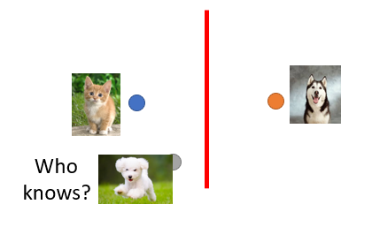
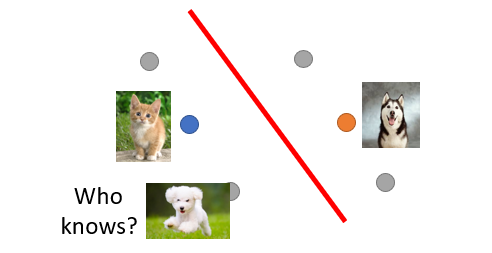

# Semi-supervised Learning

## Introduction

- it is easier to get unlabeled data than labeled data
- supervised learning: $\{(x^r,\hat y^r)\}^R_{r=1}$
- semi-supervised learning: $\{(x^r,\hat y^r)\}^R_{r=1}, \{x^u\}^{R+U}_{u=R}$
  - usually the unlabeled set is much bigger
  - ==transudative learning== unlabeled data is the testing data
  - ==inductive learning== unlabeled data is *not* the testing data

## Why semi-supervised learning helps?

 → 

- distribution of unlabeled data tells us something

---

## Semi-supervised learning for generative learning