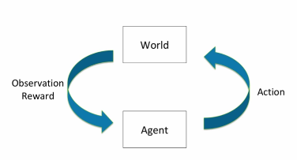

# Introduction to RL (Reinforcement Learning)

> **Learning** to make **good** decisions under **uncertainty**

## Reinforcement Learning involves 

- optimization
- delayed consequences
- exploration
- generalization

### Optimization

- goal is to find an optimal way to make decisions
  - yielding best (or very good) outcomes 
- explicit notion of utility of decisions
- example: finding minimum distance route between 2 cities given network of roads

### Delayed Consequences

- decisions now can impact things much later
  - kill an enemy hero or destroy basement in DotA
- introduces 2 challenges
  - when planning: decisions involve reasoning about not just immediate benefit of a decision but also its long term ramifications
  - when learning: temporal credit assignment is hard (what caused later high or low rewards)

### Exploration

- learning about the world by making decisions
- censored data
  - only get a reward (label) for decision made
- decisions impact what we learn about

### Generalization

- policy is mapping from past experience to action

---

## Initiation Learning

- SL = Supervised learning; UL = Unsupervised learning; RL = Reinforcement Learning; IL = Imitation Learning
  - AI planning assumes have a model of how decisions impact environment
  - SL has access to the correct labels
  - UL has no access to labels
  - RL is given only reward information, and only for states reaches & actions takes
  - IL typically assumes unput demonstrates good polices
    - IL reduces RL to SL

---

## Markov Decision Processes MDPs

### Sequential Decision Making

- goal: select actions to maximize total expected future rewards
  - may require balancing immediate & long term rewards 

#### Sequential Decision Process: Agent & the World

- each time step $t$
  - agent takes action $a_t$
  - world updates given action $a_t$ emits observation $o_t$ and reward $r_t$
  - agent receives $o_t$ and $r_t$

#### History: Sequence of past observations, actions, & rewards

- history $h = (a_1,o_1,r_1,...a_t,o_t,r_t)$
- agent chooses action based on history
- state is information assumed to determine what happens next
  - function of history

#### Markov Assumption

- information state: sufficient statistic of history
- state $s_t$ is Markov if and only if 
  - future is independent of past given present

### MDP Model

- agents representation of how world changes given agent's action
- transition / dynamics model predicts next agent state
  - $p(s_{t+1}=s'|s_t=s,a_t=a)$
- reward model predicts immediate reward
  - $r(s_t=s,a_t=a) = E[r_t|s_t=s,a_t=a]$
- policy $\pi$ determines how the agent chooses actions
  - **maps states to actions**
  - can be deterministic or stochastic
  - 
- value function $V^\pi$: expected discounted sum of future rewards under policy $\pi$
  - future rewards from being in a state and / or action when following particular policy
  - $V^\pi(s_t=s) = E_\pi[r_t+\gamma r_{t+1}+\gamma^2 r_{t+2}+...|s_t=s]$
  - discount factor $\gamma$ weights immediate vs future rewards

#### Types of RL Agents

- model-based
  - explicit model
  - may or may not have policy / value function 
- model-free
  - no model
  - has policy and / or value function 

---

## Markov Process or Markov Chain

- memoryless random process
  - sequence of random states with Markov property
- definition of Markov Process
  - $S$ is a finite set of states $s \in S$
  - $P$ is dynamics / transition model that specifies $p(s_{t+1}=s|s_t=s)$
- *note* no rewards, no actions
- if finite number $N$ of states can express $P$ as a matrix

### Example Markov Chain

---

## Markov Reward Process MRP

- MDP + $\pi(a|s)$  = MRP
- where 

---

## Return and Value Function

- ==horizon== $H$
  - number of time steps in each episode
  - can be infinite
  - other called finite Markov reward process
- ==return== $G_t$
  - discounted sum of rewards from time step $t$ to horizon $H$
  - 
- ==State Value Function== $V(s)$
  - expected return from starting in state $s$
  - 

>  in Markov decision process, a large discount factor $\gamma$ means that short term rewards are more influential than long term
>
> this is FALSE

### Computing value of a MRP

- MRP value function satisfies
  - $V(s) = R(s) + \gamma \sum+{s'\in S}P(s'|s)V(s')$
  - or the immediate reward + discounted sum of future rewards 

---

# Broad Summary

1. **Course Outline:**
   - Markov decision processes & planning
   - Model-free value-based RL algorithms
   - Reinforcement learning with function approximation & Deep RL
2. **Reinforcement Learning:**
   - Definition: Learning to make good decisions under uncertainty.
3. **Huge Increase in Interest:**
   - Applications in various domains, including plasma control for fusion science, COVID-19 border testing, and tumor detecting and positioning.
4. **Key Concepts in Reinforcement Learning:**
   - Optimization: Finding optimal decisions for best outcomes.
   - Delayed Consequences: Decisions impact outcomes over time.
   - Exploration: Learning about the world through decisions.
   - Generalization: Mapping past experiences to actions.
5. **RL vs Other AI and Machine Learning:**
   - Comparison with AI Planning, Supervised Learning, Unsupervised Learning, and Imitation Learning.
6. **Sequential Decision Making:**
   - Goal: Select actions to maximize total expected future reward, balancing immediate and long-term rewards.
7. **Examples of Sequential Decision Problems:**
   - Web Advertising, Robot Unloading Dishwasher, Blood Pressure Control.

## Markov Decision Processes (MDPs)

1. **Definition:**
   - MDP is a tuple (S, A, P, R, γ), including states, actions, transition dynamics, reward function, and discount factor.
2. **Markov Assumption:**
   - Future is independent of the past given the present state.
3. **Types of Sequential Decision Processes:**
   - Markov Processes, Markov Reward Processes (MRPs), Markov Decision Processes (MDPs).
4. **MDP Components:**
   - Policies, Value Functions, Q-Values, Model, and Bellman Equation.

## Value Iteration and Policy Iteration

1. **Value Iteration:**
   - Compute optimal value for a finite horizon and incrementally extend the horizon.
2. **Policy Iteration:**
   - Alternates between policy evaluation and policy improvement.
3. **Contraction Operators:**
   - Definitions related to contraction properties in iterative algorithms.
4. **Q-Iteration and Q-Learning:**
   - Q-Iteration as an extension of Value Iteration, and Q-Learning for model-free RL.

## Deep Q Network (DQN)

1. **Introduction:**
   - Extension of Q-Learning using neural networks to approximate Q-Values.
2. **Target Network:**
   - Use of a separate target network to stabilize training.
3. **Tips for Q Learning:**
   - Experience Replay, Fixed Q Targets, and exploration-exploitation trade-off.
4. **Applications:**
   - Examples of applying Q-Learning in different domains.

## Conclusion

1. **Tips for Q Learning:**
   - Recap of key tips for effective Q-Learning.
2. **Suggested Readings:**
   - Additional resources for further study