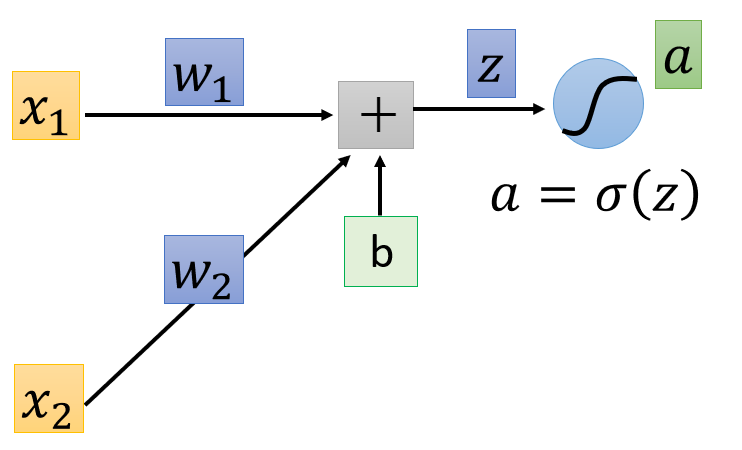

# Backpropagation

[toc]

## Gradient Descent

-  network parameters $\theta = \{w_1, w_2,..., b_1, b_2, ...\}$
  - where $w_i$ are weights and $b_i$ are biases

$$
\nabla L(\theta) = 
\begin{bmatrix}
\partial L(\theta)/\partial w_1\\
\partial L(\theta)/\partial w_2\\
...\\
\partial L(\theta)/\partial b_1\\
\partial L(\theta)/\partial b_2\\
...
\end{bmatrix} 
$$

- where $L(\theta)$ is the loss function $\eta$ is a learning rate 
- given a starting parameter $\theta_0$, compute $\theta_1 \coloneqq \theta_0 - \eta \nabla L(\theta_0)$
- $\theta_0 → \theta_1 → \theta_2 → ...$
- to compute the gradients efficiently, use *backpropagation*

## Backpropagation

- you can also refer to this

$$
\frac{\partial l}{\partial w} = \frac{\partial z}{\partial w} \frac{\partial l}{\partial z} \leftarrow \text{chain rule}
$$

1. [Forward pass](#Backpropagation: Forward Pass): compute $\partial z /\partial w$ for all parameters
2. [Backward pass](#Backpropagation: Backward Pass): compute $\partial l /\partial z$ for all activation function inputs $z$

### Backpropagation: Forward Pass

$$
z = x_1w_1+x_2w_2+b\\
\frac{\partial z}{\partial w_1} = x_1 
$$

### Backpropagation: Backward Pass

$$
\frac{\partial l}{\partial z} = \frac{\partial a}{\partial z} \frac{\partial l}{\partial a} = \sigma'(z) \frac{\partial l}{\partial a}
$$
- where you can get $\frac{\partial l}{\partial a}$ recursively

$$
\frac{\partial l}{\partial a} = \frac{\partial z_1}{\partial a} \frac{\partial l}{\partial z_1} + \frac{\partial z_2}{\partial a} \frac{\partial l}{\partial z_2}
$$

- where $z_1,z_2$ are

- if you get to the output layer as

- you can calculate $\frac{\partial l}{\partial z} $ as

$$
\frac{\partial l}{\partial z_1} = \frac{\partial y_1}{\partial z_1} \frac{\partial l}{\partial y_1} \\
\frac{\partial l}{\partial z_2} = \frac{\partial y_2}{\partial z_2} \frac{\partial l}{\partial y_2}
$$

