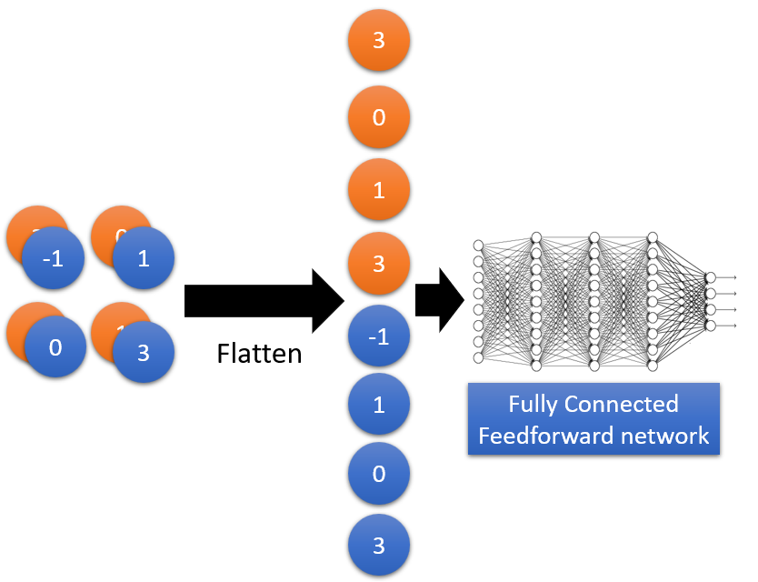

# Convolutional Neural Network

[toc]

## Why are CNNs good for images?

There are ==3 properties== to look at:

1. some patterns are much smaller than the whole image
   -  neuron does not have to see the whole image to discover them
2. the same patterns appear in different regions
   - i.e. the beak of a bird can be located in different regions of the image
3. subsampling the pixels does not change the object
   - we can subsample the pixels to decrease the parameters in the network

## What are CNNs?


- **properties 1 & 2 are achieved by the ==convolution layers==**
- **property 3 is achieved by the ==max pooling layer==**

### Convolution

- assume you have a $6 \times 6$ image

$$
6 \times 6 \text{ image}: 
\begin{bmatrix}
1 & 0 & 0 & 0 & 0 & 1\\
0 & 1 & 0 & 0 & 1 & 0\\
0 & 0 & 1 & 1 & 0 & 0\\
1 & 0 & 0 & 0 & 1 & 0\\
0 & 1 & 0 & 0 & 1 & 0\\
0 & 0 & 1 & 0 & 1 & 0
\end{bmatrix}
$$

- and you have 2 filters

$$
\text{filter 1}: \begin{bmatrix}
1 & -1& 1 \\
-1& 1 & -1\\
-1& -1& 1
\end{bmatrix},
\text{filter 2}: \begin{bmatrix}
-1& 1&-1 \\
-1& 1 & -1\\
-1& 1&-1
\end{bmatrix}
$$

- each filter detects a small $3 \times 3$ pattern
- assuming the ==stride== is 1, start with filter 1 in the top left corner, and apply it as **a sum of element-wise multiplication**

$$
\begin{bmatrix}
1 & -1& 1 \\
-1& 1 & -1\\
-1& -1& 1
\end{bmatrix}
\text{applied on}
\begin{bmatrix}
\begin{array}{ccc|ccc}
1 & 0 & 0 & 0 & 0 & 1\\
0 & 1 & 0 & 0 & 1 & 0\\
0 & 0 & 1 & 1 & 0 & 0\\
\hline
1 & 0 & 0 & 0 & 1 & 0\\
0 & 1 & 0 & 0 & 1 & 0\\
0 & 0 & 1 & 0 & 1 & 0
\end{array}
\end{bmatrix}
\rightarrow
\begin{bmatrix}
3 & \_ & \_ & \_ \\
\_ & \_ & \_ & \_\\
\_ & \_ & \_ & \_ \\
\_ & \_ & \_ & \_
\end{bmatrix}
$$

- move down the filter by 1 (i.e. stride is 1)

$$
\begin{bmatrix}
\begin{array}{c|ccc|cc}
1 & 0 & 0 & 0 & 0 & 1\\
0 & 1 & 0 & 0 & 1 & 0\\
0 & 0 & 1 & 1 & 0 & 0\\
\hline
1 & 0 & 0 & 0 & 1 & 0\\
0 & 1 & 0 & 0 & 1 & 0\\
0 & 0 & 1 & 0 & 1 & 0
\end{array}
\end{bmatrix}
\rightarrow
\begin{bmatrix}
3 & -1 & \_ & \_ \\
\_ & \_ & \_ & \_\\
\_ & \_ & \_ & \_ \\
\_ & \_ & \_ & \_
\end{bmatrix}
$$

$$
\begin{bmatrix}
\begin{array}{cc|ccc|c}
1 & 0 & 0 & 0 & 0 & 1\\
0 & 1 & 0 & 0 & 1 & 0\\
0 & 0 & 1 & 1 & 0 & 0\\
\hline
1 & 0 & 0 & 0 & 1 & 0\\
0 & 1 & 0 & 0 & 1 & 0\\
0 & 0 & 1 & 0 & 1 & 0
\end{array}
\end{bmatrix}
\rightarrow
\begin{bmatrix}
3 & -1 & -3 & \_ \\
\_ & \_ & \_ & \_\\
\_ & \_ & \_ & \_ \\
\_ & \_ & \_ & \_
\end{bmatrix}
$$

$$
\begin{bmatrix}
\begin{array}{ccc|ccc}
1 & 0 & 0 & 0 & 0 & 1\\
0 & 1 & 0 & 0 & 1 & 0\\
0 & 0 & 1 & 1 & 0 & 0\\
\hline
1 & 0 & 0 & 0 & 1 & 0\\
0 & 1 & 0 & 0 & 1 & 0\\
0 & 0 & 1 & 0 & 1 & 0
\end{array}
\end{bmatrix}
\rightarrow
\begin{bmatrix}
3 & -1 & -3 & -1 \\
\_ & \_ & \_ & \_\\
\_ & \_ & \_ & \_ \\
\_ & \_ & \_ & \_
\end{bmatrix}
$$

$$
\begin{bmatrix}
\begin{array}{ccc|ccc}
1 & 0 & 0 & 0 & 0 & 1\\\hline
0 & 1 & 0 & 0 & 1 & 0\\
0 & 0 & 1 & 1 & 0 & 0\\
1 & 0 & 0 & 0 & 1 & 0\\\hline
0 & 1 & 0 & 0 & 1 & 0\\
0 & 0 & 1 & 0 & 1 & 0
\end{array}
\end{bmatrix}
\rightarrow
\begin{bmatrix}
3 & -1 & -3 & -1 \\
-3 & \_ & \_ & \_\\
\_ & \_ & \_ & \_ \\
\_ & \_ & \_ & \_
\end{bmatrix}
$$

- and so on... until the ==feature map== is completed


- as shown, the feature map has repeated patterns (i.e. property 1)
- we can repeat this process for filter 2 as well to get a 2nd feature map


- if our images has multiple channels (i.e. RGB for a colorful image), your	 filters would also have multiple channels such that the feature maps have multiple channels


- *note* that I got points taken off in assignment 1 for not adding the matrixes of each color channel into a single matrix

#### Padding

- ==zero-padding== is when 0s are added around the input matrix such that after the convolution is done, the output matrix has the same dimension as the input
  - refer to [assignment 1](assignments/Assignment_1/CS577_Assigment_1.pdf)
- ==no padding== is when no padding is done

#### Convolution vs Fully Connected

- unlike fully connected layers, in a convolution, not all input nodes are connected to output
- for example with a $6 \times 6$ image


- as shown, not all are connected to the output (meaning less parameters)


- more so, weights can be shared across connections (meaning *even* less parameters)

#### Max Pooling

- after applying a convolution layer, we can perform *max pooling* to further reduce the size of the image
- an operation that selects the maximum element from the region of the feature map covered by the filter

 →  → →  → 

- we can repeat this process of convolution followed by max pooling (each time getting a new image)

#### Flatten

- lastly, we flatten our image representation to a single vector
- this can be used in a *fully connected feedforward network*



##  CNN in Keras

### `Convolution2D` & `MaxPooling2D`

```python
model.add(Convolution2D(25,3,3,input_shape=(28,28,1)))
```

- there are `25` `3` by `3` filters
- the `input_shape` (of the images being classified) are `28` by `28` pixels with `1` channel (i.e. black & white)

```python
model.add(MaxPooling2D((2,2)))
```


### Understanding the Shape and Parameters


```python
# 1 * 28 * 28 ->
model.add(Convolution2D(25,3,3,input_shape=(28,28,1)))
# 25 * 26 * 26 ->
```

- the input is $1 \times 28 \times 28$ from the input image
- the output is $25 \times 26 \times 26$ because of the 25 filters that are 3 by 3
  - the stride is 1 so the feature map from each is $26 \times 26$
- each filter has $3 \times 3 \times 1 = 9$ parameters
  - each filter is 3 by 3
  - the $\times 1$ is for the single channel of the input 

```python
model.add(MaxPooling2D((2,2)))
# 25 * 13 * 13 ->
```

- the output is $25 \times 13 \times 13$ as we select the max from every 2 by 2 region
  - $26/2=13$
- *note* that the number or parameters for max pooling is 0

```python
model.add(Convolution2D(50,3,3))
# 50 * 11 * 11 ->
```

- the output is $50 \times 11 \times 11$ because of the 50 filters that are 3 by 3
- each filter has $3 \times 3 \times 25 = 225$ parameters
  - each filter is 3 by 3
  - the $\times 25$ is for the 25 channels of the input 

```python
model.add(MaxPooling2D((2,2)))
# 50 * 5 * 5 ->
model.Add(Flatten())
# 1250 -> fully connected feedforward network
model.add(Dense(output_dim=100))
model.add(Activation('relu'))
model.add(Dense(output_dim=10))
model.add(Activation('softmax'))
```

## Other Applications of CNN

- deep dream - exaggerates what it sees
- deep style - two CNNs (one with content , other with style) reimagines images in different styles
- playing Alpha Go - visualizes the board as an image
  - refer to the [properties of CNN](#Why are CNNs good for images?)
  - some patterns are smaller than the whole
  - the same patterns appear in different regions
  - *however* Alpha Go does not use max pooling (as subsampling wouldn't make sense in this case)
