# Tips for Deep Learning

[toc]

## Recipe of Deep Learning

```mermaid
flowchart TB
	1[step 1: define a set of functions] --> 2["step 2: find goodness of functions (i.e. train)"]
	2 --> 3[step 3: pick the best function]
	3 --> n(neural network)
	n --> g(good results on training data?)
	g -- no --> 3
	g -- yes --> gt(good results on testing data?)
	gt -- no --> 1
	gt -- yes --> d("😊")
```

*Usually* getting bad results on testing data indicates ==overfitting==.

## Getting Bad Results on *Training* Data

### New Activation Function

- notice that in this situation, the training data accuracy drops as we add more layers (get deeper)
-  the issue maybe a result of ==Vanishing Gradient Problem==

#### Vanishing Gradient Problem

- we calculate the gradient using $\frac{\partial l}{\partial w}$
- if our $\Delta w$ is very large on our first input and our activation function is sigmoid or tanh, this will decrease the $\Delta w$ towards the next inputs as shown

> - as gradients are backpropagated, they can become extremely small, often approaching zero
> - when gradients are too small, it means that the updates to the model's parameters are minuscule
>   - slow training or the network not learning at all
> - functions like sigmoid and tanh *squash* their input values into a small range (i.e. between $[0,1]$ or $[-1,1]$)
>   - when gradients are computed for these functions, they tend to be small when the input values are very large

##### ReLU

- to solve the [Vanishing Gradient Problem](#Vanishing Gradient Problem), we can use the Rectified Linear Unit function ==ReLU== instead of sigmoid for our activation function

###### Using ReLU

 → 

- we can random sample some of the neurons and assume they have 0 output then remove them from the network (as the zero is on a corner and is not smooth)
- the rest are linear (smooth) and easy to calculate the gradient of
- I'm not sure what this is talking about; it sounds more like dropout

###### ReLU Variants

- where the parametric ReLU also has $\alpha$ in $a = \alpha z$ is learned by gradient descent

##### Maxout

- a learnable activation function
- ReLU is a special case of Maxout

- maxout is learnable as $z_1,z_2$ are learned from parameters 
  - Maxout takes the max output as $\max(z_1,z_2)$
    - where $z=wx+b$ (just the linear transformations of input in the NN)
- Activation function in maxout network can be any piecewise linear convex function
  - how many pieces depending on how many elements in a group

- given training data $x$, we know which $z$ would be the max
  - thus, we train a on a thin and linear network based on different examples

---

### Adaptive Learning Rate

#### AdaGrad

$$
w^{t+1} \leftarrow w^t - \frac{\eta}{\sqrt{\sum_{i=0}^t(g^i)^2}}g^t
$$

- where $w^t$ is weight at time step $t$
- $\eta$ is learning rate
- $g^t$ is the gradient at time step $t$
- i.e. the learning rate is divided by the square root of the sum of the squares of the gradients of the previous steps
  - the learning rate decreases as the gradient increases

#### RMSProp 

- Root Mean Square Propagation

$$
w^1 \leftarrow w^0 - \frac{n}{\sigma^0}g^0, \sigma^0 = g^0\\
w^2 \leftarrow w^1 - \frac{n}{\sigma^1}g^1, \sigma^1 = \sqrt{\alpha(\sigma^1)^2 + (1-\alpha)(g^2)^2}\\
...\\
w^{t+1} \leftarrow w^t - \frac{n}{\sigma^t}g^t, \sigma^t = \sqrt{\alpha(\sigma^{t-1})^2 + (1-\alpha)(g^t)^2}\\
$$

- the root mean square of the gradients with previous gradients being decayed
  - adjust how fast each parameter in a neural network learns by taking into account the historical information about the gradients

#### Momentum

##### Issue with Vanilla Gradient Descent

- vanilla gradient descent looks like this
  1. start at position $\theta^0$
  2. compute gradient at $\theta^0$
  3. move to $\theta^1 = \theta^0 - n \nabla L(\theta^0)$
  4. compute gradient at $\theta^1$
  5.  move to $\theta^2 = \theta^1 - n \nabla L(\theta^1)$
  6. ... stop until $\nabla L(\theta^t) \approx 0$

##### How Momentum Helps

- with momentum, movement of last step minus gradient at present
  1. start at position $\theta^0$
  2. movement $v^0 = 0$
  3. compute gradient at $\theta^0$
  4. movement $v^1 = \lambda v^0 - n \nabla L(\theta^0)$
  5. move to $\theta^1 = \theta^0 + v^1$
  6. ...
- where movement is not just based on *gradient* but previous movement

- still not guarantee reaching global minima, but gives some hope

> the `Adam` algorithm is basically RMSProp + Momentum

---

## Getting Bad Results on *Testing* Data

### Early Stopping

### Regularization

- new loss function to be minimized

$$
L'(\theta) = L(\theta) + \lambda \frac12 ||\theta||_2
$$

- where $L(\theta)$ is the original loss function
  - i.e. MSE or cross entropy
- $||\theta||_2$ is the regularization term
- the gradient is

$$
\frac{\partial L'}{\partial w} = \frac{\partial L}{\partial w} + \lambda w
$$

- refer to [Machine Learning](G:\My Drive\School\4-Senior-Fall\CS-584 Machine Learning\5+6-Linear-Regression.md#Regularization) notes as well

#### L2 Regularization

$$
||\theta||_2 = (w_1)^2+(w_2)^2
$$

- usually do not consider bias
- update as

$$
w^{t+1} = w^t - n \frac{\partial L'}{\partial w} \\= w^t - n(\frac{\partial L}{\partial w}+\lambda w^t)
$$

- where $n(\frac{\partial L}{\partial w}+\lambda w^t)$ will cause weight decay

$$
= (1-n\lambda)w^t - n\frac{\partial L}{\partial w}
$$

#### L1 Regularization

$$
||\theta||_2 = |w_1|+|w_2|
$$

- update as

$$
w^{t+1} = w^t - n \frac{\partial L'}{\partial w} \\= w^t - n(\frac{\partial L}{\partial w}+\lambda \text{sgn}(w^t))\\
= w^t - n \frac{\partial L}{\partial w} - n \lambda \text{sgn}(w^t)
$$

- where $n \lambda \text{sgn}(w^t)$ will always delete

### Dropout

- each time, before updating the parameters
  - each neuron has some probability of being dropped out (i.e. the structure of the network is changed)
  - use the new network for training
- for each mini-batch, we *resample* the dropout neurons

#### Dropout Testing

- for testing, we do not do *any* dropout
- however, if the dropout rate was $P\%$ then multiply all the weights by $(1-P)\%$ 

#### Dropout Intuition

- if you're on a team and you know your teammate will dropout, you will work even harder
- when testing and there is no dropout, the results are even better
- dropout is **a kind of ensemble**