# Recurrent Neural Network

[toc]

## 1-of-N Encoding

- **1-of-N encoding** is a way to represent a word as a vector
- a lexicon is set of vocabulary 
  - $\text{lexicon} = \{\text{apple},\text{bag},\text{cat},\text{dog},\text{elephant}\}$
- our vector is the size of our lexicon where each dimension corresponds to a word 
  - $\text{apple}=[1,0,0,0,0]$
- we can also add another dimension as a sort of catch all or "other" dimension 
  - $\text{batman} = [0,0,0,0,0,1]$
  - $\text{superman} = [0,0,0,0,0,1]$

## Neural Network Needs Memory

- say we have the sentence "arrive Taipei on November 2^nd^"
- I'd like to give a sentence to a network and the network is able to give the probabilities that each word is a destination, a time, or other
- what if I give the sentence "leave Taipei on..."
- now Taipei should not be destination
- however, if process each word individually, our network won't be able tell
- our network need memory to remember the context of "*leave*"

## Recurrent Neural Network RNN

- the hidden layers are stored is stored in the memory 
- memory can be considered as another input

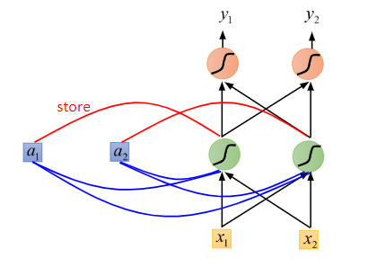

### RRN Basic Example

- given a RNN with this input sequence

$$
\begin{bmatrix}
1\\1
\end{bmatrix}
\begin{bmatrix}
1\\1
\end{bmatrix}
\begin{bmatrix}
2\\2
\end{bmatrix}
$$

- assume all weights are 1 with no bias and activation functions are linear
- the 2 memory nodes are initially 0
- starting with the first input of $[1,1]$
- the hidden layer is calculated as $h = w_1x_1+a_1+w_2x_2+a_2$
  - $1 * 1 + 0 + 1 * 1 + 0 = 2$
- the output layer is just $o = w_3h_1 + w_4h_2$
  - $1 * 2 + 1 * 2 = 4$

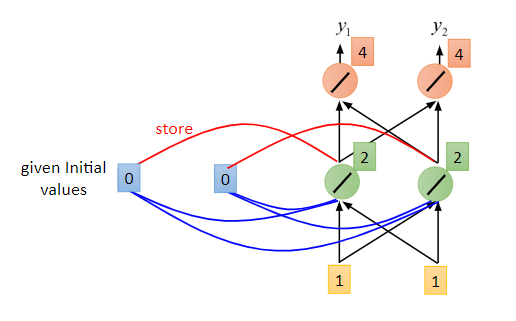

- next, we update the memory nodes to their corresponding hidden node's values
- next input is $[1,1]$

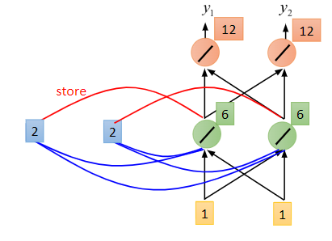

- update the memory nodes
- the next input is $[2,2]$

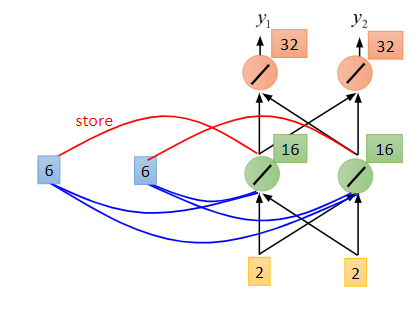

- *notice* that changing the sequence of our input will change the output

### Elman Network & Jordan Network

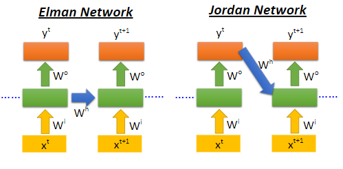

### Bidirectional RNN

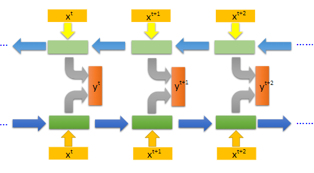

### Long Short-Term Memory (LSTM)

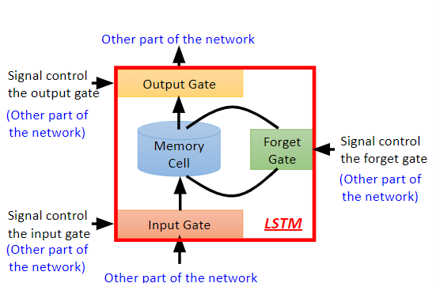

- this is a LSTM unit which is a special neuron with 4 inputs & 1 output

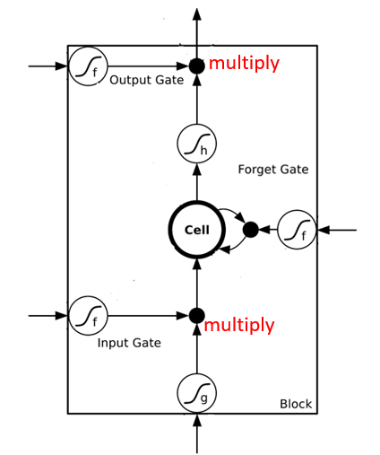

#### LSTM Example

- say we have the following sequence into our LSTM unit

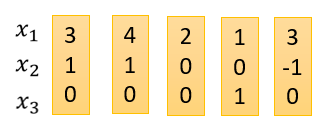

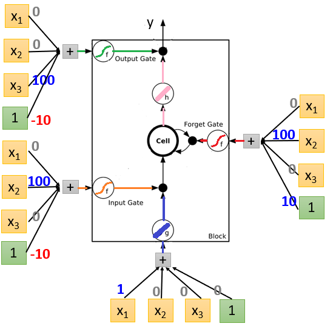

1. our input $x_1,x_2,x_3$ is $[3,1,0]$ and output will be 0 (we get the output as follows)
   - start by initializing the `cell` to 0
   - the input to $g$ is $(3*1) + (1*0) + (0*0) + (1*0) = 3$ and its output (linear) is 3
   - the input to *input gate* $f$ is $(3*0) + (1*100)+ (0*0) + (1*-10)=90$ and its output (sigmoid) is $\text{sigmoid}(90) \approx 1$
     - **note that large positive values on sigmoid evaluate to about 1 and** 
     - **large negative values to about 0**
   - the input to *forget gate* $f$ is $100 + 10 = 110$ and its output (sigmoid) is $1$
     - the forget gate is 1 meaning we **add to the** `cell` the product of *input gate* $f$ and $g$ (i.e. $3 * 1 = 3$) so the `cell` is holding 3
     - if it is 0, then we reset the `cell` to 0
   - the input to $h$ is 3 and its output (linear) is 3
   - the input to *output gate* $f$ is $-10$ and its output (sigmoid) is 0
   - the output of the LSTM is the product of *output gate* $f$ and $h$ (i.e. $0 * 3 = 0$)
2. our input is $[4,1,0]$ and output will be 0
   - our `cell` is still holding 3
   - the input to $g$ is 4 and its output (linear) is 4
   - the input to *input gate* $f$ is $100 - 10 =90$ and its output (sigmoid) is 1
   - the input to *forget gate* $f$ is $100 + 10=110$ and its output (sigmoid) is 1
     - the forget gate is 1 meaning we **add to the** `cell` the product of *input gate* $f$ and $g$ (i.e. $4 * 1 = 4$) so the `cell` is holding $3+4=7$
   - the input to $h$ is 7 and its output (linear) is 7
   - the input to *output gate* $f$ is $-10$ and its output (sigmoid) is 0
   - the output of the LSTM is the product of *output gate* $f$ and $h$ (i.e. $0 * 7 = 0$)
3. we repeat this with the rest of the inputs

#### How do we use LSTMs in our neural networks?

- simply replace the neurons with LSTM units

 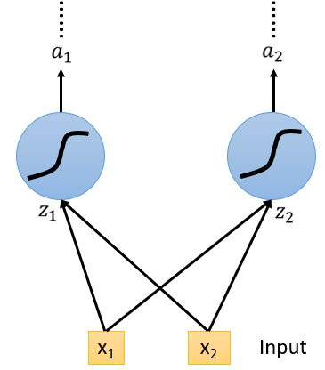 → 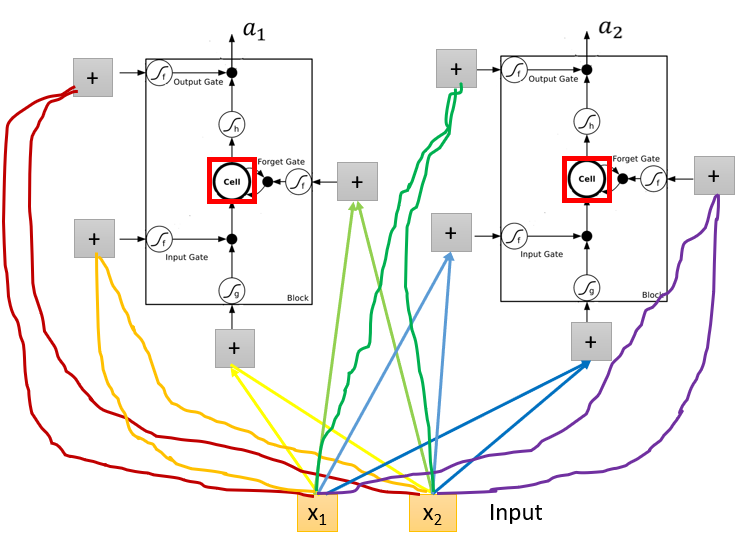

- *note* that we now have 4 times the amount of parameters for each added LSTM 

### RNNs Learning

- we use backpropagation through time (BPTT)
- there are ways to optimization this outside the scope of this class
- unfortunately RRN networks are not always easy to learn

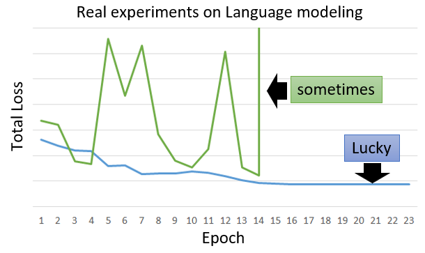

- the error surface is rough (either very flat or very steep)
  - when our gradient lands on a steep cliff, it jumps very far away (hence the instability in our loss)

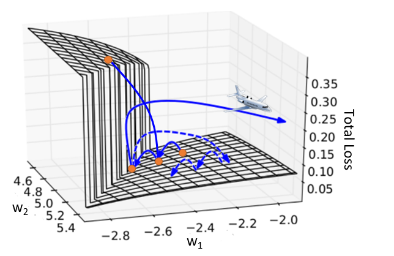

- the solution is to use **clipping**
  - where we have a threshold so if the gradient is very large, we cut it off and let it repeat again

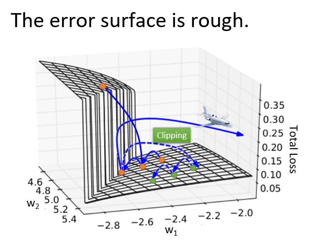
