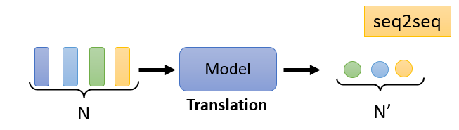

# Self-Attention

[toc]

## Sophisticated Input

- input can be a **vector**

- input can can also be a **set of vectors**

### Vector Set as Input 

- we can represent text as a set of vectors
  - one-hot encoding a lexicon
  - word embedding
- we can also represent audio as set of vectors 
- graphs are also is set of vectors (each node is a vector)
  - adjacency matrix where row is basically an edge vector

### What does output look like?

1. each vector has a corresponding label

2. the whole sequence of vectors has a label

3. the model decides the number of labels itself

> The focus of this lecture is (1) "each vector has a corresponding label"

---

## Sequence Labeling

- consider this sequence of 4 fully connected networks (the `FC` represents fully connected)
- to consider the context, we can connect the neighbors together 
  - i.e. to distinguish between "I *saw*" and "a *saw*"
- however, this limits our *window* to only the neighbors
- is there a *window* that can cover the whole sequence?

### Self-attention

- a self-attention layer can capture the context information across the entire sequence

- how can we find the relevant vectors in a sequence?

#### Dot-product

- one way to find the relevance between the 2 vectors is through dot product

#### Additive

- another is through additive
- because of dot product's simplicity, it is used more often

### Calculating Self-attention

- the output of our first node is known as the **query** whereas the others are **keys**
- the dot product between the query is taken between each key to get **attention scores** $\alpha$
- the attention scores $\alpha$ are taken to a SoftMax to get $\alpha'$, which is computed as:

$$
\alpha'_{1,i} = e^{a_{1,i}} / \sum_j e^{a_{1,j}}
$$

- then to extract information based on attention scores $\alpha'$, we can calculate the $b$ with respect to our query

- where $b$ is calculate as:

$$
b^1 = \sum_i a'_{1,i}v^i
$$

- the query is taken *with respect to each node*

- this entire process can be done through matrices as:

$$
Q = W^q I\\
K = W^k I\\
V = W^v I\\
A = K^\top Q\\
A' = \text{softmax}(A)\\
O = VA'
$$

- where $I$ is our input vector
  - weights $W^q,W^k,W^v$ are learned parameters 
  - $O$ is our output vector

---

## Applications

- it is used a lot in NLP

  - transformers
  - BERT

- speech recognition

  - however, speech is often a very large vector sequence $L$
  - so $A'$ is dimension $L \times L$
  - instead, *truncated self-attention* is used where the attention is taken in a smaller *range* instead of the entire sequence

- it could also be used for images

  - consider and image with 3 channels

    

### Self-attention vs CNN

- **CNN** is a self-attention that can only attend in a *receptive field*
  - i.e. CNN is a *simplified self-attention*
  - Self-attention is the complex version of CNN

### Self-attention vs RNN

- layers of RNNs are *nonparallel* whereas the outputs of self-attention are *parallel*
- it is hard for earlier memory cells to be considered in an RNN whereas the nodes in a self-attention are easy 

---

## Multi-Head Self-Attention

- we take multiple heads on top $q,k,v$ for different types of relevance

---

## Positional Encoding

- no position information is in self-attention
- each position has a unique positional vector $e^i$ which can be
  - hand-crafted or
  - learned from data

