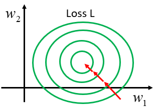

# Batch Normalization

[toc]

## Changing Landscape

- lets say that we have 2 features $x_1,x_2$ where our dataset has small values for $x_1$ but large for $x_2$
- our gradient will be smooth with respect to $w_1$ whereas it will be steep with respect to $w_2$
  - this causes the gradient descent to be inefficient where many steps will need to be run before finding a local minimum

- however, when we use $x_1,x_2$ in similar ranges, our gradient descent becomes a lot more efficient

### Feature Normalization

$$
\tilde X_i = \frac{X_i - \mu}{\sigma}
$$

- where $\tilde X_i$ is the standardized value of a feature
  - $X$ is the original value of the feature
  - $\mu$ is the mean of the feature across the dataset
  - $\sigma$ is the standard deviation of the feature across the dataset
- this makes the means of all dimensions 0 and variances all 1
  - thus all features are on the same scale
- in general, feature normalization makes gradient descent converge faster

### Batch Normalization

- batch normalization is just another network layer to help speed up training (convergence of a network)
- its job is to take the outputs from the first hidden layer and normalize them before passing them on as the input of the next hidden layer

A Batch Normalization layer has the following components:

- **Learnable Parameters**: batch normalization introduces two learnable parameters, which are updated during training:
  - $\beta$ (beta) the shift parameter allows the network to shift the normalized values.
  - $\gamma$ (gamma) the scale parameter allows the network to scale the normalized values.
- **Non-learnable Parameters**: also, batch normalization maintains two non-learnable parameters known as moving averages:
  - **Mean Moving Average**: this is a running average of the mean values of the input. It is updated during training
  - **Variance Moving Average**: this is a running average of the variance of the input. It is also updated during training and helps in normalizing the input