# Transformer

[toc]

## Sequence-to-Sequence (Seq2Seq)

- input a sequence, output a sequence
- the output length is determined by model

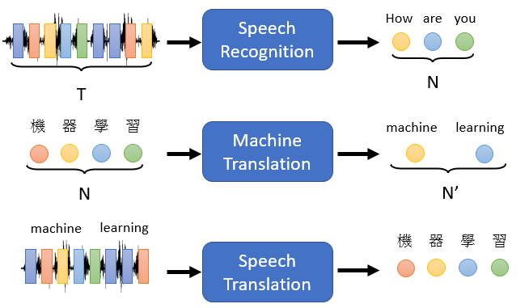

## Applications of Seq2Seq

- Text-to-Speech (TTS) Synthesis 
- Chatbot
- Syntactic Parsing (where you give a sentence and it returns a tree of POS tags)
- Multi-label Classification (each instance gets labeled with some set of classes)
- Object Detection

---

## What is Seq2Seq

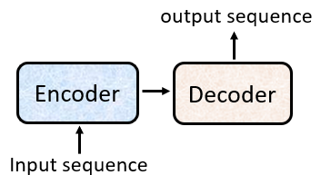

### Encoder

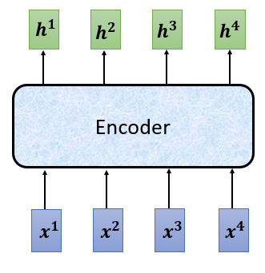

- the encoder is built up by layers of inputs to blocks like this

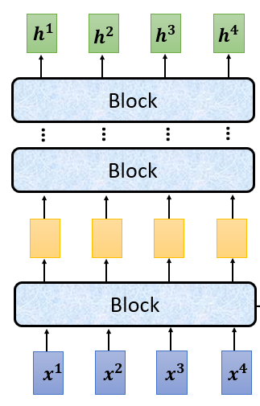

- each block is a [self-attention](6-Self-Attention.md) layer followed by a fully connected layer

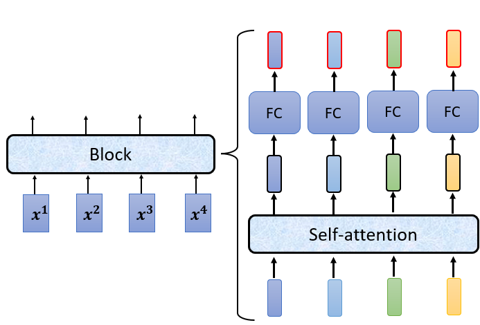

- the output of the self attention layer $a$ actually gets added to its original input $b$
  - this is called the *residual* (which is a vector)
  - the residual then goes through a layer *norm*
  
  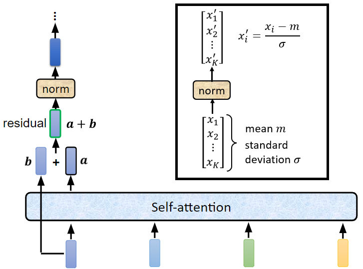

- finally, this norm output goes through the fully connected layer 
  - output also gets added to its original input (for another residual)
  - followed by another layer norm before its final output

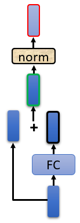

- the entire encoder looks like this

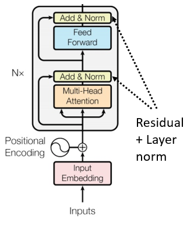

---

### Decoder

- the encoder and decoder are similarly structured

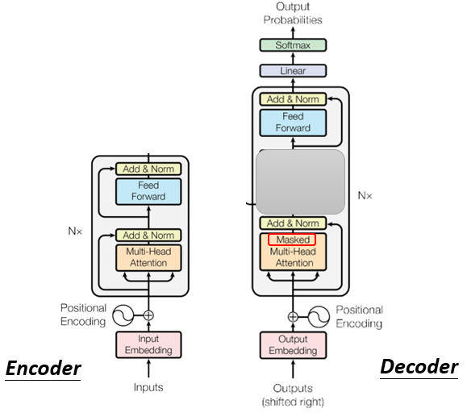

#### Decoder Autoregressive (AT)

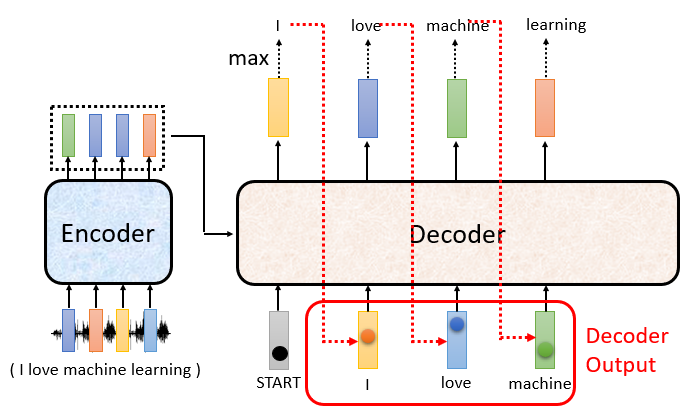

- with autoregressive, we only consider the previous outputs when going back into the decoder instead of all connections
  - this is why we use a [masked self-attention layer](#Masked Self-Attention)

##### Masked Self-Attention

- instead of considering all of the node connections, we only consider the previous connections
  - $b_1$ only connects to $a_1$
  - $b_2$ connects to $a_1,a_2$
  - $b_3$ connects to $a_1,a_2,a_3$...

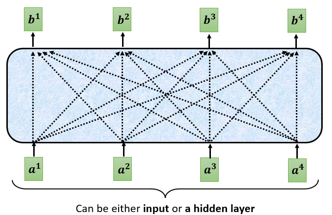 → 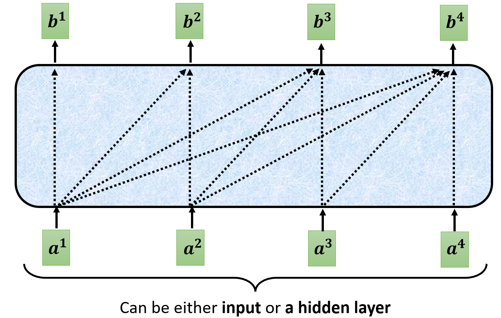 

##### How do we terminate?

- because autoregressive decoder doesn't know when our sequence terminates, it will continue generating more output indefinitely 
- to solve this, we can include an "END" symbol in our lexicon so the decoder can estimate when a sequence terminates

##### Decoder Non-Autoregressive (NAT)

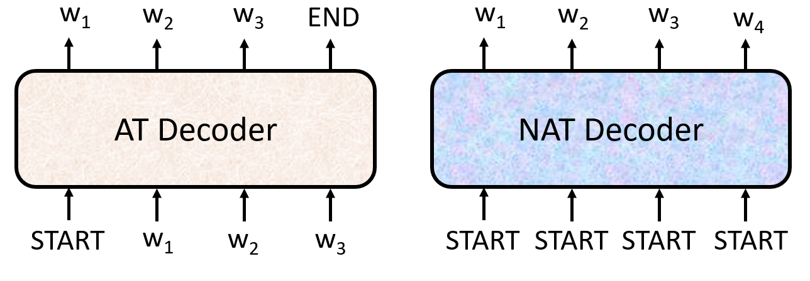

- how do decide output length for NAT decoder?
  - another predictor for output length
  - output a very long sequence and ignore the tokens after the "END" token appears

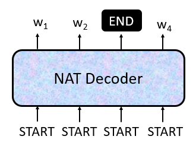

- the **advantages** of NAT include
  - parallel
  - more stable generation (such as in text to speech TTS)

### Decoder: Cross Attention

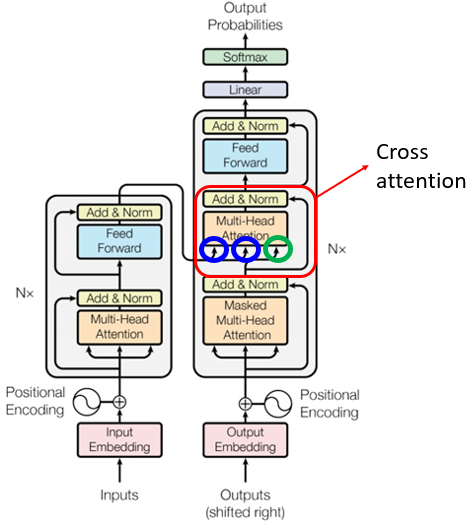

- the blue inputs are from the encoder and the green are from the decoder itself

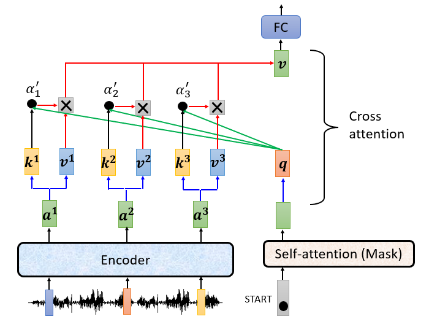

