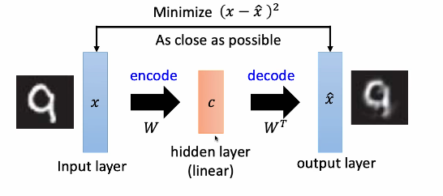

# Deep Auto-encoder

## Auto-Encoder

- the encoder generates a compact representation of the input object
- the decoder can reconstruct original object
- both of them learn together

### Review: Principal Component Analysis PCA

- PCA is a technique used in statistics and machine learning to simplify the complexity in high-dimensional data while retaining trends and patterns

### Deep Auto-encoder

- note that the symmetry is not necessary

### De-noising auto-encoder

- add noise to the input image before encoding
- this makes the encoding more robust

---

## Auto-encoder for CNN

### CNN: Unpooling

- when performing max pooling, save *max location switches*
- when reconstructing use the switches to unpool 

- alternative is to simply repeat the values 

### CNN: Deconvolution

- actually, deconvolution *is* a convolution
- simply add zero-padding so that the output is the same shape as the input

- where the left is a convolution
  - the middle is a deconvolution
  - and the right is the equivalent convolution to the deconvolution

