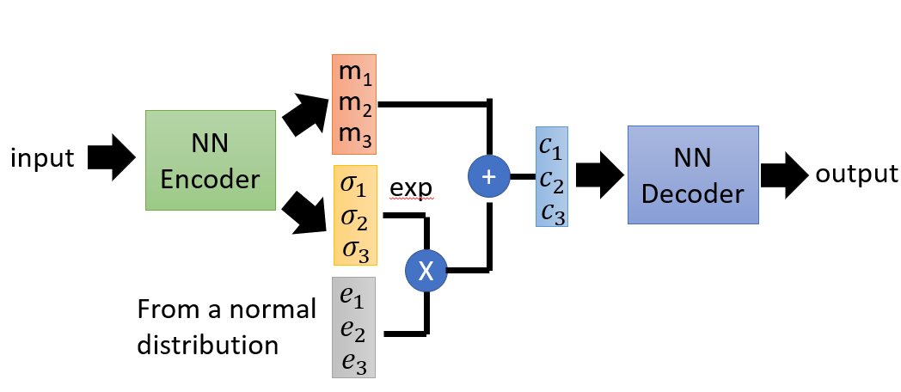
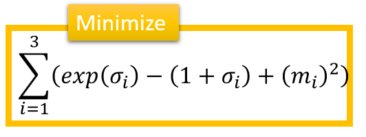
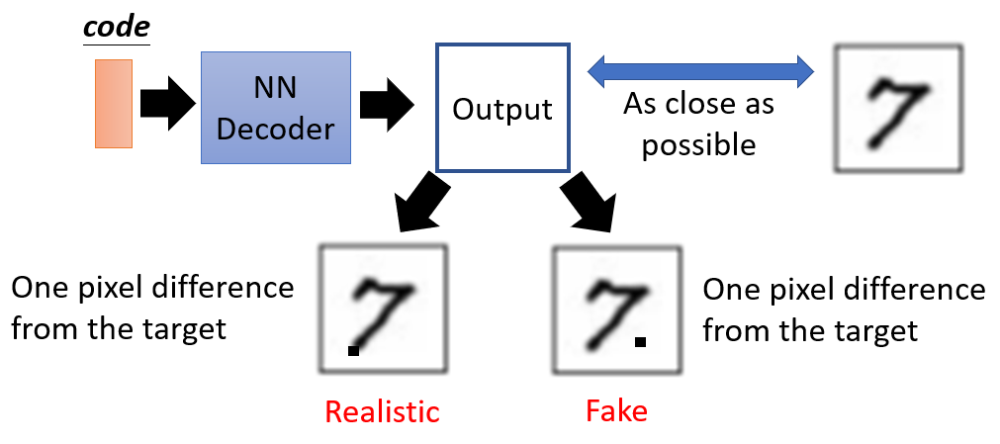
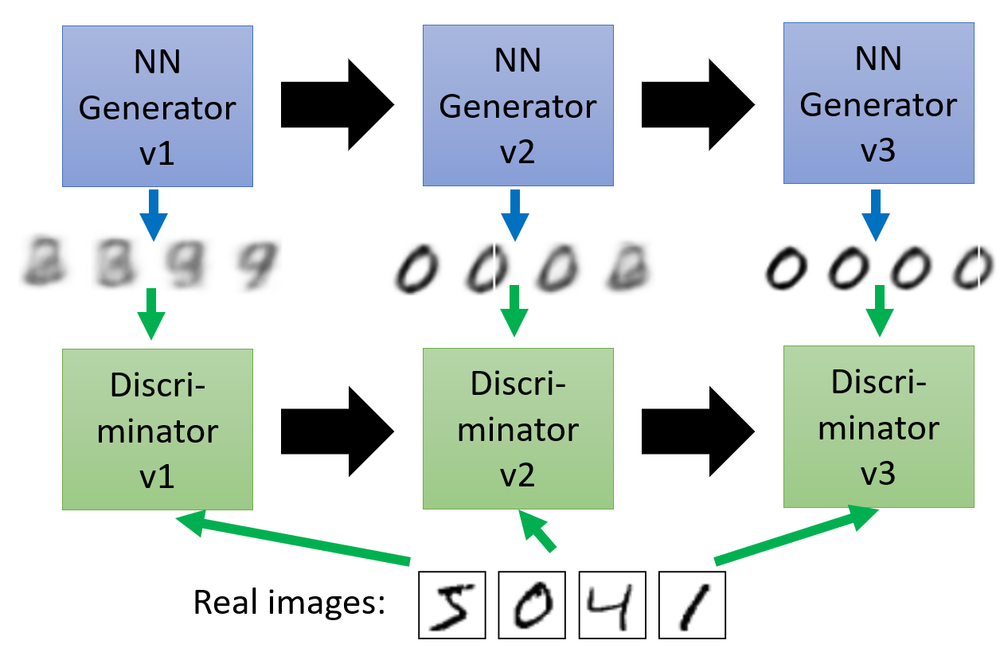

# Generative Adversarial Network GAN

## Variation Auto Encoder VAE

- a special type of auto-encoder

- where the encoder produces means, variances, and normal distribution
  - then the exponential of the normal distribution is taken with the variances and added to the means
    - $c_i = \text{exp}(\sigma_i) \times e_i + m_i$
  - we want to minimize the error where our loss function is
    

### Problems of VAE

- it doesn't really try to simulate real images
- the loss function will consider images with one pixel difference as the same quality of generation even though the one pixel can mean the difference between a realistic and fake image

### Evolution of Generation

- the discriminator is a binary classifier that  predicts if the image is real or fake
- the discriminator & generator get trained side by side in a network

---

